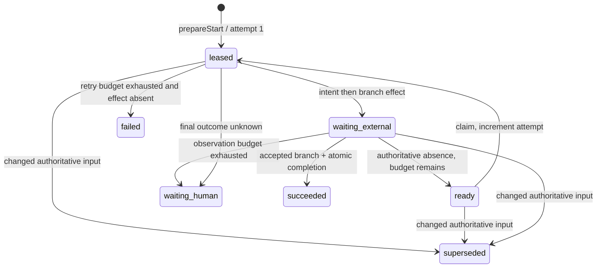

# Research: Configurable QRSPI stages and their current runtime boundary

**Date**: 2026-07-22T11:55:42+10:00
**Git Commit**: 5bfec302fcb6e97e8bf1f399e561ea53881a6c6e
**Branch**: opencode/workflowd-vs3.4-stage-runtime
**Repository**: BNasraoui/workflowd

## Research Question

1. How does Workflowd currently load, Schema-decode, normalize, hash, persist, and revalidate its server-owned `WorkflowDefinition`, and which stage-definition fields and invariants are enforced from configuration through Generation creation (`src/config.ts`, `src/qrspi/domain.ts`, `src/qrspi/store.ts`, and their tests)?
2. How do the QRSPI contract and current source represent stage identity, ordering, activation, typed inputs and results, source references, revisions, and progression, including ticket-versus-artifact precedence, `acceptedRevision` consumption, and the distinct document and implementation shapes (`docs/qrspi-contract.md` and `src/qrspi/`)? Which parts exist as executable domain/store behavior and which exist only in the contract today?
3. How does the existing trusted agent-harness system register and resolve stable versioned references, bind Effect Schemas and payload limits, validate availability, build launch intents and prompts, and create, resume, fence, retry, or abort generation-scoped OpenCode sessions (`src/agent-harness.ts`, `src/opencode/`, `src/worker.ts`, and related tests)?
4. How are `Generation` and `WorkflowOperation` records currently modeled and transacted, from WorkflowStart completion and initial `StageProduce`/`ArtifactPublish` creation through leases, retries, replacement, currentness, parent effects, external observation, quarantine, restart recovery, and supersession (`src/qrspi/store.ts`, `src/store/migrations.ts`, `src/qrspi/workflow-start.ts`)? Which runtime loops currently claim each operation kind?
5. How do current workspace and repository adapters prepare, identify, verify, sign, publish, observe, and recover Git effects, including sole-parent commits, trusted trailers and session evidence, immutable artifact identity, remote-head checks, exact-old ref semantics, uncertain outcomes, and stale effects (`src/workspace/`, `src/qrspi/adapters.ts`, `docs/qrspi-contract.md`, and publication tests)?
6. How are automated review, synthesis, revision decisions, and human or operation gates represented in the QRSPI contract and in current durable code, and how do their exact subjects, budgets, response identities, state transitions, and currentness rules interact with stage and Generation progression (`docs/qrspi-contract.md`, `src/qrspi/domain.ts`, `src/qrspi/store.ts`, and the existing review pipeline)?
7. What current test fixtures, layer-composition patterns, and integration boundaries demonstrate trusted catalog extension, alternate configured stages, deterministic skip/order behavior, Schema and version rejection, retry/restart recovery, stale Generation fencing, uncertain publication recovery, revision handling, and implementation checkpoint or commit handoff across `test/qrspi/`, `test/agent-harness.test.ts`, `test/layers.test.ts`, `test/worker.test.ts`, and `test/workspace.test.ts`?

## Research Methodology (verbatim)

This document will remain objective and factual. It does not contain any recommendations or implementation suggestions.
Open questions will not ask Why things haven't been built or what should be built in the future.

There is no "implementation" section - that is intentional.

## Summary

Workflowd's QRSPI definition is server-owned configuration. Startup parses JSON and normalizes it through an Effect Schema plus cross-field checks. WorkflowStart normalizes and hashes the definition again when its service is built, persists the definition under its canonical SHA-256 when a start is prepared, and rechecks both the live and persisted forms before it creates a Generation. The persisted definition is therefore both configuration and immutable Generation input (`src/config.ts:393-468`, `src/qrspi/domain.ts:222-318`, `src/qrspi/workflow-start.ts:109-120`, `src/qrspi/store.ts:647-837`).

The definition already carries configurable ordered stages, activation, schema and harness references, producer budgets, document or implementation output descriptors, review policy, human-gate policy, and initial operation declarations. Current execution stops after selecting the first runnable stage and creating its `StageProduce` and `ArtifactPublish` rows. No runtime loop claims those rows. Runtime stage runs, accepted revisions, later-stage release, automated review and synthesis, typed stage-gate responses, and artifact publication are specified by the contract but do not yet have QRSPI executors or dedicated persistence records (`docs/qrspi-contract.md:547-798`, `src/qrspi/store.ts:794-825`, `src/runtime.ts:98-195`).

Two existing systems supply concrete execution patterns around this boundary. The trusted agent harness resolves immutable `name@version` registrations, validates typed bounded payloads, persists generation-scoped launch and session identities, and fences retries and late results. The generic PR-fix workspace pipeline verifies a one-commit handoff, job trailer, optional controller signature, remote state, and restart recovery. QRSPI WorkflowStart separately implements intent-before-effect branch creation and authoritative accepted-history observation. The contract's final artifact identity, trusted trailer set, controller-authored final commit, and exact-old ref update remain distinct from both executable paths (`src/agent-harness.ts:259-477`, `src/worker.ts:53-267`, `src/workspace/fix.ts:38-222`, `src/qrspi/adapters.ts:249-377`, `docs/qrspi-contract.md:438-539`).

## Detailed Findings

### 1. A WorkflowDefinition is decoded three times and identified by canonical content

The ingress request does not accept a workflow definition. `WorkflowStartRequest` contains only repository identity, ticket identity, and a readiness judgment; the definition enters through server configuration and is captured in `WorkflowStartOptions` (`src/qrspi/domain.ts:134-150`, `src/qrspi/workflow-start.ts:54-67`).

```text
WORKFLOWD_QRSPI_DEFINITION_JSON
  JSON.parse
  normalizeWorkflowDefinition
    Effect Schema decode
    cross-field invariants
  AppConfig.qrspi.workflowDefinition
  makeWorkflowStart
    normalize again
    canonical workflowDefinitionSha256
  QrspiStore.prepareStart
    persist JSON keyed by SHA-256
  QrspiStore.completeStart
    parse JSON + Effect Schema decode
    recompute and compare SHA-256
    create Generation
```

QRSPI configuration is enabled by `WORKFLOWD_QRSPI_TOKEN`. If any QRSPI setting is present without the token, loading fails. With QRSPI enabled, the definition variable is required, parsed, and normalized; syntax, Schema, and invariant failures are wrapped as an invalid workflow definition. The same configuration block supplies repository identity, Beads workspace identity, base ref, operation timeout, completion margin, and lease duration. Defaults are `main`, 30 seconds, 10 seconds, and 60 seconds, and the lease must exceed timeout plus margin (`src/config.ts:393-468`).

The top-level Schema requires contract version `1`, a positive definition version no greater than 1,000,000, and at most 32 stages. Each stage has the following complete shape (`src/qrspi/domain.ts:162-239`):

| Field | Current decoded representation |
|---|---|
| `key` | Lowercase key matching `^[a-z][a-z0-9_-]{0,63}$` |
| `kind` | `document` or `implementation` |
| `activation` | Enabled, disabled, or conditional with stable policy identity, version, and precomputed decision |
| `definitionVersion` | Positive integer through 1,000,000 |
| `inputContract` | Schema ID, schema version, and encoded input limit through 1 MiB |
| `producer` | Harness ID/version, agent, provider/model, timeout, retry attempts, and backoff |
| `outputContract` | Artifact path/media type or implementation checkpoint contract ID/version |
| `reviewPolicy` | No review or automated contribution/deadline/revision budgets |
| `humanGatePolicy` | None, required, or on escalation |
| `initialOperations` | At most 16 ready or blocked `StageProduce`/`ArtifactPublish` declarations with parent effects and optional parameters |

Normalization first runs `Schema.decodeUnknownSync(WorkflowDefinition)`, then checks facts that span fields and array members. A definition must contain a directly or conditionally enabled stage; stage keys must be unique; each stage must declare one and only one of both initial operation kinds; each runnable stage must expose at least one ready operation; automated review minimums cannot exceed maximums; and artifact path templates must be relative safe paths. Safe paths reject absolute, drive-prefixed, backslash, empty, dot, parent, and case-insensitive `.git` segments and permit only ordinary path characters plus exact `{ticketId}` and `{stageKey}` placeholders (`src/qrspi/domain.ts:251-318`).

Hashing wraps the decoded definition with contract and normalization versions, recursively NFC-normalizes strings and object keys, preserves array order, sorts object keys during serialization, rejects invalid JSON values, lone surrogates, non-finite numbers, negative zero, and normalization-colliding keys, then computes SHA-256 (`src/qrspi/domain.ts:243-249`, `src/qrspi/domain.ts:517-579`). Stage declaration order therefore contributes to definition identity.

Preparation stores `JSON.stringify(decodedDefinition)` with the canonical hash as its primary key. Completion reloads that row, decodes `Schema.parseJson(WorkflowDefinition)`, and compares its computed hash with the lookup hash before any Generation write. This final store decode reruns field-level Schema checks; the live definition passed through the cross-field normalizer during config loading and service construction (`src/qrspi/store.ts:309-323`, `src/qrspi/store.ts:712-737`).

#### Testing patterns

`test/config.test.ts:199-261` passes definition JSON through the real configuration loader and checks the complete decoded value and lease constraints. `test/qrspi/ticket.test.ts:391-492` tests complete stage semantics, deterministic hash shape, unsafe paths, absent runnable work, all-blocked runnable stages, and missing operation kinds as synchronous domain tests. `test/qrspi/workflow-start.test.ts:314-354` uses real SQLite migrations with fake ticket/repository ports and checks the exact stored definition JSON and fixed hash; `test/qrspi/workflow-start.test.ts:800-870` forces a Generation insert failure to prove atomic rollback; `test/qrspi/workflow-start.test.ts:1009-1086` covers constructor rejection, alternate stage declarations, and producer retry propagation.

### 2. Configuration determines the first runnable stage, but there is no executable stage progression

The stages array is the current ordering authority. Generation creation selects its first directly enabled stage or conditional stage whose stored decision is enabled. Conditional activation is not evaluated at runtime; the trusted configuration already contains the decision. Only the selected stage receives initial operations (`src/qrspi/domain.ts:212-233`, `src/qrspi/store.ts:794-825`).

```text
definition.stages in declaration order
  disabled / conditional-disabled  -> not selected
  first enabled candidate           -> create declared initial operations
  later enabled candidates          -> no rows yet
```

Each child has Generation scope and an identity that embeds workflow, generation, operation kind, stage key, and hard-coded stage revision `1`:

```text
logicalOperationId = <workflowId>:<generation>:<kind>:<stageKey>:1
operationId        = <logicalOperationId>:1

input = {
  stageKey,
  stageKind,
  stageRevision: 1,
  workflowDefinitionSha256,
  parameters?
}
```

`StageProduce.max_attempts` comes from the configured producer retry policy. `ArtifactPublish.max_attempts` is three. State and parent effects are copied from each initial declaration (`src/qrspi/store.ts:799-824`, `src/qrspi/store.ts:932-948`).

The contract's runtime model is richer. It defines a linear sequence in which succeeded or skipped stages release the next stage, and a `StageRun` owns published, pending, and accepted revision pointers. Successors consume only `acceptedRevision`. Document revisions carry source artifacts, producer/publisher operations, prepared and final artifacts, review round, and state; implementation revisions carry source artifacts, ordered implementation steps, delivery evidence, checkpoint, review round, and state (`docs/qrspi-contract.md:547-665`).

Current QRSPI persistence has no `StageRun`, `StageRevision`, document-revision, implementation-revision, artifact-reference, or implementation-checkpoint table. `stageRevision: 1` exists only inside the initial operation input. There is no function that completes `StageProduce`, unblocks `ArtifactPublish`, records stage acceptance, persists a skipped-stage reason, or releases a later stage (`src/store/migrations.ts:385-532`, `src/qrspi/store.ts:647-840`).

The contract also states ticket authority over technical artifacts and technical precedence `Plan > Structure > Design > Research > Questions`. Ticket readiness and ticket-revision currentness are executable during WorkflowStart. Artifact precedence cannot run because QRSPI has no accepted artifact pointers or successor-stage input assembly (`docs/qrspi-contract.md:571-578`, `src/qrspi/workflow-start.ts:139-204`, `src/qrspi/workflow-start.ts:609-670`).

Stage input and output contracts are currently descriptors. QRSPI validates their IDs, versions, byte bounds, and tagged output shape, but does not resolve a stage schema, enforce its encoded payload limit, launch its configured harness, or decode its result. Document and implementation are likewise configuration tags rather than separate executable record shapes (`src/qrspi/domain.ts:166-233`).

#### Testing patterns

`test/qrspi/workflow-start.test.ts:1018-1052` replaces the default `questions` stage with one enabled `research` document stage and confirms its two declared operations. Current tests use one enabled document stage at a time. They do not execute a disabled-stage skip, a multi-stage ordering transition, an implementation stage, or `acceptedRevision` consumption. `test/qrspi/ticket.test.ts:453-492` covers definition rejection for no runnable stage, blocked runnable work, and incomplete operation declarations.

### 3. WorkflowStart is the only QRSPI operation with an executor

The migration permits twelve operation kinds and ten lifecycle states. It stores logical and physical revision identity, retry linkage, scope/input/output JSON, canonical input hash, currentness, attempts, leases, external intent and observation, observation budgets, parent effects, and terminal metadata. One partial unique index allows only one current revision for a logical operation (`src/store/migrations.ts:423-492`).

| Operation kind admitted by SQL | Current QRSPI claiming path |
|---|---|
| `WorkflowStart` | Synchronous `POST /workflows/qrspi`; new rows start leased and later ingress calls can claim/re-lease |
| `StageProduce` | None |
| `ArtifactPublish` | None |
| `ReviewContribute` | None |
| `ReviewSynthesize` | None |
| `TicketUpdate` | None |
| `TargetReconcile` | None |
| `ProvenancePublish` | None |
| `PrePullRequestVerify` | None |
| `PullRequestPublish` | None |
| `PullRequestRetire` | None |
| `GenericReviewHandoff` | None |

The process supervises job, publication, reconciliation, and command loops. Those loops claim separate legacy `jobs`, `publications`, `reconciliations`, and `commands` tables through `WorkflowStore`; the publisher does not claim QRSPI `ArtifactPublish`, and the reconciler does not claim QRSPI `TargetReconcile` (`src/runtime.ts:98-195`, `src/worker.ts:292-537`).

WorkflowStart uses the following durable state machine (`src/qrspi/store.ts:309-645`, `src/qrspi/workflow-start.ts:230-560`):



`prepareStart` transactionally stores the definition and ticket revision, resolves the current logical start, reuses identical current work, replaces a retryable failure with a new operation revision linked by `retry_of`, or retires changed-input work and cancels its pending gate. New work starts leased at attempt one (`src/qrspi/store.ts:309-405`).

External mutation follows intent-before-effect. WorkflowStart stores expected-absent branch intent under an unexpired lease, validates authority, calls the repository inside an uninterruptible completion boundary, then stores either confirmed waiting-external state or an unknown observation. A later identical ingress request observes the branch and recovers the same durable operation. Recovery is request-driven; startup has no `workflow_operations` scanner (`src/qrspi/workflow-start.ts:391-530`, `src/qrspi/store.ts:466-604`).

Completion is one SQLite transaction. It verifies current waiting-external state; decodes persisted scope, input, repository, observation, and definition; compares all supplied completion identity with stored input; supersedes active predecessor Generation work; cancels predecessor gates; allocates `max(generation)+1`; inserts a running current Generation and the first-stage operations; and marks WorkflowStart succeeded (`src/qrspi/store.ts:647-840`).

The Generation row pins repository, base target, branch, root/current-head cursor, ticket revision, and definition hash. One partial unique index allows a single current Generation per workflow. When a successor starts, completed/rejected/cancelled/failed predecessor states are preserved but lose currentness; other predecessor states become superseded, and active Generation-scoped operations lose leases and currentness (`src/store/migrations.ts:501-530`, `src/qrspi/store.ts:738-793`).

Persisted WorkflowStart rows are Schema-decoded before use. Invariant failure quarantines a workflow operation as `data_error`, clears its lease, and records terminal error text. Persisted definition failures remain typed definition errors and abort the completion transaction (`src/qrspi/store.ts:221-264`, `src/qrspi/store.ts:844-877`). Parent effects for stage children are durable JSON, but no current executor reads and applies them.

#### Testing patterns

`test/qrspi/workflow-start.test.ts:466-986` covers retryable replacement, uncertain branch creation, timeout/interruption, crashes before and after mutation, absent-effect retry, observation gates, retry exhaustion, final-attempt recovery, transaction rollback, concurrent leases, and reconstruction against the same file-backed database. `test/qrspi/workflow-start.test.ts:1088-1405` covers completion identity, successor Generations, predecessor fencing, gate cancellation, terminal-state preservation, unknown history, and data-error quarantine. These tests use real SQLite transactions and migrations with mutable fake ticket and repository ports (`test/qrspi/workflow-start.test.ts:74-209`, `test/qrspi/workflow-start.test.ts:271-311`).

### 4. The trusted harness already binds stable definitions to generation-scoped sessions

`TrustedAgentHarnessCatalog` registers definitions by `name@version`. Registration verifies required runtime fields, Effect Schema objects, metadata, timeout and retry policy, and declared payload limits; generates input and output JSON Schemas; rejects duplicate references; and hashes the ref, execution metadata, limits, retry policy, prompt contract, and generated schemas. Ref lookup rejects unknown versions, while preparation also requires object identity with the trusted registered definition (`src/agent-harness.ts:193-315`, `src/agent-harness.ts:606-642`).

The live catalog currently contains stable review and fix definitions, `opencode.pr-review@1` and `opencode.pr-fix@1`, and passes the same definition objects to the automation adapter (`src/opencode.ts:71-136`, `src/layers.ts:35-48`). This catalog is separate from QRSPI stage `producer.harnessId` and `harnessVersion`; no QRSPI stage executor resolves those fields today.

Preparation performs a complete trusted boundary check (`src/agent-harness.ts:317-429`):

```text
registered definition object
  decode execution context
  decode input with definition.inputSchema
  enforce per-definition encoded UTF-8 byte limit
  bound generated title and prompt
  resolve absolute directory
  create AgentLaunchIntent
    stable harness ref + definition hash
    agent + model + decoded input
    GenerationScope
    operation ID/revision + attempt + lease token
    timeout + retry policy + timestamp
  decode against global durable launch envelope
```

The OpenCode lifecycle deliberately separates session creation from prompting. Workers persist a launch intent, create a native session, persist its controller `SessionReference`, then resume and prompt. The reference repeats server/endpoint, directory, native session ID, scope, operation revision, attempt, and lease token. Resume compares all of those identities before calling OpenCode (`src/agent-harness.ts:431-503`, `src/worker.ts:68-139`, `src/worker.ts:168-240`).

Structured output passes through the global output envelope, the harness-specific byte limit, and the trusted output Effect Schema. Session execution races event delivery against status/message polling and reconnects after event-stream failures (`src/opencode/structured-session.ts:75-278`). Startup validates every required agent and provider/model before starting workers or acquiring the HTTP listener (`src/opencode/adapter.ts:115-196`, `src/runtime.ts:109-199`).

Durable job writes fence launch, session, and result records by current PR Generation, head SHA, latest review request, job state, attempt, worker lease, and lease token. A stale session reference is still retained for cleanup, but its result cannot complete current work. Retries abort or supersede expired `session_ready` executions before creating a replacement session; an abort failure leaves replacement work fenced until cleanup succeeds or reaches operator disposition (`src/store/jobs.ts:228-575`, `src/store/currentness.ts:3-69`, `src/worker.ts:292-404`).

#### Testing patterns

`test/agent-harness.test.ts:32-188` defines a custom trusted harness and covers duplicate/unknown refs, malformed metadata, envelope limits, and input bounds. `test/agent-harness.test.ts:190-528` covers launch identity, create-before-prompt, lost create response, endpoint fencing, structured-output retry policy, and terminal invalid output. `test/opencode/structured-session.test.ts:49-238` covers output envelopes, events, polling, cancellation, idle sessions, and malformed results. `test/store/agent-execution.test.ts:62-951` uses real SQLite to test launch/session checkpoints, replacement attempts, late-output fencing, and stale Generation cleanup. `test/worker.test.ts:194-446` covers abort and cleanup ordering.

### 5. Existing Git paths split generic fix publication from QRSPI branch observation

The generic fix path prepares or recovers a Git worktree, while QRSPI WorkflowStart works through a repository-provider port. They share currentness and external-observation concerns but persist different evidence and perform different mutations.

| Concern | Generic PR-fix path | QRSPI WorkflowStart path | Contracted artifact path |
|---|---|---|---|
| Mutation | Agent-created commit then ordinary refspec push | Expected-absent branch creation | Controller-finalized commit and exact-old ref update |
| Commit shape | Exactly one commit with original head as sole parent | Accepted-history walk of one-parent commits | Candidate sole parent is Generation cursor; controller creates final commit |
| Trailer evidence | Exactly one `Workflowd-Job` trailer | Same trailer plus durable trusted-publication lookup per accepted commit | Ordered Ticket, job, session, harness, agent, and model trailers |
| Signature | Optional configured key, verified before push | GitHub verified signature plus stored controller fingerprint | Controller signs final commit |
| Remote checks | `ls-remote` before and after push | Authoritative GitHub ref/commit observation | Exact old SHA, fast-forward-only, then authoritative head observation |
| Recovery | Classify retained worktree as none/committed/pushed | Persist intent/unknown observation and recover on later ingress | Contract defines observed completion and stale-effect handling |
| Artifact identity | Typed `CommitPrepared` checkpoint | Branch and root SHA for Generation | Repository, workflow, Generation, stage/revision, commit, path, blob, content hash, media type |

Fix worktrees have stable job/Generation paths so retries retain edits and commits. Preparation installs controller-context exclusion, restores scoped signing config on release, checks dirty/head consistency, and classifies retained state against the remote (`src/workspace.ts:57-81`, `src/workspace/context.ts:98-245`, `src/workspace/fix.ts:22-35`).

Publishing requires a clean worktree, a `CommitPrepared` SHA equal to `HEAD`, one exact parent equal to the expected original head, exactly one matching `Workflowd-Job` trailer, and, when enabled, a good/trusted signature whose fingerprint matches configuration. It reads the remote before mutation, asks a durable `isCurrent` capability immediately before push, accepts an already-pushed candidate, and verifies the remote afterwards (`src/workspace/fix.ts:38-222`). Session/harness identity remains in durable agent-execution records; the generic fix commit carries the job trailer only.

QRSPI accepted-history observation accepts a branch at the configured base, at the previous trusted cursor, or at the end of a verified chain. Each advanced commit must have one parent, one numeric job trailer, a GitHub-verified signature, matching durable trusted-publication evidence, and an actual parent equal to the durable job's original expected head (`src/qrspi/adapters.ts:249-288`, `src/qrspi/adapters.ts:333-377`). The executable mutation is `createRef` for an absent ticket branch, guarded by lease time sufficient for repository timeout plus completion margin (`src/qrspi/adapters.ts:290-313`).

The contract defines immutable `ArtifactReference` identity and an artifact commit protocol. It does not use a mutable path, worktree, branch URL, session, or future PR head as artifact identity. Workflowd verifies the producer's candidate tree and parent, replaces candidate provenance trailers with trusted runtime trailers, signs the final commit, then performs `updateRef(expectedOld=currentHeadSha, new=finalSha, fastForwardOnly=true)` and observes the authoritative remote head (`docs/qrspi-contract.md:438-539`). The current `ArtifactPublish` row has no executor for that protocol.

#### Testing patterns

`test/workspace.test.ts:38-177` builds real bare/source Git repositories and PR refs. `test/workspace.test.ts:823-1238` covers retained edits, committed and pushed recovery, scoped signing, unsigned and multi-commit rejection, trailer ownership, wrong result SHA, revoked currentness, and unchanged `NoChanges`. `test/worker.test.ts:854-1015` asserts checkpoint, publication, completion, and recovery ordering. `test/qrspi/adapters.test.ts:180-397` uses fake Octokit surfaces for accepted history, signature and durable-publication evidence, bounded calls, and lease-time mutation refusal. `test/qrspi/workflow-start.test.ts:541-916` covers uncertain branch effects and authoritative recovery. No current test claims a QRSPI `ArtifactPublish` row.

### 6. Review and human-gate configuration is durable before its QRSPI execution model

An automated stage review policy currently records minimum and maximum contributions, deadline milliseconds, and maximum revisions. Schema bounds are 1-20 contributions, positive deadlines through one day, and 0-20 revisions; normalization requires minimum contributions not to exceed maximum contributions. A human-gate policy records `none`, `required`, or `on_escalation`. Both are stored and hashed with the definition (`src/qrspi/domain.ts:197-210`, `src/qrspi/domain.ts:243-290`).

The contract defines review subjects as an exact `ArtifactReference` or `ImplementationCheckpointReference`, bounded independent contributions, one synthesizer, and outcomes `Accept`, `Revise`, `AskHuman`, or non-retryable `Fail`. Budget exhaustion maps to `AskHuman`. It also defines gate responses that carry action ID, gate ID, expected gate revision, expected scope, expected review subject when relevant, and a typed payload. Those responses atomically accept a stage revision, create a replacement revision/review round, or resume an operation (`docs/qrspi-contract.md:667-798`).

Current QRSPI SQL admits `ReviewContribute` and `ReviewSynthesize`, but the store insertion helper does not insert them and no runtime claims them. There are no contribution, review-round, synthesis-result, contested-claim, revision-decision, or exact review-subject records (`src/store/migrations.ts:423-500`, `src/qrspi/store.ts:914-930`).

The executable gate is narrower. `workflow_operation_gates` is keyed by operation ID and records only pending/answered/cancelled state, reason, and creation time. WorkflowStart opens one when external observation is exhausted, a final outcome is unknown, or untrusted initial branch history requires an operator. Changed start input or a successor Generation cancels pending gates. No gate response endpoint or typed response payload exists (`src/store/migrations.ts:493-500`, `src/qrspi/store.ts:513-645`, `src/qrspi/store.ts:748-757`, `src/http.ts:21-92`).

The existing generic PR review pipeline provides executable contribution-like and implementation-fix behavior, but its durable jobs, publications, review request numbers, `ReviewResult`, and `FixResult` are not QRSPI `StageRun` or review-round records. Its currentness model fences by PR Generation/head/latest review request rather than a QRSPI stage revision and review subject (`src/domain/review-result.ts`, `src/domain/fix-result.ts`, `src/store/currentness.ts:3-69`, `src/store/jobs.ts:351-419`).

#### Testing patterns

`test/qrspi/ticket.test.ts:391-436` demonstrates review-policy decoding and hashing. `test/qrspi/workflow-start.test.ts:651-717` covers operation-gate creation and cancellation after input changes; `test/qrspi/workflow-start.test.ts:1270-1297` covers cancellation under successor Generation. Existing pipeline tests cover review request revisions and stale publication/currentness (`test/store/workflows.test.ts:640-824`), but there are no QRSPI review-subject, synthesis-outcome, stage-gate response, or accepted-revision tests because those executable records are absent.

### 7. Test composition separates durable cores from external adapters

The current suites use three main boundaries:

| Fixture style | Real components | Replaced boundary |
|---|---|---|
| QRSPI WorkflowStart integration | SQLite, migrations, transactions, QRSPI store/service | Mutable ticket and repository Effect services |
| Agent/store and layer integration | SQLite and durable store; or full live Layer graph | OpenCode SDK, GitHub, and selected ports |
| Workspace integration | Filesystem and real Git subprocesses | GitHub network and worker store |

The QRSPI fixture can delay, crash, lose, or report unknown branch effects and mutate ticket, base, branch, PR, and trust observations. It composes `QrspiStoreLive` over a temporary file database with `Layer.succeed` fakes for `TicketSource` and `QrspiRepository` (`test/qrspi/workflow-start.test.ts:74-209`).

The harness fixture declares a complete custom trusted definition, while worker fixtures provide typed prepared launch intents with Generation scope and record orchestration actions. Store harnesses use in-memory SQLite and reusable work builders (`test/agent-harness.test.ts:32-49`, `test/worker.test.ts:34-180`, `test/store/harness.ts:9-117`).

Layer tests parse environment configuration, build `makeLiveLayer`, provide SQLite, and resolve `WorkflowStore`, GitHub, automation, harness, workspace, and WorkflowStart services. Disabled QRSPI still resolves a WorkflowStart service that returns typed unauthorized failure (`test/layers.test.ts:17-180`).

The demonstrated coverage boundary is precise:

| Requested behavior | Current demonstration |
|---|---|
| Trusted catalog extension | Custom harness registration and full typed session execution |
| Alternate configured stages | One renamed enabled document stage and changed producer retry budget |
| Deterministic skip/order | First runnable selection exists in source; no multi-stage execution test |
| Schema rejection | Ticket, definition, harness, structured output, and persisted-row boundaries |
| Version rejection | Unknown harness ref is rejected; no explicit unsupported QRSPI-version test |
| Retry/restart recovery | WorkflowStart, sessions, workers, publications, and retained worktrees |
| Stale Generation fencing | QRSPI successor supersession and generic PR-generation result fencing |
| Uncertain publication recovery | Generic GitHub/workspace publication; QRSPI branch creation rather than ArtifactPublish |
| Revision handling | Ticket hashes, WorkflowStart operation revisions, and generic review request revisions |
| Implementation handoff | Generic Fix Work checkpoint/commit path; no QRSPI implementation-stage execution |

## Code References

### Definition and WorkflowStart core (exhaustive for current QRSPI definition execution)

- `src/config.ts:393-468` — QRSPI enablement, definition JSON loading, timeout/lease configuration, and server binding.
- `src/qrspi/domain.ts:134-249` — WorkflowStart request/input plus all configurable stage and workflow definition Schemas and definition hashing.
- `src/qrspi/domain.ts:251-318` — Cross-field definition invariants and safe artifact path templates.
- `src/qrspi/domain.ts:517-579` — Canonical normalization, JSON serialization, and SHA-256.
- `src/qrspi/workflow-start.ts:54-204` — Server definition capture, normalization/hash, request authorization, ticket readiness, and durable input preparation.
- `src/qrspi/workflow-start.ts:230-607` — Accepted-history observation, leases, external branch effect, recovery, final recheck, and completion.
- `src/qrspi/store.ts:100-217` — QRSPI store port and completion contracts.
- `src/qrspi/store.ts:266-840` — WorkflowStart persistence, state transitions, external observation, supersession, and atomic Generation creation.
- `src/qrspi/store.ts:844-960` — Persisted-row validation, quarantine, child-operation insertion, and live store Layer.
- `src/store/migrations.ts:385-532` — Complete current QRSPI tables, operation kinds/states, gates, and Generation constraints.

### Contract and adapter boundary (key files; contract covers more lifecycle detail)

- `docs/qrspi-contract.md:438-539` — Immutable artifacts, final commit provenance, exact-old ref mutation, and authoritative observation.
- `docs/qrspi-contract.md:547-665` — Ordered stages, authority precedence, StageRun pointers, and document/implementation revisions.
- `docs/qrspi-contract.md:667-798` — Review contributions, synthesis, revision decisions, and typed human gates.
- `src/qrspi/ports.ts` — Ticket and repository Effect service contracts used by WorkflowStart.
- `src/qrspi/adapters.ts:94-145` — Beads source extraction and ticket adaptation.
- `src/qrspi/adapters.ts:189-378` — GitHub repository inspection, accepted branch history, branch creation, and trusted-publication checks.
- `src/qrspi/source-resolver.ts:4-25` — Trusted local, URL, and named source-reference resolution.
- `src/http.ts:21-92` — Sole QRSPI HTTP start endpoint, bounded input, authentication, and typed error mapping.
- `src/layers.ts:35-120` — Trusted harness and QRSPI service composition.
- `src/runtime.ts:98-215` — Startup availability validation and all supervised runtime loops.

### Agent execution system (key files; all current OpenCode lifecycle components listed)

- `src/agent-harness.ts:21-167` — Stable refs, execution scopes, session references, launch intents, definitions, and typed errors.
- `src/agent-harness.ts:193-315` — Trusted catalog validation, JSON Schemas, hashes, and lookup.
- `src/agent-harness.ts:317-562` — Preparation, availability, create/resume/abort, identity checks, and retry classification.
- `src/agent-payload.ts` — Global and per-harness encoded payload bounds.
- `src/opencode.ts:71-174` — Built-in review/fix definitions, availability selection, titles, and prompts.
- `src/opencode/adapter.ts:98-332` — OpenCode SDK boundary, availability, sessions, messages, status, events, and abort.
- `src/opencode/structured-session.ts:56-278` — Create/resume split, event/poll race, output selection, and Schema decoding.
- `src/store/jobs.ts:213-575` — Durable trusted publication, agent execution checkpoints, currentness, result writes, rescheduling, and cleanup.
- `src/store/currentness.ts:3-69` — PR Generation and job/session currentness predicates.
- `src/worker.ts:53-404` — Review/fix agent orchestration, abort ownership, retries, and job loop.

### Workspace and Git effects (key files; support modules also live under `src/workspace/`)

- `src/workspace.ts:27-110` — Workspace service entry points, keyed locking, preparation, and publication delegation.
- `src/workspace/model.ts:6-39` — Prepared workspace and recovery-state contracts.
- `src/workspace/discovery.ts:127-240` — Repository/worktree identity and registry discovery.
- `src/workspace/managed.ts:58-206` — Stable managed paths and retained branch/worktree recovery.
- `src/workspace/context.ts:42-245` — Owned controller context, Git exclusion, preparation checks, and scoped signing.
- `src/workspace/fix.ts:22-222` — Commit identity, sole-parent/trailer/signature checks, remote observations, currentness, push, and recovery.

### Tests (comprehensive for the researched behavior groups)

- `test/config.test.ts:199-261` — QRSPI config loading and lease bounds.
- `test/qrspi/ticket.test.ts:38-492` — Ticket/source/definition Schemas, readiness, hashing, and invariants.
- `test/qrspi/adapters.test.ts:36-397` — Beads/GitHub adapters, accepted history, durable trust, and lease-bounded mutation.
- `test/qrspi/workflow-start.test.ts:74-1454` — Full QRSPI durable start, recovery, Generation, currentness, and quarantine suite.
- `test/store/migrations.test.ts:110-223` — Strict QRSPI migrations, foreign keys, and ticket-revision keying.
- `test/agent-harness.test.ts:32-528` — Trusted catalog, payloads, identity, sessions, and retries.
- `test/opencode/adapter.test.ts:31-177` — SDK request and event mapping.
- `test/opencode/structured-session.test.ts:49-238` — Structured session completion and output validation.
- `test/store/agent-execution.test.ts:62-951` — Durable launch/session/result checkpoints and stale fencing.
- `test/store/workflows.test.ts:341-824` — Generic publication and review-revision currentness.
- `test/worker.test.ts:34-1647` — Layered worker orchestration, cleanup, publication, stale work, and checkpoint handoff.
- `test/workspace.test.ts:38-1238` — Real Git workspace and publication integration.
- `test/layers.test.ts:17-180` — Full live Layer composition and disabled QRSPI behavior.

## Architecture Documentation

QRSPI uses immutable input snapshots and current mutable cursors. Ticket revisions and workflow definitions are content-addressed snapshots. A Generation references both snapshots and owns a branch/root/current-head cursor. Workflow operations use logical identity plus physical revisions and a partial unique currentness index. External effects carry persisted intent and authoritative observation rather than treating a successful API return as durable completion.

Effect Schemas define trust boundaries at configuration, HTTP, durable JSON, harness input/output, and adapter results. Cross-record rules live beside the code that has all required context: workflow-definition normalization checks stage-level invariants, store transactions check persisted identity/currentness, and adapters check provider-specific evidence.

The current runtime has two queue families. The generic PR automation family has supervised job, publication, reconciliation, and command loops and a complete OpenCode/workspace publication lifecycle. QRSPI has a separate `workflow_operations` table and HTTP-driven WorkflowStart lifecycle. The common concepts—Generation scope, operation identity, attempts, lease tokens, durable intent, external observation, and stale-result fencing—already appear in both families, but they do not share a claiming loop or stage executor.

The contract is the broad QRSPI lifecycle model. Current domain types preserve many of its configuration descriptors, and current storage admits its operation names, but executable behavior must be identified by a concrete creator, claimer, transition, and result consumer. By that measure, current QRSPI execution ends at first-stage operation creation; later-stage progression, review, synthesis, gate response, and artifact publication remain contract representations.

## Open Questions

None.
