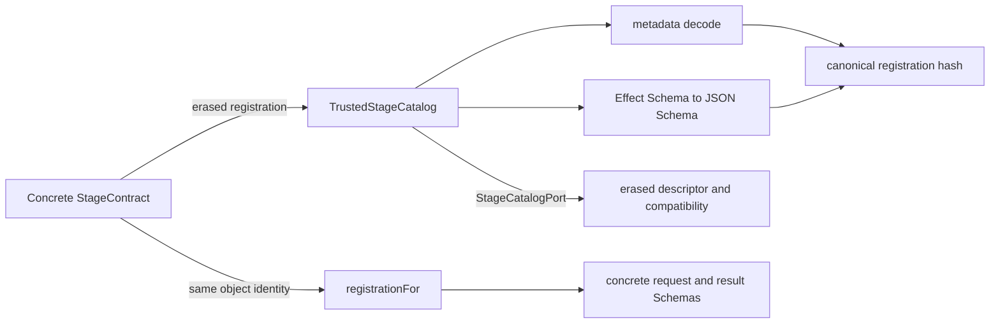
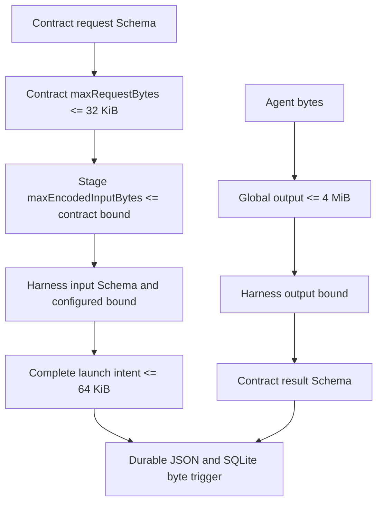

# Research: Current typed stage contracts, source identity, and durable replay

**Date**: 2026-07-23T22:30:56+10:00
**Git Commit**: c5a18e27c709facd9bd21c991fccea720a410229
**Branch**: opencode/workflowd-vs3.4.2
**Repository**: BNasraoui/workflowd

## Research Question

1. How does the current `StageContract` and `TrustedStageCatalog` flow work end to end, from registration metadata and Schema hashing through definition validation, erased descriptor resolution, trusted concrete-type restoration, and the existing production and test call sites for contract methods?
2. How are configured stages ordered, normalized, converted into executable snapshots, persisted with contract and harness identities, and revalidated during restart, including the current handling of disabled or custom stages, duplicate identities, reordered snapshots, and registration changes?
3. How are ticket and other source references represented, validated, and resolved today across `domain.ts`, `source-resolver.ts`, repository ports, and adapters, and what identity, byte-reading, precedence, and immutability guarantees does each current source path provide?
4. What request, result, and generic agent-payload Schemas and size limits exist today, where are encoded UTF-8 bounds enforced, and how do Schema, catalog, adapter, and persistence boundaries classify malformed, non-JSON, oversized, missing, or mismatched values?
5. How does the current `WorkflowStart` and `QrspiStore` path construct and persist workflow, Generation, stage-snapshot, and initial `StageProduce` identities, and which exact persisted fields and hashes govern same-input replay, changed-input replacement, transaction completion, and recovery after restart?
6. What distinct document and implementation data shapes already exist in the QRSPI domain, contract documentation, and related tagged-union models, and how are their artifact, checkpoint, revision, repository-target, and revision-intent fields represented and validated today?
7. How do current tests demonstrate catalog extension without stage-specific orchestration, deterministic registration and stage order, typed Schema restoration, durable corruption detection, source resolution, and restart behavior, and which production seams do those tests exercise directly versus only through fixtures?

## Research Methodology (verbatim)

This document will remain objective and factual. It does not contain any recommendations or implementation suggestions.
Open questions will not ask Why things haven't been built or what should be built in the future.

There is no "implementation" section - that is intentional.

## Summary

The current runtime has a heterogeneous registration seam and an erased validation seam. A `StageContract` owns concrete Effect request/result Schemas and executable closures. `TrustedStageCatalog` validates an erased registration, converts both Schemas to JSON Schema, hashes those Schemas with registration metadata, and exposes only descriptors and compatibility through `StageCatalogPort`. Exact concrete generic types return only through `registrationFor`, which requires the same registered object by identity (`src/qrspi/stage-catalog.ts:34-71,111-249`). Production currently invokes compatibility while creating and revalidating snapshots; direct calls to request assembly, task construction, and output preparation occur only in catalog tests (`src/qrspi/stage-catalog.ts:262-308,457-600`; `test/qrspi/stage-catalog.test.ts:67-129`).

Workflow definitions preserve declaration order. Every configured stage, including disabled and custom-keyed stages, receives an executable snapshot containing its full definition, semantic hash, contract registration hash, and harness registration hash. Completion persists all snapshots and derives initial work from the first effectively enabled stage. Restart preflight reloads each current `stage_snapshots_v1` generation, checks stored shape and order, and resolves every snapshot against the current catalogs and availability state (`src/qrspi/domain.ts:249-263,298-441`; `src/qrspi/stage-catalog.ts:310-439`; `src/qrspi/store.ts:316-575,957-1250`).

Current ticket sources are bounded strings that resolve as URLs, workspace-contained existing paths, or named `beads:`, `ticket:`, and `provenance:` references. The Beads adapter performs a bounded byte read and JSON decode, but workspace source resolution checks existence and containment without reading source bytes. Immutable Git artifact identity, exact ordered source bytes, repository targets, revision requests, document stage revisions, and implementation stage revisions are specified in QRSPI documentation but are not current production Schemas. In production, `ExactStageSources` and `StageExecutionContext` remain unknown-valued records, and the sole built-in contract is the broad Questions contract (`src/qrspi/source-resolver.ts:4-25`; `src/qrspi/stage-catalog.ts:21-49,646-670`; `docs/qrspi-contract.md:472-488,659-698`; `docs/qrspi-stage-runtime-design.md:201-242`).

`WorkflowStart` already supplies the durable identity and recovery base. It hashes immutable repository and ticket identity into a workflow ID, persists an input hash that includes ticket, definition, and ordered snapshot identities, and either reuses the current operation or creates a new operation revision. Completion atomically writes the generation, stage definitions, initial child operations, and successful observation. Durable loaders and catalog preflight classify malformed, missing, duplicate, reordered, hash-mismatched, identity-mismatched, or newly incompatible state (`src/qrspi/domain.ts:462-485`; `src/qrspi/store.ts:619-717,957-1292`; `src/qrspi/workflow-start.ts:208-231,233-814`).

## Detailed Findings

### 1. The trusted catalog fingerprints erased registrations and restores concrete types only for the original object

The catalog boundary has three views of one contract:

| View | Contents | Consumer |
|---|---|---|
| `StageContract<Request, ..., Result, ...>` | Concrete Schemas, limits, kind, and four executable methods | Contract author and trusted typed caller |
| `StageContractRegistration` | Reference plus otherwise erased or optional metadata | Catalog constructor and live-layer extension seam |
| `StageContractDescriptor` | Reference, kind, limits, registration hash | Workflow validation through `StageCatalogPort` |

These shapes live together in `src/qrspi/stage-catalog.ts:34-71`. The constructor decodes metadata, verifies both values are Effect Schemas, verifies all four executable members are functions, materializes JSON Schema for request and result, and rejects declarations above the global request/result envelopes (`src/qrspi/stage-catalog.ts:92-156`). It keys registrations as `name@contractVersion`, so duplicate references fail even when the remaining metadata differs (`src/qrspi/stage-catalog.ts:100,157-175`).

Registration identity is the canonical SHA-256 of a versioned envelope containing metadata and both generated JSON Schemas:

```text
registrationSha256 = canonicalSha256({
  contractVersion: 1,
  normalizationVersion: "RFC8785-NFC-1",
  metadata: { ref, implementationRevision, kind, maxRequestBytes, maxResultBytes },
  requestJsonSchema,
  resultJsonSchema,
})
```

The executable closures are not serialized. Their declared identity is `implementationRevision`, which is inside the hash (`src/qrspi/stage-catalog.ts:161-167`). Canonical hashing NFC-normalizes strings and keys, rejects values outside the JSON domain, rejects lone surrogates and normalized-key collisions, sorts object keys, and hashes the resulting canonical JSON (`src/qrspi/domain.ts:659-721`).

Descriptor lookup Schema-decodes the supplied reference before key lookup. `registrationFor` then adds an object-identity check: the submitted source must be the exact registration object retained by the catalog. A spread copy with the same fields is `untrusted_source`. Once identity matches, the return value reads Schemas from the generic source, restoring its concrete request and result types (`src/qrspi/stage-catalog.ts:178-214`).



Production constructs the catalog in `makeLiveLayer`, defaulting to `questionsStageContract`, then provides its erased port to the workflow runtime (`src/layers.ts:36-80`). Production invokes `compatibility` through `StageCatalogPort.validateCompatibility` while resolving every fresh or persisted stage (`src/qrspi/stage-catalog.ts:229-247,457-502`). Production validates that `assembleRequest`, `buildTask`, and `prepareOutput` exist at registration time but does not currently call them. The built-in Questions contract implements all four methods with `{ ticket: unknown }` request and `{ text: string }` result Schemas (`src/qrspi/stage-catalog.ts:646-670`).

#### Testing patterns

`test/qrspi/stage-catalog.test.ts:19-64` defines document and implementation fixture contracts with distinct request/result Schemas. Unit tests create real `TrustedStageCatalog` instances and verify stable hashes, revision-sensitive hashes, Schema object identity, typed decoding, duplicate rejection, and lookalike object rejection (`test/qrspi/stage-catalog.test.ts:67-160`). The extension test registers the second fixture without a stage-key branch, then directly calls restored `buildTask` and `prepareOutput` (`test/qrspi/stage-catalog.test.ts:106-129`). These tests exercise the production catalog and methods with fixture contracts; no production orchestrator invokes those executable methods today.

### 2. Declaration order becomes durable snapshot identity for every configured stage

`normalizeWorkflowDefinition` decodes the full definition and returns stages in declaration order. It rejects duplicate keys, unsafe artifact path templates, invalid contribution bounds, impossible known-stage order, disabled Design, Structure without an earlier enabled Design, misplaced specialized policies, and definitions with no effectively enabled stage (`src/qrspi/domain.ts:339-460`). Known keys have the rank Questions, Research, Design, Structure, Plan, Implementation; custom keys remain in their declared positions and do not change the last known rank (`src/qrspi/domain.ts:382-406`).

Activation determines execution eligibility, not snapshot inclusion. Enabled stages and conditionals whose stored decision is enabled are effectively enabled; disabled and conditionally disabled stages are not (`src/qrspi/domain.ts:298-303`). `validateWorkflowDefinition` still resolves every stage serially with `concurrency: 1`, then deduplicates harness/agent/model availability selections by first occurrence (`src/qrspi/stage-catalog.ts:262-308,602-615`).

Each resolution performs this current sequence:

```text
resolveExecutableSnapshot
  describe contract reference
  invoke trusted compatibility closure
  compare contract kind with stage kind
  compare configured input bound with contract request bound
  compare document/implementation kind with output policy
  validate specialized policy references
  describe and validate the stage harness
  decode ExecutableStageSnapshot {
    sequencePosition,
    stageDefinitionSha256,
    definition,
    contractRegistrationSha256,
    harnessRegistrationSha256
  }
```

The implementation is at `src/qrspi/stage-catalog.ts:457-600`, and the snapshot Schema is at `src/qrspi/domain.ts:249-256`.

The store persists stage snapshots in `qrspi_stage_definitions`. Its primary identity is `(workflow_definition_sha256, stage_definition_sha256)`, with separate uniqueness for stage key and sequence position inside a workflow definition. Denormalized contract and harness references sit beside both registration hashes (`src/store/migrations.ts:575-608`). Completion checks the supplied snapshot count, position, key, full stage definition, semantic hash, contract identity, harness identity, and hash of the entire ordered snapshot array before insert (`src/qrspi/store.ts:1022-1099,1144-1184`).

On restart, `loadCurrentGenerationSnapshotSets` selects current `stage_snapshots_v1` generations in workflow/generation/sequence order (`src/qrspi/store.ts:522-575`). Its decoder identifies missing sets, count mismatches, duplicate keys or positions, non-contiguous order, malformed stage JSON, changed stage hashes, and denormalized identity mismatches (`src/qrspi/store.ts:316-491`). Catalog preflight then reconstructs and normalizes the persisted definition, resolves every stage against current contract and harness registrations, compares both current registration hashes with persisted hashes, and reruns availability checks (`src/qrspi/stage-catalog.ts:310-439`; `src/qrspi/workflow-start.ts:208-231`).

#### Testing patterns

Pure normalization tests use in-memory definitions to cover hashing, complete semantic preservation, ordering, activation, policy placement, and path safety (`test/qrspi/ticket.test.ts:391-572`). Catalog tests use fixture catalogs and snapshots to prove compatibility is rerun and changed/missing contract or harness registrations are rejected (`test/qrspi/stage-catalog.test.ts:542-875`). SQLite-backed workflow integration tests persist disabled and enabled stages, assert declaration order and first-seen availability order, and show that only the first effectively enabled stage receives initial work (`test/qrspi/workflow-start.test.ts:1754-1900`). Restart tests directly exercise production store decoding and preflight with fake external ports (`test/qrspi/workflow-start.test.ts:1902-2281`).

### 3. Current source resolution proves syntax and local availability, while exact artifact-byte identity exists in documentation

QRSPI separates repository identity, ticket identity, and ticket source strings. `RepositoryReference` contains provider-instance ID, stable repository ID, and current full-name locator. `TicketReference` contains tracker, tracker-instance ID, and native ticket ID (`src/qrspi/domain.ts:10-25`). Workflow identity hashes stable provider/repository and tracker/ticket IDs but omits `repositoryFullName`, so a rename does not change the workflow ID (`src/qrspi/domain.ts:472-485`; `src/qrspi/workflow-start.ts:889-904`).

The ticket Schema permits incomplete tracker data; `ReadyTicket` requires title, description, at least one source, acceptance criteria, and a complete scenario (`src/qrspi/domain.ts:27-75`). Sources are plain strings, each at most 2,000 characters, with at most 100 entries. Domain readiness recognizes sources in this precedence:

1. An embedded HTTP or HTTPS URL, normalized through `URL.href` and delegated to the resolver.
2. A safe workspace-style path without empty or parent segments.
3. A named `beads:`, `provenance:`, or `ticket:` reference.

This interpretation is in `src/qrspi/domain.ts:630-657`; failure of any source contributes `unresolved_source` during readiness checks (`src/qrspi/domain.ts:491-607`). The workspace resolver accepts named references, then absolute HTTP(S) URLs with hostnames, then resolves an existing path through `realpathSync` and checks that it remains inside the real workspace root (`src/qrspi/source-resolver.ts:4-25`). It does not read file contents or return bytes.

The Beads adapter is the current byte-reading source path. It runs `bd --readonly -q -C <workspace> show <id> --json`, retains at most 256,000 stdout bytes, rejects truncation, decodes bytes with `TextDecoder`, parses JSON, decodes exactly one supported Beads record, and checks the returned native ID (`src/qrspi/adapters.ts:17-92`). The port returns untrusted JSON; `WorkflowStart` decodes it as `Ticket` and compares the returned ticket reference with the requested reference (`src/qrspi/ports.ts:5-23`; `src/qrspi/workflow-start.ts:816-831`).

Current immutability guarantees differ by path:

| Path | Current identity or guarantee | Byte behavior |
|---|---|---|
| Repository | Stable provider-instance and repository IDs; full-name rename tolerated | Adapter observes repository and branch SHAs |
| Beads ticket | Requested tracker identity and returned native ID must match | Bounded 256,000-byte CLI stdout read |
| Workspace path source | Real path must exist inside real workspace root | No content read |
| URL or named source | Syntax and trusted-resolver acceptance | No remote or named-source content read |
| Ticket revision | Canonical product fields and scenario coverage hash | Tracker revision and check time stored but omitted from digest |

The contract documentation defines a stronger artifact identity with repository, workflow, generation, stage/revision, commit SHA, path, blob SHA, content SHA-256, and media type (`docs/qrspi-contract.md:472-488`). The runtime design also defines ordered source roles, exact content, source-set hash, repository target, and optional revision reason, with byte/hash verification and duplicate rejection (`docs/qrspi-stage-runtime-design.md:201-242`). Those shapes do not currently exist as production Schemas. `ExactStageSources` is currently `Readonly<Record<string, unknown>>` (`src/qrspi/stage-catalog.ts:21`).

#### Testing patterns

Ticket-domain tests call production readiness and workspace resolution with in-memory tickets, existing/missing paths, URLs, and named references (`test/qrspi/ticket.test.ts:263-310`). Adapter tests inject a command runner to inspect the exact bounded read-only Beads command and classify truncation, malformed JSON/records, and ID mismatch (`test/qrspi/adapters.test.ts:37-164`). Workflow-start integration tests use fake ticket and repository ports while exercising production ingress identity checks, including repository renames and cross-workspace ticket rejection (`test/qrspi/workflow-start.test.ts:1523-1570`). There is no current production test for immutable Git artifact content resolution because that resolver is represented only in design documentation.

### 4. Payload limits are layered from contract Schemas through durable SQLite byte checks

The global encoded envelopes are 32 KiB for a stage request, 64 KiB for a complete launch intent, and 4 MiB for agent output (`src/agent-payload.ts:3-5`). `boundedAgentPayload` calls `JSON.stringify` and measures `Buffer.byteLength(..., "utf8")`; it emits Schema filter failures for non-JSON-encodable values and values above the encoded byte limit (`src/agent-payload.ts:7-24`).

Contract and harness declarations add narrower bounds:



Catalog construction rejects contract declarations above the global request/output envelopes, and workflow resolution rejects a stage input bound above its contract (`src/qrspi/stage-catalog.ts:111-149,512-520`). Agent harness preparation decodes execution context and contract-specific input, applies the harness UTF-8 bound, builds and structurally decodes the launch intent, then applies the global launch envelope (`src/agent-harness.ts:452-519`). Structured session output applies the global output envelope, harness-specific bound, and contract result Schema in that order (`src/opencode/structured-session.ts:208-224`).

Persistence encodes the global envelope and domain Schema before serialization. Failures become `SqlError` with the durable-envelope operation context (`src/store/jobs.ts:36-47,371-444`). SQLite triggers independently measure JSON as BLOB bytes and reject launch intents above 64 KiB or outputs above 4 MiB (`src/store/migrations.ts:337-382`).

Boundary classifications remain specific to each layer:

| Boundary | Current classification examples |
|---|---|
| Effect Schema | Missing, malformed, pattern-mismatched, non-JSON, or encoded-size filter failure |
| Catalog | `malformed_registration`, `duplicate_reference`, `unknown_reference`, `untrusted_source`, `incompatible_definition` |
| Beads adapter | `TicketSourceError` for command/truncation/absence/identity; `TicketSourceMalformedError` for JSON or record decode |
| Harness/session | `AgentHarnessError` for prompt/intent validation; `StructuredSessionError` for output decode |
| QRSPI store | `malformed`, `missing`, `duplicate`, `reordered`, `hash_mismatch`, `identity_mismatch` |
| SQL | `SqlError` or strict JSON/byte trigger rejection |

The store error reasons are declared at `src/qrspi/store.ts:264-285` and used while decoding current generations at `src/qrspi/store.ts:316-491`.

#### Testing patterns

Harness tests use real Schemas and catalog code with fixture harness definitions to test excessive declarations, exact maximum stage inputs, smaller harness limits, and full launch-envelope overhead (`test/agent-harness.test.ts:53-283`). Structured-session tests feed bounded and malformed byte outputs into the production decoder (`test/opencode/structured-session.test.ts:50-88,221-238`). Store tests write through production persistence and also use direct SQL to verify output and launch-intent trigger limits (`test/store/agent-execution.test.ts:370-462`). Catalog tests cover malformed Schemas, missing closures, and excessive contract declarations (`test/qrspi/stage-catalog.test.ts:131-172`).

### 5. WorkflowStart uses one logical operation with revisioned durable attempts and atomic generation completion

`WorkflowStart` computes `workflowIdFor` from immutable repository and ticket identity, inspects the authorized repository/base, validates the complete configured workflow, and hashes the ordered snapshot array (`src/qrspi/domain.ts:472-485`; `src/qrspi/workflow-start.ts:245-331`). Its durable input binds:

```text
contractVersion
repository
ticket
ticketRevisionSha256
workflowDefinitionSha256
stageSnapshotsSha256
baseRef
baseSha
branchName
```

The Schema is at `src/qrspi/domain.ts:142-152`. `prepareStart` stores the definition and ticket revision by hash, then compares the new `inputSha256` with the current logical operation (`src/qrspi/store.ts:619-717`). Same input reuses the current operation unless that operation ended in a retryable failure. Changed input supersedes active current work and creates the next operation revision. Each revision has operation ID `${workflowId}:start:${revision}` and logical ID `workflow-start:${workflowId}` (`src/qrspi/store.ts:646-713`).

External branch mutation uses a durable intent/observation protocol:

```text
persist and lease WorkflowStart
  record external intent under lease authority
  call repository createBranch
  record waiting_external / unknown outcome
  re-observe authoritative branch state
  recheck ticket, repository, definition, and snapshots
  completeStart transaction
```

Intent, waiting-external transitions, expired-lease recovery, and absent-branch replay are implemented at `src/qrspi/store.ts:776-914` and orchestrated at `src/qrspi/workflow-start.ts:333-700`. A present branch is adopted; an absent branch can be retried under a new lease; an unknown final observation moves the operation to human waiting (`src/qrspi/store.ts:823-873`).

`completeStart` performs one SQL transaction. It revalidates persisted input and currentness, reloads the definition, checks the complete ordered snapshots and `stageSnapshotsSha256`, supersedes the prior current generation, allocates the next generation, persists every stage definition, inserts the generation, creates initial child operations, and records successful `WorkflowStart` output and observation (`src/qrspi/store.ts:957-1250`).

The first effectively enabled stage receives two operations:

| Operation | Initial state | Identity |
|---|---|---|
| `StageProduce` | `ready` | `${workflowId}:${generation}:StageProduce:${stageKey}:1:1` |
| `ArtifactPublish` | `blocked` | `${workflowId}:${generation}:ArtifactPublish:${stageKey}:1:1` |

Both share logical identity without the final operation-revision suffix, stage revision 1, a Generation scope, and an input containing stage key, kind, revision, and workflow-definition hash (`src/qrspi/store.ts:1199-1238`). Disabled snapshots before that stage remain persisted but receive no initial child operations.

#### Testing patterns

The main SQLite-backed integration suite constructs production `WorkflowStart` and `QrspiStore` with fake ticket, repository, and harness ports (`test/qrspi/workflow-start.test.ts:120-272`). It covers exact initial identities, same-input duplicate success, retryable replacement, changed-input supersession, intent-before-effect, unknown outcomes, expired leases, reconstruction over the same database, and successor generations (`test/qrspi/workflow-start.test.ts:389-1441`). A trigger-induced completion failure verifies rollback of generation, snapshots, children, and success observation as one transaction (`test/qrspi/workflow-start.test.ts:874-949`). Direct SQL corruption fixtures exercise production row decoding and quarantine (`test/qrspi/workflow-start.test.ts:1465-1521`).

### 6. Production distinguishes output kinds, while full revision and artifact unions remain contract-document shapes

Current production has two distinct levels of document/implementation discrimination. `StageDefinition.kind` is `document | implementation`, and `StageOutputPolicy` is a tagged union of `Artifact` and `ImplementationCheckpoint`. Catalog resolution requires document stages to use artifact output and implementation stages to use checkpoint output (`src/qrspi/domain.ts:183-256`; `src/qrspi/stage-catalog.ts:503-532`). Contract output preparation returns a TypeScript union:

```ts
type PreparedDocumentOutput = {
  readonly _tag: "Document"
  readonly text: string
}

type PreparedImplementationStepOutput = {
  readonly _tag: "ImplementationStep"
  readonly value: unknown
}
```

These types are at `src/qrspi/stage-catalog.ts:23-27`. They are not Effect Schemas; each contract's result Schema validates the value before projection.

Production repository targets are spread across existing types rather than represented by one named target Schema. `WorkflowStartInput` binds repository, base ref/SHA, and branch; `RepositoryInspection` supplies observed base and head repository; `WorkflowStartOutput` records branch and root SHA (`src/qrspi/domain.ts:142-152,462-470`; `src/qrspi/ports.ts:25-30`). Branch effect intent is persisted as valid JSON with repository, head ref, expected absence or SHA, and expected base SHA, but there is no production `RevisionIntent` or `RevisionRequest` Schema (`src/qrspi/workflow-start.ts:574-587,664-675`; `src/qrspi/store.ts:776-797,1257-1287`).

The fuller data model exists in documentation:

| Document shape | Current documented fields | Production counterpart today |
|---|---|---|
| `ArtifactReference` | Repository, workflow, generation, stage/revision, commit, path, blob/content hashes, media type | No matching production Schema |
| `DocumentStageRevision` | Sources, producer/publication operations, prepared result, final artifact, review round, state | No matching production union member |
| `ImplementationStageRevision` | Sources, ordered steps, delivery evidence, checkpoint, review round, state | No matching production union member |
| `ImplementationCheckpointReference` | Stable ID, base/final SHAs, ordered commits, changed paths, evidence hash | Output-policy tag only |
| `ExactStageSources` design | Exact ticket revision, ordered role/artifact/content sources, source-set hash, target, revision reason | Unknown-valued record alias |

The contract definitions are at `docs/qrspi-contract.md:472-488,659-698,980-1005`; the exact source envelope and separate durable revision records are at `docs/qrspi-stage-runtime-design.md:201-242,262-318`. Current migrations persist workflow/start identity, generation identity, and stage-definition snapshots, not produced stage-revision subtype tables (`src/store/migrations.ts:385-532,575-620`).

#### Testing patterns

Catalog fixture tests directly prove that document and implementation contracts can restore different typed Schemas and produce different tagged outputs (`test/qrspi/stage-catalog.test.ts:19-64,106-129`). Compatibility tests exercise production rejection of mismatched stage kind and output policy (`test/qrspi/stage-catalog.test.ts:443-539`). Snapshot persistence tests prove durable stage-definition identity, not produced document/implementation revision persistence. No current tests instantiate the documented `ArtifactReference`, stage-revision union, checkpoint-reference record, or exact source envelope as production Schemas.

### 7. Tests combine real catalog/store seams with fixture contracts and external ports

The current coverage divides along stable boundaries:

| Behavior demonstrated | Production seam exercised | Fixture boundary |
|---|---|---|
| Catalog extension and typed restoration | `TrustedStageCatalog`, `registrationFor`, contract methods | Two test contracts and Schemas |
| Deterministic registration identity | JSON Schema generation and canonical hash | Fixture metadata/Schemas |
| Ordered snapshot persistence | Workflow validation, store transaction, SQLite schema | Fake ticket/repository/harness ports |
| Registration drift on restart | Persisted snapshot validator and current catalogs | Fixture catalog registrations |
| Durable corruption detection | Store row codecs, typed errors, quarantine | Direct SQL mutation creates poison state |
| Source resolution | Ticket domain and workspace resolver | Literal source strings and test workspace |
| Branch restart recovery | WorkflowStart state machine and durable SQLite records | Fault-injecting repository port |

The extension test shows heterogeneous registration without production stage-key dispatch (`test/qrspi/stage-catalog.test.ts:106-129`). The order integration test runs the production workflow validator and completion store against SQLite, while its external dependencies are fakes (`test/qrspi/workflow-start.test.ts:1792-1899`). Restart tests reconstruct service and database layers or load persisted snapshot sets through production code (`test/qrspi/workflow-start.test.ts:1103-1112,2076-2200`). Corruption tests mutate SQL only to create states that public APIs do not produce, then assert production loaders classify and quarantine them (`test/qrspi/workflow-start.test.ts:1465-1521,2202-2280`).

The direct contract-method coverage is narrower than the catalog-validation coverage. `buildTask` and `prepareOutput` are invoked in the second-contract unit test; `assembleRequest` appears in production and fixture registrations but has no direct invocation test. Compatibility is exercised through full fresh and persisted definition validation (`test/qrspi/stage-catalog.test.ts:174-237,542-615`).

#### Testing patterns

Catalog and domain tests are unit-style and in memory. Workflow-start and migration tests are integration-style with real SQLite migrations and store transactions. External command, repository, and harness effects use injected fakes so tests can control timeout, crash, lease, identity, and availability observations. No end-to-end test currently reads immutable Git artifact bytes into a typed stage request or persists a produced document/implementation stage revision, because those production seams do not exist in the current code.

## Code References

### Contract and catalog runtime

- `src/qrspi/stage-catalog.ts:21-71` — Exact-source aliases, prepared-output union, typed contract, erased registration, and descriptor.
- `src/qrspi/stage-catalog.ts:73-249` — Catalog errors, metadata validation, registration hashing, descriptor lookup, trusted restoration, and erased port.
- `src/qrspi/stage-catalog.ts:262-439` — Fresh workflow and persisted snapshot validation.
- `src/qrspi/stage-catalog.ts:441-615` — Per-stage resolution and first-seen availability selection.
- `src/qrspi/stage-catalog.ts:646-670` — Current built-in Questions request/result Schemas and contract.
- `src/layers.ts:36-80` — Catalog extension argument, default registration, construction, and service wiring.
- `src/agent-harness.ts:315-400` — Parallel trusted harness catalog and erased harness port.
- `src/agent-harness.ts:725-746` — Harness registration hashing inputs.

### Domain identity and normalization

- `src/qrspi/domain.ts:5-102` — Bounded repository/ticket types, ticket readiness shapes, and ticket revision.
- `src/qrspi/domain.ts:135-175` — WorkflowStart request/input, payload bounds, and contract references.
- `src/qrspi/domain.ts:183-263` — Output-policy union, activation/retry policies, stage definitions, snapshots, and workflow definitions.
- `src/qrspi/domain.ts:266-460` — Definition diagnostics, effective activation, hashes, normalization, and artifact-path safety.
- `src/qrspi/domain.ts:462-485` — WorkflowStart output and immutable workflow identity.
- `src/qrspi/domain.ts:491-607` — Ticket readiness and revision construction.
- `src/qrspi/domain.ts:630-721` — Source interpretation and canonical hashing.

### Source ports and adapters

- `src/qrspi/source-resolver.ts:4-25` — Named, URL, and workspace-contained path resolution; exhaustive file.
- `src/qrspi/ports.ts:5-69` — Ticket and repository error/port contracts.
- `src/qrspi/adapters.ts:17-146` — Bounded Beads JSON read and markdown-to-ticket conversion.
- `src/qrspi/adapters.ts:148-405` — GitHub repository inspection, branch observation, and creation adapter.
- `src/qrspi/workflow-start.ts:816-904` — Ticket ingress decoding and repository/ticket equality.

### Payload boundaries

- `src/agent-payload.ts:3-24` — Global byte constants and JSON/UTF-8 bounded envelopes; exhaustive file.
- `src/agent-harness.ts:150-196` — Launch-intent and prepared-work shapes.
- `src/agent-harness.ts:452-519` — Contract input, harness bound, launch structure, and global envelope validation.
- `src/opencode/structured-session.ts:208-224` — Global, harness, and contract result decoding.
- `src/store/jobs.ts:36-47,371-444` — Durable payload encoding and persistence call sites.
- `src/store/migrations.ts:337-382` — SQLite JSON byte-size triggers.

### Workflow start and persistence

- `src/qrspi/workflow-start.ts:133-231` — Live service construction, closed service, and restart preflight.
- `src/qrspi/workflow-start.ts:233-748` — Main request, replay, branch effect, and completion orchestration.
- `src/qrspi/workflow-start.ts:750-814` — Final authoritative recheck.
- `src/qrspi/store.ts:20-285` — Operation, persisted input, snapshot-set, port, and typed error contracts.
- `src/qrspi/store.ts:316-491` — Persisted current-generation snapshot decoding and classification.
- `src/qrspi/store.ts:493-717` — Store construction, snapshot loading, branch resolution, and start preparation.
- `src/qrspi/store.ts:719-955` — Claims, intents, observations, expired lease recovery, and terminal transitions.
- `src/qrspi/store.ts:957-1292` — Atomic generation/snapshot/child-operation completion and row invariants.
- `src/store/migrations.ts:385-532` — Current workflow, ticket revision, definition, operation, and generation tables.
- `src/store/migrations.ts:575-620` — Stage-definition snapshots and generation format migration.

### Tests

- `test/qrspi/stage-catalog.test.ts:19-539` — Typed fixtures, catalog registration/restoration, compatibility, policy, kind, and output tests.
- `test/qrspi/stage-catalog.test.ts:542-875` — Persisted registration, compatibility, harness, and availability revalidation.
- `test/qrspi/ticket.test.ts:38-310` — Ticket bounds, revision identity, canonical hashing, and source resolution.
- `test/qrspi/ticket.test.ts:391-572` — Full definition normalization, hashing, ordering, activation, and policy rules.
- `test/qrspi/adapters.test.ts:36-398` — Beads and GitHub adapter tests.
- `test/qrspi/workflow-start.test.ts:388-1570` — Replay, replacement, effect recovery, transaction, generation, and corruption integration tests.
- `test/qrspi/workflow-start.test.ts:1572-2281` — Snapshot ordering, persistence, restart, registration drift, and durable shape corruption.
- `test/agent-harness.test.ts:53-623` — Harness catalog, payload declarations, launch validation, and session behavior.
- `test/opencode/structured-session.test.ts:50-88,221-238` — Output byte and result-Schema decoding.
- `test/store/agent-execution.test.ts:370-462,562-724` — Durable envelope triggers and agent-session restart fencing.
- `test/store/migrations.test.ts:554-832` — Stage-definition strict-table identity and constraints.

### Contract and design documentation

- `docs/qrspi-contract.md:448-557` — Git branch and immutable artifact contract.
- `docs/qrspi-contract.md:659-698` — Document and implementation stage-revision union.
- `docs/qrspi-contract.md:980-1005` — Implementation checkpoint and review-subject union.
- `docs/qrspi-stage-runtime-design.md:159-242` — Contract output union and exact source-envelope design.
- `docs/qrspi-stage-runtime-design.md:250-318` — Stage/operation identity and separate revision-record design.
- `docs/qrspi-trusted-stage-catalog-design.md:109-250` — Catalog registration, output, and trusted type-restoration design.
- `skills/qrspi-design-structure/references/qrspi-design-structure-contract.md:666-700` — Mirrored stage-revision contract reference.

The production lists above are exhaustive for the core QRSPI catalog, workflow-start, source-resolver, and store path. The test list covers the direct suites and key cross-cutting payload/store suites; other runtime and HTTP tests also compose WorkflowStart but do not add a distinct typed-stage contract seam.

## Architecture Documentation

The current architecture separates semantic configuration from executable registration. Workflow definitions persist contract and harness references plus policy choices. Trusted process-local catalogs turn those references into descriptors and registration hashes. Executable snapshots join the two, recording both the semantic stage hash and the exact current catalog identities without serializing executable closures.

Persistence treats ordered arrays as identities rather than sets. The workflow-definition hash covers the complete declared stage array, each stage has its own semantic hash and position, and `stageSnapshotsSha256` covers the ordered executable snapshots. Database uniqueness, store decoding, completion validation, and restart catalog validation enforce different parts of that same identity.

External repository mutation follows an intent/observe/complete flow. Durable intent and lease authority precede branch creation; authoritative observation follows it; final rechecks precede the generation transaction. This lets the same logical WorkflowStart survive unknown outcomes and process reconstruction while fencing stale attempts.

The source architecture currently has two layers. Ticket readiness recognizes bounded citation syntax and delegates trust decisions to a resolver; the workspace resolver proves local containment or accepts named/URL references. The documented stage-runtime source envelope goes further by carrying immutable artifact identity, exact content, ordered authority roles, and a source-set hash. That documented envelope has not yet replaced the current unknown-valued `ExactStageSources` alias.

Likewise, production currently distinguishes document and implementation at stage kind, output policy, and prepared-output tags. The contract documents define the later durable revision model with separate document artifacts and ordered implementation steps/checkpoints. Current persistence ends at stage-definition snapshots and initial operation identities rather than produced stage revisions.

## Open Questions

None.
