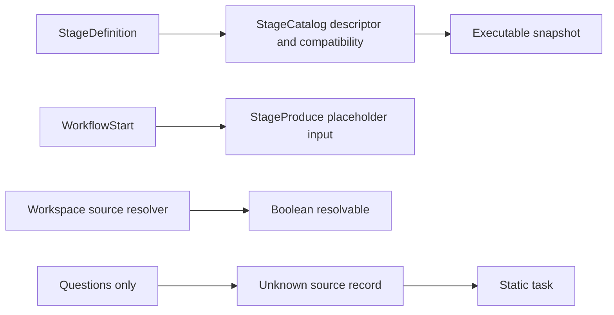

### Summary of change request

Replace the placeholder Questions contract and unknown source/output records with six trusted, versioned QRSPI stage contracts. Each contract must own a distinct bounded Effect request and result Schema, assemble only exact accepted inputs in authority order, build a deterministic trusted task, and project a bounded document or implementation result. Source resolution must read immutable Git artifacts by commit, path, blob, and content identity. The exact assembled request and its canonical hash must survive retry and restart without rediscovering a mutable source; full ticket authority remains in the existing content-addressed ticket-revision store and is bound into the request by exact identity.

### Current State

- Workflow definitions can name and order Questions, Research, Design, Structure, Plan, and Implementation, but only Questions has a built-in runtime registration.
- The Questions registration accepts an untyped ticket value, builds a static task that does not include the request, and returns an unbounded text-shaped result under the global result ceiling.
- Source readiness establishes only that a URL, named reference, or workspace-contained path can be resolved. It does not read accepted artifact bytes or prove immutable Git identity.
- The trusted catalog validates registration metadata and Schema identity, but its public port exposes only descriptors and compatibility. Production does not yet invoke request assembly, task construction, or prepared-output projection.
- Workflow operations already persist JSON input and a canonical hash, while initial StageProduce input contains only stage key, kind, revision, and workflow-definition hash.
- WorkflowStart already stores each full immutable `TicketRevision` under `(workflowId, ticketRevisionSha256)`, and each Generation binds that row by foreign key, but the store exposes no exact revision reader for later task construction.
- Document and implementation stages have different configured output policies, but the implementation prepared value and both execution context records remain untyped.

### Desired End State

- All six built-in contracts register in one explicit deterministic order and resolve through the existing trusted catalog without a stage-key switch, per-stage service, queue, worker, or store family.
- Each contract has its own stage-tagged request and result Schema. Shared identity fields are composed from one exact source envelope rather than copied into an untyped common payload.
- Every request binds WorkflowId, Generation, run and revision identity, stage and workflow definition hashes, an exact content-addressed ticket-revision reference, ordered accepted upstream artifact bytes and hashes, repository target, and optional revision intent.
- The Ticket remains the highest product authority. Accepted technical artifacts appear newest to oldest: Plan, Structure, Design, Research, Questions. Disabled or otherwise absent predecessors are omitted without changing relative order.
- Artifact bytes are read only from an exact commit and repository-relative path, then checked against both the Git blob SHA and the content SHA-256 before assembly.
- Duplicate, missing, unexpected, reordered, malformed, changed, cross-scope, stale, or oversized sources fail before CAP-D2 returns an encoded request to downstream lifecycle code. Each artifact reference must equal the current target repository, WorkflowId, Generation, expected predecessor stage and role, exact accepted revision pointer, and accepted final artifact identity before its bytes enter a request. Malformed, mistagged, or oversized results fail before CAP-D2 returns prepared output to its downstream owner.
- The complete Schema-decoded request and its canonical SHA-256 are persisted in the existing workflow-operation input envelope. Retry and restart decode that same value, reload only the immutable ticket revision named by its hash, and never reread a tracker, latest artifact path, or mutable source or rebuild the technical source set.
- Questions through Plan project bounded document output. Implementation projects a typed prepared-commit step and never passes through the document shape.
- A test-only contract extends the runtime by registration alone, and tests make no aggregate database or workspace capacity claim.
- Every Schema-valid request can fit the existing 32 KiB stage envelope because it carries a bounded ticket reference rather than an independently much larger `TicketRevision`; the full revision remains exact, untruncated, and hash-verified before the task authority manifest is returned.
- Request assembly may perform immutable reads outside a transaction. The encoded `StageProduceInput` with exact scope, contract ref, complete decoded nested request, and `requestSha256` provides a pure currentness expectation and comparison input for downstream lifecycle code. CAP-D2 supplies typed mismatch diagnostics but does not own ready-state persistence or stale/currentness state effects.

### What we're not doing

- Executing an agent session, publishing Git state, advancing a StageRun, or implementing review, gate, Provenance, Plan-execution, or Implementation-execution lifecycles.
- Adding CAP-D3 StageRun, StageRevision, document-revision, implementation-step, or checkpoint tables.
- Persisting or enabling ready work, claiming or exposing tasks, or applying stale, superseded, quarantine, or other runtime-state transitions.
- Converting or activating existing placeholder StageProduce rows. Later runtime work must distinguish its new-format operation input before claiming it.
- Loading contracts, prompts, Schemas, policies, or executable code from a repository.
- Discovering mutable latest artifacts, accepting branch-relative content identity, or weakening exact accepted-revision checks.
- Adding an aggregate storage quota, reservation, retention, cleanup, readiness, or capacity subsystem.

### Proposed End State Architecture

Before:



After:

```mermaid
flowchart LR
  A[Accepted ticket reference and upstream revisions] --> X[Exact source assembler]
  G[Repository port exact artifact read] --> X
  X --> V[Verify commit path blob content and order]
  V --> C[TrustedStageCatalog resolve]
  C --> R[Contract-specific request decode and bound]
  R --> E[Encode StageProduceInput with request SHA]
  E --> O[Downstream lifecycle persists ready operation]
  O -->|retry or restart| L[Load exact stored TicketRevision]
  L --> K[Decode and verify ticket revision hash]
  K --> T[Bounded task plus authority manifest]
  T --> H[AgentHarness later]
  H --> Z[Contract-specific result decode and bound]
  Z --> P{Prepared output}
  P -->|Questions through Plan| D[Document]
  P -->|Implementation| I[ImplementationStep]
```



The implementation adds four narrow surfaces:

1. `src/qrspi/contracts/` owns shared bounded identity Schemas and one module per built-in contract. Each module exports its request Schema, result Schema, trusted task rendering, compatibility rule, and prepared-output projection.
2. `src/qrspi/source-assembly.ts` accepts the current stage snapshot, exact ticket-revision reference, accepted predecessor pointers, repository target, and revision intent. It derives the expected enabled predecessor roles and first requires every pointer and final artifact reference to equal the current repository, WorkflowId, Generation, expected role/stage, accepted stage revision, and complete accepted artifact identity. Only then does it read immutable artifact bytes through the repository port, validate membership/order/duplicates/observed hashes, and return `ExactStageSources`.
3. `TrustedStageCatalog` retains executable closures inside its private runtime registration and exposes erased operations that always select one registration, decode and bound its request/result, invoke only its closures, and decode the prepared output. Its erased task operation verifies the stored `TicketRevision` named by the selected request and returns a bounded prompt plus a typed immutable authority manifest; type erasure does not escape this seam.
4. CAP-D2 defines and encodes a versioned `StageProduceInput` for the existing `workflow_operations.input_json` and `input_sha256` boundary. The payload contains exact scope, contract ref, complete decoded nested request, and `requestSha256`. `QrspiStorePort` gains an exact read of the existing content-addressed ticket-revision row. Downstream CAP-D3/D7 lifecycle code persists and transitions this payload atomically using the current Generation, executable snapshot identities, exact target parent, current stage run/revision scope, and ordered accepted predecessor pointers/final artifact references. No new table or stage lifecycle is introduced by this Bead.

The shared source model is Schema-backed and order-preserving:

```ts
type ExactArtifactSource = {
  readonly role: "questions" | "research" | "design" | "structure" | "plan"
  readonly artifact: ArtifactReference
  readonly content: string
}

type TicketRevisionReference = {
  readonly workflowId: WorkflowId
  readonly ticketRevisionSha256: Sha256
}

type StageTaskAuthority = {
  readonly ticketRevision: TicketRevisionReference
  readonly sources: ReadonlyArray<ExactArtifactSource>
}

type ExactStageSources = {
  readonly workflowId: WorkflowId
  readonly generation: Generation
  readonly stageKey: string
  readonly runOrdinal: number
  readonly stageRevision: number
  readonly stageDefinitionSha256: Sha256
  readonly workflowDefinitionSha256: Sha256
  readonly ticketRevision: TicketRevisionReference
  readonly sources: ReadonlyArray<ExactArtifactSource>
  readonly sourceSetSha256: Sha256
  readonly target: {
    readonly repository: RepositoryReference
    readonly headRef: string
    readonly expectedParentSha: GitSha
  }
  readonly revisionReason?: RevisionRequest
}
```

`TicketRevisionReference` binds the request to the full immutable revision already stored by WorkflowStart. The store reader selects exactly `(workflowId, ticketRevisionSha256)`, Schema-decodes `revision_json`, recomputes the ticket revision hash using the existing ticket identity rules, and rejects missing, malformed, or mismatched rows before task construction. This is an immutable local content-addressed read, not tracker rediscovery. `ArtifactReference` binds repository, WorkflowId, Generation, source stage and revision, commit SHA, repository-relative path, blob SHA, content SHA-256, and media type. Repository authority compares stable provider-instance and repository IDs; `repositoryFullName` remains a mutable locator and a rename does not change authority. For each expected predecessor, every other artifact field must equal the final artifact reference held by that predecessor's exact current `acceptedRevision`; role must map to that predecessor's trusted stage key. `sourceSetSha256` hashes the canonical ordered artifact-reference array. Exact technical content remains in the request, while source-set identity remains independent of JSON object-key order.

`StageTaskAuthority` preserves task authority order without putting full authority into the prompt: the Ticket reference is first and technical sources retain their validated newest-to-oldest order. `AgentTask` adds this manifest beside its bounded title, prompt, and result Schema. CAP-D4 must materialize the exact referenced ticket first and the supplied technical sources after it before starting the selected harness.

Each request composes the common envelope with a literal stage tag and local fields. The source assembler derives expected predecessor roles from the normalized executable snapshots and accepted revisions; contracts reject roles outside their stage's allowed prefix.

| Contract | Allowed accepted technical roles in exact order | Local request/result distinction |
|---|---|---|
| `qrspi.questions@1` | none | `QuestionsRequest`; `QuestionsResult` tagged `Questions` with bounded Markdown |
| `qrspi.research@1` | Questions | `ResearchRequest`; `ResearchResult` tagged `Research` with bounded Markdown |
| `qrspi.design@1` | Research, Questions | `DesignRequest` also binds pinned Design, promotion, and Structure policy refs; `DesignResult` tagged `Design` with bounded Markdown |
| `qrspi.structure@1` | Design, Research, Questions | `StructureRequest` also binds one exact accepted Design package, response, promotion result, and graph snapshot scope; `StructureResult` tagged `Structure` with bounded Markdown |
| `qrspi.plan@1` | Structure, Design, Research, Questions | `PlanRequest`; `PlanResult` tagged `Plan` with bounded Markdown |
| `qrspi.implementation@1` | Plan, Structure, Design, Research, Questions | `ImplementationRequest` binds checkpoint position and expected parent; `ImplementationResult` is a tagged non-final/final prepared-commit union with bounded changed paths and final scenario evidence |

Disabled predecessors are omitted. A stage may therefore receive a subsequence of its allowed roles, but every enabled accepted predecessor before it must appear exactly once and in the table's relative order. Structure's acceptance package is a distinct typed field rather than a generic artifact role because it carries owner-issued identities in addition to Git artifacts.

The five document result Schemas remain distinct through literal tags even though they share a bounded Markdown field. Their projection is always `{ _tag: "Document", text: result.document }`. The Implementation result keeps candidate commit, expected parent, changed paths, finality, and optional final evidence typed and projects to `{ _tag: "ImplementationStep", value: result }`.

The exact request flow is:

```text
derive expected accepted predecessor roles from the executable snapshots
  -> reject missing, extra, duplicate, or reordered accepted revisions
  -> require each reference to match target repository identity and current WorkflowId/Generation
  -> require role/source stage, stage revision, and complete artifact identity to match the exact accepted pointer
  -> read each artifact by repository + commit + path with a byte cap
  -> verify returned commit/path and Git blob SHA
  -> hash exact returned bytes and verify content SHA-256
  -> construct ordered ExactStageSources and sourceSetSha256
  -> invoke the selected contract's assembleRequest
  -> decode the contract request Schema
  -> enforce per-source UTF-8 and complete encoded-request bounds
  -> compute requestSha256 from the decoded encoded form
  -> encode StageProduceInput { contractVersion, scope, contract ref, request, requestSha256 } for downstream persistence
  -> on task construction load TicketRevision by request workflow/hash identity
  -> Schema-decode and recompute the immutable ticket revision identity
  -> hash-check the outer input, nested request, and ordered source set
  -> invoke the selected contract's buildTask with the verified request
  -> return a bounded prompt plus the verified ticket/source authority manifest
```

`MAX_STAGE_SOURCE_BYTES` is an individual UTF-8 content ceiling below `MAX_STAGE_REQUEST_BYTES`; the complete request remains subject to the existing 32 KiB global ceiling and the stage's configured `maxEncodedInputBytes`. The request contains only the bounded `TicketRevisionReference`, not the full ticket record, so contract-local source cardinality and byte constants can guarantee that every Schema-valid request fits its declared envelope. Contract result declarations remain bounded by their stage-specific Schema and the existing 4 MiB global result ceiling. Exact numeric source and document limits are exported constants and part of registration identity through generated Schemas and contract metadata. These are per-record limits only.

Task construction is deterministic trusted code. The generic catalog task operation loads and verifies the exact immutable `TicketRevision` named by the decoded request, then the selected contract returns fixed stage instructions in a bounded prompt and a typed authority manifest containing the verified ticket reference followed by exact technical sources in stored order. It does not inline the unbounded ticket record into the 32,768-character prompt or the 64 KiB launch intent. CAP-D4 later materializes the verified full ticket and technical materials in its isolated workspace before execution; that is an explicit typed handoff, not execution or workspace ownership in this Bead. Retry can reread the content-addressed ticket row because its bytes and semantic hash are fixed; it cannot reread the tracker or any mutable artifact source. Durable decode recomputes the outer operation hash, nested request hash, and ordered source-set hash. A missing or corrupt row returns a typed `missing`, `malformed`, `hash_mismatch`, or `identity_mismatch` data error before task construction; downstream lifecycle code owns its state disposition. CAP-D2 supplies typed currentness mismatch diagnostics for downstream use, but stale/superseded state effects and claim/exposure fencing are owned by CAP-D3/D4/D7. Source authority failures identify the source role/index and stable reason such as `source_repository_identity_mismatch`, `source_workflow_id_mismatch`, `source_generation_mismatch`, `source_role_stage_mismatch`, `source_accepted_revision_mismatch`, or `source_artifact_identity_mismatch`. A corrected tracker ticket receives a new ticket revision hash and successor Generation through the existing WorkflowStart path rather than mutating or reopening old work. Agent, model, timeout, retry, workspace, materialization, and publication choices remain outside the contract and come from the validated definition and harness.

Compatibility remains split by ownership. Existing generic validation checks contract kind, configured request bound, output-policy tag, supported policy versions, and harness identity. Each built-in closure checks only its fixed stage key, required or forbidden specialized policy refs, expected media/checkpoint policy, and contract-specific invariants. The same checks run for fresh definitions and restart preflight.

### Design Questions

All design questions were resolved through the human's explicit instruction to accept the recommended option at every decision gate.

### Resolved Design Questions

#### How should common identity coexist with six exact contract shapes?

Compose one Schema-backed `ExactStageSources` base into six separately exported, stage-tagged request and result Schemas. Questions through Plan share only bounded Markdown projection; Implementation retains a typed prepared-commit union.

This avoids copying identity rules while preserving local contract ownership and registration hashes. A single broad request/result shape was rejected because it would move stage semantics back into unknown records or downstream switches. Six wholly duplicated envelopes were rejected because their order, hashing, and identity rules would drift.

#### How should accepted source authority and ordering be represented?

Use an ordered array of exact artifact sources, with the Ticket held separately as the highest product authority. Include every enabled accepted predecessor exactly once and order technical context newest to oldest: Plan, Structure, Design, Research, Questions. Hash the complete ordered reference array as `sourceSetSha256`.

An object map was rejected because it does not make authority order explicit. Caller-supplied arbitrary arrays were rejected because expected membership must derive from trusted executable snapshots and accepted revision pointers. Mutable latest-path lookup was rejected because retry must reproduce one accepted source set.

#### Where should immutable artifact bytes be read and verified?

Add an exact artifact-read operation to `QrspiRepositoryPort` and its repository adapter. It reads a repository-relative path from an exact commit, enforces a byte cap, verifies the observed Git blob SHA, computes SHA-256 over returned bytes, and compares the content hash before returning content.

Expanding the workspace source resolver was rejected because that boundary only answers ticket-source readiness and has no repository, commit, blob, or byte identity. Reading by branch or path alone was rejected because either value can move.

#### Where should type erasure and executable dispatch live?

Keep erasure inside `TrustedStageCatalog`. Private runtime registrations retain the selected Schemas and executable closures. Erased catalog methods decode the nested request/result around those closures and return only Schema-checked prepared output.

A stage-key switch in the generic runner was rejected because adding a contract would then require central orchestration changes. Passing untyped closures or values out of the catalog was rejected because it would widen the trust boundary beyond the shipped registration seam.

#### What is the durable replay identity for this Bead?

Persist a versioned `StageProduceInput` in the existing workflow-operation JSON/hash columns. It contains exact Generation/stage scope, contract ref, exact nested request, and `requestSha256`. Compute the request hash with the existing canonical NFC/RFC-8785-style JSON rules after Schema decoding. On retry and restart, decode and hash-check the persisted request, verify the immutable ticket row named by its reference, and build the same bounded task and authority manifest without mutable source resolution.

A second payload table was rejected because the generic operation envelope already supplies durable JSON plus canonical hash identity. Persisting only technical artifact references and rereading repository bytes on retry was rejected because it can observe unavailable or substituted content; the ticket revision is different because WorkflowStart already stores and foreign-key-binds its immutable content-addressed row. CAP-D3 stage-state and revision tables were rejected here as out of scope. Existing placeholder child rows remain historical and unclaimable rather than being guessed into the new format.

#### How should bounds and failures be enforced?

Apply bounds in layers: repository read bytes, each decoded source content value, the selected contract's complete JSON-encoded request, the configured stage input bound, the selected result Schema, and the global result envelope. Reject source membership/order/identity before persistence and reject request/result hash or Schema corruption on every durable read.

Only checking the global 32 KiB/4 MiB envelopes was rejected because it would not provide an individual source contract. Adding aggregate storage admission was rejected because this Bead has authority only for bounded records and must not claim cumulative capacity safety.

#### How can every accepted ticket bind exact authority without exceeding the stage-request envelope?

Store the complete accepted `TicketRevision` once under its existing `(workflowId, ticketRevisionSha256)` primary identity and place only that bounded content-addressed reference in each stage request. Before task construction, load that exact row, Schema-decode it, recompute its semantic ticket revision hash, and require its workflow and hash identity to match the request and Generation. The contract returns that verified reference in a typed authority manifest; CAP-D4 can materialize the complete revision without truncation before execution, while the prompt and launch input stay bounded.

Embedding the complete `TicketRevision` was rejected because `ReadyTicket` permits far more than 32 KiB and `TicketRevision.scenarioCoverage` has no finite encoded maximum, so a readiness-valid ticket could make every stage unclaimable. Raising the request limit was rejected because it would also require larger prompt, launch-intent, harness, durable-agent, and SQLite limits without a defensible finite ceiling. Tightening ticket readiness to fit an arbitrary stage budget was rejected because ticket validity should not depend on repeated transport overhead when the exact immutable revision is already stored. Missing or corrupt referenced revisions fail closed; correction creates a new ticket revision and successor WorkflowStart/Generation identity.

#### How should registration and tests prove extension?

Export an explicit ordered tuple `[questions, research, design, structure, plan, implementation]` as the live default. Preserve duplicate-reference rejection and registration hashing. Add a seventh test-only registration and exercise the erased assemble/build/prepare path without changing catalog, runner, store, queue, or stage-kind dispatch.

Filesystem discovery and object-value enumeration were rejected because registration order would become implicit. A fixture that calls only concrete contract methods was rejected because it would not prove the production erased seam.

#### How does a hash-valid assembled request prove current authority at claim time?

CAP-D2 treats immutable source assembly as preparation and provides typed currentness mismatch diagnostics for downstream use. Downstream CAP-D3/D7 lifecycle code owns the guarded SQLite transitions that reload the current Generation, workflow/stage snapshots, run/revision scope, target expected parent, and complete ordered accepted-predecessor pointer set; compare them with the decoded request; then write or enable the operation and its hashes only if every predicate still holds. CAP-D3/D4/D7 own the atomic claim/task-exposure transitions so a change committed after persistence cannot expose stale authority.

Persisting after a non-transactional recheck was rejected because an accepted pointer or target parent can change between the check and write. Treating canonical hashes as currentness proof was rejected because hashes prove that stored values did not change, not that their authority is still current. CAP-D2 supplies typed currentness diagnostics, but stale/superseded state effects are owned by downstream tickets; malformed or hash-corrupt rows continue through the existing data-error path.

#### Which cross-field checks make an artifact reference authoritative for this request?

Before reading bytes, require stable repository identity to match the current target, WorkflowId and Generation to match the current request scope, role to map to the expected trusted predecessor stage, and stage revision plus every artifact field to equal that predecessor's exact current accepted final artifact reference. After reading, require observed commit/path/blob and SHA-256 of exact UTF-8 bytes to match, and recompute the ordered source-set hash. Downstream lifecycle code reruns the authority equalities in the guarded persistence transition and on durable decode before task exposure.

Checking only commit/path/blob/content hashes was rejected because a valid Git object may belong to another repository, workflow, Generation, stage, or nonaccepted revision. Comparing `repositoryFullName` as authority was rejected because repository identity uses stable provider-instance and repository IDs and must tolerate a rename.

### Patterns to follow

These show the patterns found in the existing codebase that will be followed to implement the proposed end state architecture.

#### Keep concrete types at contract ownership and erasure in the catalog

The current contract already gives each registration local Schemas and closures while `TrustedStageCatalog` owns heterogeneous storage - `src/qrspi/stage-catalog.ts:34-49,84-90`.

```ts
type AgentTask<Result, ResultEncoded> = {
  readonly title: string
  readonly prompt: string
  readonly authority: StageTaskAuthority
  readonly resultSchema: Schema.Schema<Result, ResultEncoded, never>
}

export type StageContract<Request, RequestEncoded, Result, ResultEncoded> = {
  readonly requestSchema: Schema.Schema<Request, RequestEncoded, never>
  readonly resultSchema: Schema.Schema<Result, ResultEncoded, never>
  readonly assembleRequest: (sources: ExactStageSources) => RequestEncoded
  readonly buildTask: (request: Request) => AgentTask<Result, ResultEncoded>
  readonly prepareOutput: (
    result: Result,
    context: StageExecutionContext,
  ) => PreparedDocumentOutput | PreparedImplementationStepOutput
}
```

The implementation extends `RuntimeRegistration` with those validated closures and adds erased catalog operations; it does not introduce a stage switch.

```ts
type RuntimeRegistration = {
  readonly descriptor: StageContractDescriptor
  readonly requestSchema: Schema.Schema.Any
  readonly resultSchema: Schema.Schema.Any
  readonly assembleRequest: (sources: ExactStageSources) => unknown
  readonly buildTask: (request: unknown) => AgentTask<unknown, unknown>
  readonly prepareOutput: (result: unknown, context: StageExecutionContext) => PreparedStageOutput
}
```

#### Preserve ordered arrays in canonical identity

Canonical hashing retains array order while normalizing and sorting object keys - `src/qrspi/domain.ts:659-720`.

```ts
export function canonicalSha256(value: unknown): string {
  return createHash("sha256")
    .update(canonicalJson(normalize(value)))
    .digest("hex")
}

if (Array.isArray(value)) return value.map(normalize)
```

The source-set and request hashes reuse that behavior so reordered sources produce a different identity.

```ts
const sourceSetSha256 = canonicalSha256(sources.map(({ role, artifact }) => ({
  role,
  artifact,
})))
const requestSha256 = canonicalSha256(decodedRequest)
```

#### Decode durable JSON and then verify its stored hash

WorkflowStart persistence already stores one JSON input and canonical hash, then rejects a mismatch during read - `src/qrspi/store.ts:1257-1287`.

```ts
const operationInput = yield* Schema.decodeUnknown(
  Schema.parseJson(PersistedWorkflowStartInput),
)(row.input_json)

if (canonicalSha256(operationInput) !== row.input_sha256) {
  return yield* Effect.fail(
    dataError("workflow_operation", row.operation_id, "persisted row invariants failed"),
  )
}
```

`StageProduceInput` follows the same boundary and also verifies its nested `requestSha256` before task construction.

#### Recheck currentness in the transaction that grants claimability

`completeStart` already reloads persisted identity, checks currentness and complete ordered snapshots, and writes the Generation and initial children in one transaction - `src/qrspi/store.ts:957-1249`. Downstream CAP-D3/D7 lifecycle code follows that compare-and-write pattern for new-format StageProduce persistence rather than relying on an earlier in-memory check. CAP-D2 supplies the encoded `StageProduceInput` and typed currentness mismatch diagnostics.

```ts
yield* sql.withTransaction(Effect.gen(function* () {
  yield* verifyCurrentGenerationAndStage(scope)
  yield* verifyTargetParent(request.target)
  yield* verifyAcceptedPointers(request.sources)
  yield* insertReadyStageProduce(stageProduceInput)
}))
```

The downstream implementation uses sequential Effect statements inside the transaction and returns a typed currentness mismatch before the insert. The atomic claim predicate repeats these checks, following the repository's existing lease/currentness update pattern.

#### Bind large immutable authority by content-addressed identity

WorkflowStart already stores the full ticket revision once and carries only its hash in operation and Generation identity - `src/qrspi/domain.ts:142-152`, `src/qrspi/store.ts:619-641,969-1020`, and `src/store/migrations.ts:397-408,502-525`.

```ts
export const WorkflowStartInput = Schema.Struct({
  contractVersion: Schema.Literal(1),
  repository: RepositoryReference,
  ticket: TicketReference,
  ticketRevisionSha256: Sha256,
  workflowDefinitionSha256: Sha256,
  stageSnapshotsSha256: Sha256,
  baseRef: BoundedText(256),
  baseSha: GitSha,
  branchName: BoundedText(256),
})
```

Stage requests follow the same identity pattern. The new store reader returns the exact decoded row only after recomputing its semantic hash; task construction then returns the verified reference in a typed authority manifest beside the bounded prompt. The later producer may materialize that exact row but may not substitute tracker state.

#### Verify exact repository observations against the request

The repository adapter already requests commit data by exact SHA and rejects a response whose identity differs - `src/qrspi/adapters.ts:343-374`.

```ts
const response = await client.rest.repos.getCommit({
  owner,
  repo,
  ref: currentSha,
  request: { signal },
})

if (commit.sha !== currentSha || commit.parents.length !== 1) {
  return false
}
```

The artifact reader follows the same request/observe/compare rule for exact commit, path, blob SHA, bounded bytes, and content SHA-256.

#### Test corruption through production decoders

Current restart tests mutate SQLite only to create states public APIs cannot produce, then assert typed reasons from production loading - `test/qrspi/workflow-start.test.ts:2229-2279`.

```ts
test.each([
  { name: "missing snapshot set", reason: "missing" },
  { name: "malformed snapshot JSON", reason: "malformed" },
  { name: "reordered sequence", reason: "reordered" },
])("rejects $name without new work", async ({ mutation, reason }) => {
  expect(failure).toMatchObject({
    value: { _tag: "QrspiStoreDataError", reason },
  })
})
```

Contract and source tests should use pure Schema/catalog cases, injected repository-adapter observations, and one file-SQLite replay/corruption suite. They must cover UTF-8 exact limits; missing/extra/duplicate/reordered roles; repository/workflow/Generation/role-stage/accepted-revision/final-artifact mismatches before any repository read; repository rename with stable identity; commit/path/blob/content mismatch; changed request/hash; exact ticket-reference lookup; missing/malformed/hash-mismatched ticket rows; large readiness-valid tickets whose bounded stage references and prompts still fit; authority-manifest Ticket-first order; corrected-ticket successor identity; six distinct results; deterministic tuple order; and registration-only extension. Durable wrong-scope fixtures recompute all hashes after changing one authority field and must still fail the cross-field check, proving hashes alone are insufficient. Deterministic SQLite transition-race tests for Generation, run/revision, target-parent, or accepted-pointer changes between assembly, ready persistence, and claim are owned by downstream CAP-D3/D4/D7 tickets.
