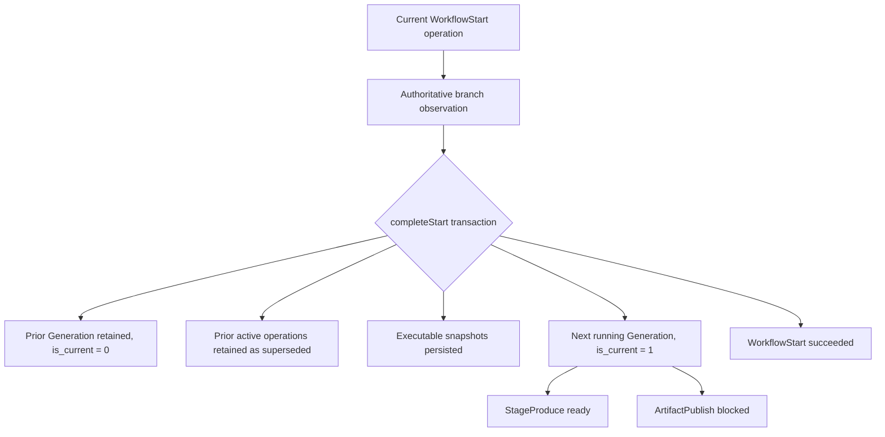

# Research: Durable Tagged Stage Runtime State

**Date**: 2026-07-24T22:37:50+10:00
**Git Commit**: 50be40c936c696c4030bd2a2cbb6c9a0bdc8f375
**Branch**: opencode/workflowd-vs3.4.3
**Repository**: BNasraoui/workflowd

## Research Question

1. In `src/qrspi/workflow-start.ts`, `src/qrspi/store.ts`, and `src/store/migrations.ts`, how does WorkflowStart create or recover a workflow, replace the current Generation, preserve prior Generation and WorkflowOperation history, and seed the first stage operations in one durable transition?
2. Across `src/qrspi/domain.ts`, `src/qrspi/contracts/common.ts`, `src/qrspi/stage-catalog.ts`, `docs/qrspi-contract.md`, and `docs/qrspi-stage-runtime-design.md`, what tagged runtime identities, record variants, references, pointers, and relationships exist for workflows, Generations, stage runs, document revisions, implementation revisions, implementation steps, and shared operations?
3. How does the current `workflow_operations` lifecycle represent logical identity, monotonic revisions, current history, retry lineage, leases, external intent and observation, terminal outcomes, and gates, and which SQL and typed-store checks govern each state transition?
4. How do QrspiStore transitions atomically fence mutations against Generation identity, operation identity and revision, currentness, lease authority, and external observations, and how are zero-row updates and stale callers represented and handled today?
5. How are durable QRSPI JSON values decoded and identity-checked at read and transition boundaries, and how do malformed, missing, reordered, duplicate, or hash-mismatched records become typed diagnostics or quarantined `data_error` history without advancing work?
6. What append-only migration, strict-table, partial-index, file-backed upgrade, crash-recovery, and restart-replay patterns do `src/store/migrations.ts`, `test/store/migrations.test.ts`, `test/qrspi/workflow-start.test.ts`, and `test/qrspi/stage-replay.test.ts` currently establish for durable runtime records and immutable current pointers?

## Research Methodology (verbatim)

This document will remain objective and factual. It does not contain any recommendations or implementation suggestions.
Open questions will not ask Why things haven't been built or what should be built in the future.

There is no "implementation" section - that is intentional.

## Summary

The implemented durable QRSPI runtime currently ends at workflow kickoff, immutable ticket and executable-stage snapshots, monotonic Generations, and a shared `workflow_operations` envelope. WorkflowStart persists intent before repository mutation, recovers uncertain outcomes by authoritative observation, and completes kickoff in one SQLite transaction. That transaction retires the prior current Generation, supersedes its active Generation-scoped operations, retains historical rows, inserts the next Generation and all executable snapshots, seeds `StageProduce` and `ArtifactPublish` for the first enabled stage, and marks WorkflowStart succeeded (`src/qrspi/store.ts:1096-1392`).

The live type layer already carries exact stage scope, accepted predecessor pointers, artifact references, source-set hashes, and a typed `StageProduceInput` replay envelope (`src/qrspi/contracts/common.ts:35-61`, `src/qrspi/contracts/common.ts:204-365`, `src/qrspi/contracts/common.ts:402-461`). It does not yet define or persist `StageRun`, `DocumentStageRevision`, `ImplementationStageRevision`, durable implementation-step records, implementation commit references, or implementation checkpoints. Those broader identities and tables are specified in the normative contract and accepted runtime design (`docs/qrspi-contract.md:596-708`, `docs/qrspi-contract.md:984-994`, `docs/qrspi-stage-runtime-design.md:244-318`).

Durable integrity is split across SQLite and typed boundaries. `STRICT` tables, checks, foreign keys, composite keys, and partial unique indexes protect storage shape and current pointers (`src/store/migrations.ts:385-530`, `src/store/migrations.ts:575-617`). Effect Schema decoding, canonical hashes, denormalized-column comparisons, and currentness predicates protect semantic identity (`src/qrspi/store.ts:341-516`, `src/qrspi/store.ts:547-715`, `src/qrspi/store.ts:1096-1238`, `src/qrspi/store.ts:1396-1463`). Operation corruption can be quarantined as terminal `data_error`; immutable ticket or snapshot corruption is returned as typed diagnostics and blocks preflight or replay without creating new work (`src/qrspi/store.ts:534-597`).

The tests use real SQLite, including temporary file-backed databases, to demonstrate upgrade, rollback, restart, and replay behavior. They retain old migration runners to create pre-upgrade databases, reconstruct fresh layers against the same file, inject repository uncertainty and transaction failures, and inspect durable rows directly (`src/store/migrations.ts:619-640`, `test/qrspi/workflow-start.test.ts:337-378`, `test/qrspi/workflow-start.test.ts:910-985`, `test/qrspi/workflow-start.test.ts:1938-2135`).

## Detailed Findings

### 1. WorkflowStart turns repository confirmation into one atomic Generation replacement

WorkflowStart first validates configuration and persisted current snapshot sets, then authorizes the request against repository and tracker bindings. It derives a stable workflow ID from provider/repository and tracker/ticket identity, reads the current Generation cursor, and resolves a durable branch name before preparing an operation (`src/qrspi/workflow-start.ts:208-312`; `src/qrspi/domain.ts:472-485`). Branch resolution inserts once with `ON CONFLICT DO NOTHING`, so subsequent starts use the stored branch (`src/qrspi/store.ts:743-756`).

`prepareStart` stores the workflow definition and ticket revision, then finds the one current logical operation `workflow-start:<workflowId>` (`src/qrspi/store.ts:758-786`). Same-input non-retry work is returned unchanged. A retryable same-input failure becomes a new operation revision whose `retry_of` names the prior physical row. Changed input cancels the old pending gate, supersedes active work, clears its lease, and creates a new revision without retry lineage (`src/qrspi/store.ts:787-849`).

The repository mutation follows intent-before-effect ordering. WorkflowStart records branch intent under a valid lease, validates the lease again, invokes branch creation, records an unknown observation if the call fails after mutation may have occurred, and re-observes the branch authoritatively before completion (`src/qrspi/workflow-start.ts:574-685`; `src/qrspi/store.ts:915-960`). An expired final attempt is recovered from authoritative branch presence, absence, or uncertainty into `waiting_external`, `failed`, or `waiting_human` respectively (`src/qrspi/workflow-start.ts:422-464`; `src/qrspi/store.ts:962-1012`).

`completeStart` is one store transaction:

```text
completeStart
  require current WorkflowStart in waiting_external
  decode persisted input/scope and the supplied repository/observation
  load and re-hash the persisted workflow definition
  decode, order-check, and hash-check all stage snapshots
  retire the current Generation
  cancel gates and supersede active Generation-scoped operations
  allocate max(generation) + 1
  persist executable stage snapshots
  insert the new running Generation
  seed StageProduce and ArtifactPublish for the first enabled stage
  mark WorkflowStart succeeded with its authoritative observation
```

The transaction first requires the operation to be current and `waiting_external`. It matches workflow, ticket revision, workflow definition, base, branch, and repository against durable input, then checks the caller-supplied authoritative observation against the supplied branch and root SHA (`src/qrspi/store.ts:1096-1160`). It does not compare that observation with the operation's stored `external_observation_json`; the final success update replaces that field. The transaction validates the workflow definition and every supplied snapshot before changing current state (`src/qrspi/store.ts:1161-1238`).

The prior Generation row remains in `qrspi_generations`: `is_current` becomes `0`, nonterminal states become `superseded`, and terminal states retain their existing state (`src/qrspi/store.ts:1239-1248`). Active Generation-scoped operation rows likewise remain as noncurrent `superseded` history with leases cleared, while their pending gates become `cancelled` (`src/qrspi/store.ts:1249-1267`). The next Generation number is `max(generation) + 1` (`src/qrspi/store.ts:1268-1272`).

All executable snapshots are persisted before the new current Generation. Existing snapshot keys are accepted only when every denormalized identity and registration field matches (`src/qrspi/store.ts:1283-1323`). The new Generation starts in `running`, with `root_sha` and `current_head_sha` set to the confirmed branch SHA and `generation_format = 'stage_snapshots_v1'` (`src/qrspi/store.ts:1324-1337`). The first effectively enabled stage receives a ready `StageProduce` and blocked `ArtifactPublish`, both at operation revision 1 and stage revision 1 (`src/qrspi/store.ts:1338-1377`). The WorkflowStart success update is the final statement in the same transaction (`src/qrspi/store.ts:1379-1392`).



#### Testing patterns

The primary integration test uses a temporary SQLite file, real migrations, fake ticket/repository ports, deterministic time and UUIDs, then inspects the database directly. It verifies Generation 1, the WorkflowStart and two child operations, the ticket revision, definition hash, child input, and branch observation (`test/qrspi/workflow-start.test.ts:337-464`).

A trigger aborts Generation insertion during `completeStart`; the test observes the original `waiting_external` operation and zero Generations, snapshots, or child operations afterward, demonstrating transaction rollback (`test/qrspi/workflow-start.test.ts:910-985`). Successor tests retain Generation 1, create Generation 2, supersede leased predecessor work, cancel pending gates, and preserve terminal predecessor states (`test/qrspi/workflow-start.test.ts:1310-1477`).

### 2. Live exact stage identities stop short of durable StageRun and revision records

The live workflow identity is derived from stable repository and ticket authority rather than the repository display name. `WorkflowId` and positive integer `Generation` are reused from the WorkflowStart output (`src/qrspi/domain.ts:462-485`; `src/qrspi/contracts/common.ts:35-37`). SQL identifies a Generation by `(workflow_id, generation)` and permits one current Generation per workflow (`src/store/migrations.ts:502-530`).

The live exact stage scope already names the coordinates needed by stage tasks:

```text
ExactStageScope = {
  workflowId,
  generation,
  stageKey,
  runOrdinal,
  stageRevision,
  workflowDefinitionSha256,
  stageDefinitionSha256
}
```

This is a typed request/replay identity, not a persisted StageRun row (`src/qrspi/contracts/common.ts:39-48`). `ArtifactReference` binds repository, workflow, Generation, stage/revision, commit, path, blob, content hash, and media type (`src/qrspi/contracts/common.ts:204-216`). `AcceptedPredecessorPointer` adds snapshot, run ordinal, accepted revision, target parent, contract registration, and a hash over the complete pointer identity (`src/qrspi/contracts/common.ts:218-238`). Exact sources require pointer/artifact equality, content hashing, workflow/Generation/repository authority, stage role, accepted revision, and an ordered source-set hash (`src/qrspi/contracts/common.ts:240-365`).

The following boundary separates live records from documented runtime records:

| Concept | Live code and schema | Normative contract/runtime design |
|---|---|---|
| Workflow | `qrspi_workflows`, stable `WorkflowId`, `WorkflowScope` | Broader controller ownership is documented |
| Generation | Composite SQL identity, current pointer, root/current head, definition and ticket references | Current stage/run pointers are documented but not migrated |
| Executable stage definition | Immutable hash, order, contract and harness registration | Implemented in migration 0009 |
| Exact stage scope | Typed workflow/Generation/stage/run/revision/hash coordinates | Used by live contracts and replay |
| StageRun | No live Schema or table | `StageRunId` and `qrspi_stage_runs` are documented |
| Document revision | `PreparedStageOutput` has a tagged `Document` variant | Durable `DocumentStageRevision` and table are documented |
| Implementation revision | Built-in contract has typed request/result variants | Durable `ImplementationStageRevision` and table are documented |
| Implementation step | `PreparedStageOutput` has tagged `ImplementationStep` data | Ordered durable step, commit reference, and checkpoint records are documented |
| Shared operation | Live `workflow_operations` SQL envelope | Full generic typed operation model across all kinds is documented |

The accepted runtime design assigns `StageRunId = workflowId + generation + stageKey + runOrdinal` and `StageRevisionId = workflowId + generation + stageKey + stageRevision`, then lists strict tables for runs, common revisions, document revisions, implementation revisions, steps, references, handoffs, and reconciliation (`docs/qrspi-stage-runtime-design.md:244-318`). Those tables do not appear in the current migration list, which ends with executable stage definitions and `generation_format` (`src/store/migrations.ts:575-640`).

The normative contract describes StageRun states and published, pending, and accepted revision pointers, plus tagged document and implementation revision records (`docs/qrspi-contract.md:596-708`). The live `PreparedStageOutput` tags only classify a prepared document or implementation-step value; they do not create durable revision identities (`src/qrspi/contracts/common.ts:388-400`).

#### Testing patterns

Contract tests decode literal request/result records through Effect Schema and exercise each identity dimension independently. Source assembly tests substitute Generation, snapshot, run ordinal, stage revision, target parent, contract registration, and pointer identity, including substitutions whose internal hashes have been recomputed (`test/qrspi/source-assembly.test.ts:54-89`, `test/qrspi/source-assembly.test.ts:339-411`).

Implementation contract tests decode both prepared commit result tags and project them into the live `ImplementationStep` prepared-output variant. They test parent, evidence, path, and byte bounds at the contract boundary rather than durable step persistence (`test/qrspi/contracts.test.ts:1125-1247`).

### 3. Workflow operations retain logical history while one revision remains current

`workflow_operations` stores physical and logical identity, revision and retry lineage, typed kind/state literals, JSON input/output/effect fields, currentness, attempts, lease authority, external intent and observation, terminal metadata, and timestamps (`src/store/migrations.ts:423-483`). The primary identity rules are:

```sql
operation_id PRIMARY KEY
UNIQUE (logical_operation_id, operation_revision)
UNIQUE INDEX workflow_operations_current(logical_operation_id)
  WHERE is_current = 1
```

These constraints retain prior revisions while preventing two current rows for one logical operation (`src/store/migrations.ts:423-427`, `src/store/migrations.ts:471-487`). WorkflowStart computes revisions with `max(operation_revision) + 1`; retry lineage is used only for a same-input failed row whose policy is `retryable` (`src/qrspi/store.ts:787-849`). Changed input is revision succession without `retry_of`.

The state and authority fields form the current lifecycle:

| State or record | SQL/store representation |
|---|---|
| Claimable | `ready`, or expired `leased`, current, below attempt limit |
| Leased | Owner, token, and expiry must all be present |
| External intent | JSON persisted while current lease token remains valid |
| Waiting external | Lease cleared; observation recorded and attempts incremented |
| Retry after absent observation | `waiting_external` becomes `ready` below observation limit |
| Human gate | `waiting_human`, `operator_required`, one pending gate row |
| Success | Output JSON present and authoritative observation retained |
| Failure/cancellation/data error | Terminal reason and policy required for WorkflowStart |
| Superseded | Historical row becomes noncurrent and loses lease authority |

SQLite enforces valid state literals, attempt bounds, complete lease tuples exactly for `leased`, and WorkflowStart terminal metadata (`src/store/migrations.ts:444-482`). `decodeRow` adds semantic checks: the kind must be WorkflowStart, logical identity must match `WorkflowScope`, input hash must match decoded input, waiting-external rows need intent, and success must agree with output presence (`src/qrspi/store.ts:1396-1427`).

`workflow_operation_gates` is keyed one-to-one by operation ID and records `pending`, `answered`, or `cancelled` with a reason (`src/store/migrations.ts:493-500`). Current store behavior creates a pending gate when final-attempt external state is unknown, when observation attempts are exhausted, or when WorkflowStart explicitly waits for an operator (`src/qrspi/store.ts:962-1012`, `src/qrspi/store.ts:1014-1053`, `src/qrspi/store.ts:1074-1094`).

#### Testing patterns

Retry tests leave revision 1 as failed/noncurrent and create revision 2 as succeeded/current with `retry_of` pointing to revision 1 (`test/qrspi/workflow-start.test.ts:576-627`). Changed-input tests verify pending gate cancellation (`test/qrspi/workflow-start.test.ts:796-827`). Retry-budget, observation-budget, and branch-history tests inspect terminal policy and gate state directly (`test/qrspi/workflow-start.test.ts:862-907`, `test/qrspi/workflow-start.test.ts:1099-1121`).

### 4. Store transitions combine lease predicates, currentness checks, and typed stale outcomes

Lease-bearing mutations use the physical operation ID as their revision identity, `is_current = 1`, expected state, matching lease token, and, where repository mutation authority remains valid, an unexpired lease. `claimStart` accepts only current ready work or an expired current lease below the attempt maximum; a zero-row claim becomes either retry exhaustion or `WorkflowStartCurrentnessError` (`src/qrspi/store.ts:858-912`). `validateLease` checks current leased state, token, and expiry immediately before repository mutation (`src/qrspi/store.ts:924-929`).

The current zero-row vocabulary is method-specific:

| Transition | Fencing | Zero-row result |
|---|---|---|
| `recordBranchIntent` | current leased operation, token, unexpired lease | `"stale"` |
| `markWaitingExternal` | current leased operation, token, unexpired lease | `"stale"` |
| `recordUnknownOutcome` | current leased operation and token | `"stale"` |
| `recoverExpiredLease` | current expired final-attempt lease | `"stale"` |
| `recordBranchAbsent` | current `waiting_external` operation | `"stale"` |
| `validateLease` | current leased operation, token, unexpired lease | `false` |
| `isStartCurrent` | current succeeded operation and input hash | `false` |
| `claimStart` | current claimable operation below attempt limit | typed currentness or retry-exhausted error |

The predicates and mappings are in `src/qrspi/store.ts:858-1053`. `recordUnknownOutcome` deliberately retains the token fence but not an unexpired-lease predicate, allowing the caller to record uncertainty after a timed external call (`src/qrspi/store.ts:950-960`).

Generation replacement is fenced differently. `completeStart` starts from a current physical WorkflowStart operation in `waiting_external`, matches its durable scope/input, validates a caller-supplied authoritative observation against the supplied branch and root SHA, and performs the Generation updates within one transaction (`src/qrspi/store.ts:1096-1238`). It does not compare that observation with the stored operation observation. The current Generation update is selected by workflow ID plus `is_current = 1`; `CompleteStartInput` does not carry an expected prior Generation number. Child operation supersession selects `GenerationScope`, the same workflow ID, and active states (`src/qrspi/store.ts:1239-1267`).

`supersedeStart` and `failStart` update nonterminal rows but return `void`; `waitStartForOperator` uses its row count only to decide whether to insert a gate (`src/qrspi/store.ts:1055-1094`). The final WorkflowStart success update uses operation ID and currentness but does not classify a zero-row result separately; it remains inside the transaction after the explicit currentness precheck (`src/qrspi/store.ts:1099-1107`, `src/qrspi/store.ts:1379-1392`).

#### Testing patterns

Concurrent duplicate kickoff gates the fake repository call. The second caller receives busy behavior and no second repository mutation (`test/qrspi/workflow-start.test.ts:1080-1097`). Crash-before-creation recovery obtains a new lease token, while uncertain accepted mutation is recovered through observation without another create call (`test/qrspi/workflow-start.test.ts:651-747`). Final-attempt tests manually construct expired leases and recover both persisted-intent and missing-intent cases (`test/qrspi/workflow-start.test.ts:1034-1078`).

### 5. Durable JSON is accepted only after structural decode and semantic identity checks

SQLite first constrains JSON storage. Ticket revisions, workflow definitions, operation scope/input/output, Generation repository data, and stage definitions require valid JSON with object shape where the schema declares it (`src/store/migrations.ts:397-417`, `src/store/migrations.ts:434-463`, `src/store/migrations.ts:502-506`, `src/store/migrations.ts:575-606`). Runtime reads then decode relational columns and JSON with Effect Schema.

Each durable boundary adds checks suited to its identity:

| Boundary | Runtime checks |
|---|---|
| WorkflowStart operation | Row shape, scope/input JSON, logical ID, canonical input hash, lease tuple, intent/output state invariants |
| Ticket revision | Composite lookup, row shape, nested key equality, semantic ticket hash recomputation |
| StageProduce input | Operation exists, kind is `StageProduce`, exact envelope with no excess properties, request hash, nested exact stage scope, outer input hash |
| Current snapshot set | Definition exists and re-hashes, snapshots exist, count/order/uniqueness, row identity, stage hash, denormalized contract/harness identity |
| Completion snapshots | Supplied order and stage hashes match persisted WorkflowStart input and persisted workflow definition |

WorkflowStart row decoding is implemented in `decodeRow` and `toStartRecord` (`src/qrspi/store.ts:1396-1463`). Ticket revision identity checks occur at `src/qrspi/store.ts:599-659`. StageProduce decoding rejects excess properties and re-hashes the full envelope (`src/qrspi/store.ts:547-597`; `src/qrspi/contracts/common.ts:402-461`). Current Generation snapshot sets are loaded in deterministic order and grouped by workflow/Generation before full validation (`src/qrspi/store.ts:341-516`, `src/qrspi/store.ts:661-715`).

`QrspiStoreDataError` classifies records with `malformed`, `missing`, `duplicate`, `reordered`, `hash_mismatch`, or `identity_mismatch` and can carry workflow, Generation, sequence, and expected/actual hash details (`src/qrspi/store.ts:290-339`). A workflow-operation data error passes through `quarantine`, which writes terminal `data_error`, records the exact message as both `last_error` and terminal reason, clears lease authority, and re-fails with the original typed error (`src/qrspi/store.ts:534-544`).

`readStageProduceInput` does not quarantine a wrong operation kind: it returns `identity_mismatch` and leaves the row unchanged. Missing, malformed, and hash-mismatched operation records do pass through quarantine (`src/qrspi/store.ts:547-597`). Ticket, definition, and stage-snapshot errors are returned without changing an operation because quarantine only updates `record === "workflow_operation"` (`src/qrspi/store.ts:534-544`). Persisted snapshot preflight fails service construction before new work advances (`src/qrspi/workflow-start.ts:208-230`).

#### Testing patterns

Stage replay tests classify missing, malformed, nested-identity-mismatched, and semantically hash-mismatched ticket rows (`test/qrspi/stage-replay.test.ts:115-186`). Operation tests demonstrate that a wrong kind remains byte-for-byte unchanged, while malformed envelopes and changed nested requests produce typed identity, malformed, or hash errors (`test/qrspi/stage-replay.test.ts:576-754`).

WorkflowStart tests corrupt persisted operation input and verify terminal `data_error`, including corruption discovered while claiming ready work (`test/qrspi/workflow-start.test.ts:1501-1557`). Restart preflight tests remove or mutate definitions and snapshots and receive exact missing, malformed, cross-column, hash, or reordered diagnostics without adding technical work (`test/qrspi/workflow-start.test.ts:2238-2316`).

### 6. Numbered migrations and file-backed tests preserve old rows across upgrades and restarts

The migration record retains versions 0001 through 0008 and exports a runner at that historical boundary. The current runner spreads those migrations and appends 0009 for executable stage definitions and 0010 for Generation format (`src/store/migrations.ts:619-640`). Migration 0010 adds a non-null `generation_format` with default `legacy`, so shipped rows acquire an explicit classification without being reconstructed (`src/store/migrations.ts:610-617`).

All QRSPI tables are `STRICT`. The current durable shape uses composite primary keys for ticket revisions and Generations, immutable workflow-definition and stage-definition hashes, foreign keys among workflow/ticket/definition/Generation records, and partial unique indexes for current operation and Generation pointers (`src/store/migrations.ts:385-530`, `src/store/migrations.ts:575-608`). The store enables foreign keys, sets a five-second busy timeout, and runs migrations before exposing its service (`src/qrspi/store.ts:1504-1512`).

```text
0005_qrspi_workflow_start
  qrspi_workflows
  qrspi_ticket_revisions
  qrspi_workflow_definitions
  workflow_operations
  workflow_operation_gates
  qrspi_generations

0009_qrspi_stage_definitions
  immutable executable stage snapshots

0010_qrspi_generation_format
  legacy | stage_snapshots_v1
```

File-backed upgrade tests create a database with the through-0008 runner, insert a legacy current WorkflowStart or current Generation, close that layer, and start the current service against the same filename. The operation upgrade retains the legacy row as superseded revision 1 and creates current revision 2; the Generation upgrade leaves the row current with `generation_format = 'legacy'` (`test/qrspi/workflow-start.test.ts:1938-2060`).

Restart recovery reconstructs a fresh Effect layer around the same database. A post-create uncertain operation resumes from `waiting_external`, observes the existing branch, and creates Generation 1 without a second mutation (`test/qrspi/workflow-start.test.ts:723-747`, `test/qrspi/workflow-start.test.ts:1139-1148`). Snapshot restart tests load current `stage_snapshots_v1` rows in declaration order (`test/qrspi/workflow-start.test.ts:2112-2135`). Stage replay reconstructs all six built-in contracts from persisted input and fresh catalogs without tracker or repository rediscovery (`test/qrspi/stage-replay.test.ts:756-807`).

#### Testing patterns

Migration tests inspect `effect_sql_migrations`, SQLite table metadata, strict flags, foreign keys, and persisted DDL. For executable stage snapshots, invalid inserts exercise foreign-key, JSON-object, stage-key, positive-sequence, and workflow-scoped uniqueness checks; the migration-order assertion records migration 0010 (`test/store/migrations.test.ts:110-154`, `test/store/migrations.test.ts:554-832`). Earlier append-only migrations also use direct backfill fixtures and metadata assertions (`test/store/migrations.test.ts:156-209`).

The QRSPI harness creates a temporary `workflowd.db`, composes the real SQL/store layers with fake ports, and deletes the directory after each test (`test/qrspi/workflow-start.test.ts:44-47`, `test/qrspi/workflow-start.test.ts:269-378`). Reusing the filename with a fresh layer models process restart; SQL triggers and mutable repository fakes model atomic rollback and uncertain external outcomes (`test/qrspi/workflow-start.test.ts:104-237`, `test/qrspi/workflow-start.test.ts:910-985`).

## Code References

### Workflow kickoff and store transitions

- `src/qrspi/workflow-start.ts:127-230` — WorkflowStart service construction, preflight, and persisted snapshot validation.
- `src/qrspi/workflow-start.ts:233-748` — Request authorization, operation recovery, repository effects, final recheck, and completion call.
- `src/qrspi/store.ts:193-310` — QrspiStore port and typed store errors.
- `src/qrspi/store.ts:716-856` — Current cursor, durable branch resolution, and WorkflowStart operation preparation.
- `src/qrspi/store.ts:858-1094` — Claim, lease, intent, observation, recovery, terminal, and gate transitions.
- `src/qrspi/store.ts:1096-1392` — Atomic Generation replacement, snapshot persistence, child seeding, and WorkflowStart completion.
- `src/qrspi/store.ts:1396-1501` — Durable WorkflowStart row decoding and operation insertion.

### Durable schema and migrations

- `src/store/migrations.ts:385-532` — Exhaustive current core QRSPI workflow, ticket, definition, operation, gate, and Generation schema.
- `src/store/migrations.ts:575-617` — Exhaustive executable stage-definition snapshot and Generation-format migrations.
- `src/store/migrations.ts:619-640` — Historical through-0008 runner and current ordered migration record.

### Domain identities and contracts

- `src/qrspi/domain.ts:10-118` — Repository, ticket, ticket revision, and readiness identities.
- `src/qrspi/domain.ts:183-296` — Stage definition, output policy, executable snapshot, and validation diagnostic models.
- `src/qrspi/domain.ts:462-485` — Tagged WorkflowStart output and stable workflow ID derivation.
- `src/qrspi/contracts/common.ts:35-123` — Exact stage scope, ticket/target references, and Structure authority references.
- `src/qrspi/contracts/common.ts:178-365` — Artifact references, accepted predecessor pointers, exact sources, and currentness comparison.
- `src/qrspi/contracts/common.ts:382-461` — Stage execution context, prepared-output variants, and exact StageProduce envelope.
- `src/qrspi/contracts/implementation.ts:46-125` — Live implementation request/result tags and prepared implementation-step projection.
- `src/qrspi/stage-catalog.ts:161-275` — Exact decode settings, generated JSON Schemas, and registration identity hashing.
- `src/qrspi/stage-catalog.ts:397-470` — Durable request/result replay through registered Effect Schemas.
- `src/qrspi/source-assembly.ts:124-322` — Accepted predecessor ordering, authority checks, and exact repository artifact reads.

### Normative and accepted design documents

- `docs/qrspi-contract.md:298-446` — Documented generic WorkflowOperation model and lifecycle.
- `docs/qrspi-contract.md:596-708` — Documented StageRun and tagged stage-revision records.
- `docs/qrspi-contract.md:984-994` — Documented implementation checkpoint identity.
- `docs/qrspi-stage-runtime-design.md:244-333` — Documented runtime identities, record tables, constraints, and Generation pointers.

### Tests

- `test/store/migrations.test.ts:110-209` — Migration order, strict schema, and append-only backfill patterns.
- `test/store/migrations.test.ts:554-832` — Executable-stage-snapshot metadata, foreign-key, JSON, key, sequence, and scoped-uniqueness tests.
- `test/qrspi/workflow-start.test.ts:337-985` — Kickoff, idempotency, retry, crash, concurrency, and atomic rollback integration tests.
- `test/qrspi/workflow-start.test.ts:1034-1683` — Final-attempt recovery, restart, Generation history, quarantine, and snapshot persistence tests.
- `test/qrspi/workflow-start.test.ts:1938-2316` — File-backed upgrades, restart loading, and persisted corruption preflight tests.
- `test/qrspi/stage-replay.test.ts:115-186` — Ticket revision durable decode and identity classification tests.
- `test/qrspi/stage-replay.test.ts:576-1020` — Stage operation quarantine, exact replay, identity substitution, and excess-field tests.
- `test/qrspi/source-assembly.test.ts:54-89` — Accepted-pointer identity dimension tests.
- `test/qrspi/source-assembly.test.ts:339-463` — Pointer substitution and exact repository observation tests.
- `test/qrspi/contracts.test.ts:1125-1247` — Implementation contract and prepared-step tests.

## Architecture Documentation

The current architecture places SQLite behind `QrspiStore` and keeps repository effects in WorkflowStart. WorkflowStart owns authorization, current repository observation, and the ordering of intent, mutation, observation, and completion. QrspiStore owns transaction boundaries, current-row predicates, typed durable decoding, history retention, and SQL state transitions. This division means repository uncertainty is represented durably before a new Generation is committed (`src/qrspi/workflow-start.ts:574-734`; `src/qrspi/store.ts:915-1392`).

Identity is layered. Stable workflow identity comes from repository and ticket authority. Generation and operation revisions provide monotonic history. Exact stage scope adds run, stage revision, workflow-definition hash, and stage-definition hash. Artifact and accepted predecessor references add immutable Git and content identity. Canonical hashes connect nested JSON values to their durable keys and envelopes (`src/qrspi/domain.ts:472-485`; `src/qrspi/contracts/common.ts:39-48`, `src/qrspi/contracts/common.ts:204-365`).

Currentness uses immutable history plus guarded pointers rather than row replacement. Partial unique indexes enforce one current operation revision and one current Generation; updates clear the old current flag while preserving rows (`src/store/migrations.ts:485-530`). The accepted runtime design uses the same historical model for future StageRun and StageRevision records, but those records are not in the live schema (`docs/qrspi-stage-runtime-design.md:244-333`).

Recovery is observation-driven. Intent is recorded before the external branch effect, unknown outcomes remain `waiting_external`, and restart performs authoritative observation before completion or retry. Completion is the transaction boundary that turns confirmed repository state into a new durable Generation (`src/qrspi/workflow-start.ts:574-734`; `test/qrspi/workflow-start.test.ts:651-747`).

## Open Questions

None.
