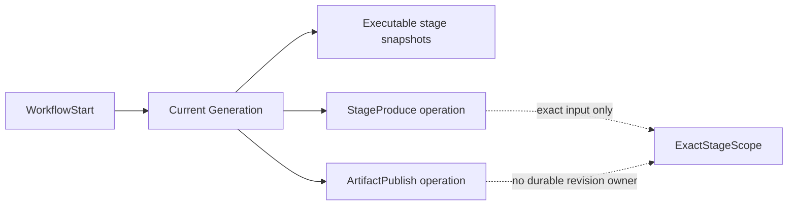
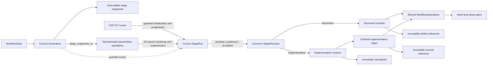

### Summary of change request

Add the durable runtime state that connects the six typed QRSPI stage contracts to the existing WorkflowStart and WorkflowOperation foundation. The runtime must retain tagged StageRun and StageRevision history, implementation steps, exact references, guarded pointers, diagnostics, and the operation relationships later capabilities need. Every transition must decode durable data and atomically reject stale Generation, revision, pointer, or lease authority.

### Current State

- A workflow can be started or restarted, and a confirmed ticket branch creates one current Generation with immutable workflow and stage-definition snapshots.
- The first enabled stage receives shared production and publication operations, but there is no durable run or revision record tying those operations to stage progress.
- Exact stage requests already carry run, revision, source, definition, and repository identity, but the database cannot retain document revisions, implementation revisions, ordered implementation steps, or accepted-revision pointers.
- Operation retries, leases, external intent, uncertain observations, terminal outcomes, and immutable operation history are durable. Equivalent stage-level fencing and history do not yet exist.
- Existing Generations and seeded stage operations predate the full stage runtime and do not contain enough facts to reconstruct it safely.

### Desired End State

- The store exposes strict tagged StageRun, common StageRevision, document-revision, implementation-revision, implementation-step, and immutable-reference records plus atomic creation and replacement primitives. `workflowd-vs3.4.7` decides when to initialize runs, record skips, activate a run, allocate a revision, seed work, or advance a pointer.
- StageRun stores its pending, published, and accepted revision pointers, while the Generation stores only guarded current-stage/current-run cursor fields. `workflowd-vs3.4.7` owns progression policy and successor release from the exact accepted revision.
- Every StageRevision has common identity and lifecycle data plus exactly one tagged document or implementation record. Implementation revisions retain ordered step records and a final checkpoint.
- Production and publication remain in the shared WorkflowOperation lifecycle while durable foreign-key relationships can tie each physical operation to one revision or implementation step. D3 supplies the relationship and insertion seams; `workflowd-vs3.4.4`, `.5`, and `.7` own execution, publication, and orchestration.
- Every state-changing store method checks the current Generation, run, revision, operation revision, pointer values, and applicable lease or external-observation authority in one transaction. A zero-row guarded update returns a typed stale outcome and never retries with weaker predicates.
- WorkflowStart-complete `stage_snapshots_v1` Generations are a nonclaimable bootstrap state. A D3 transaction invoked with caller-selected D7 records supersedes the placeholder operations, inserts exact StageRun, tagged revision, operation-ownership, and pointer state, and changes the Generation to executable `stage_runtime_v1` atomically and idempotently.
- Durable JSON is Schema-decoded, identity-checked, and hash-checked before use. Corrupt mutable operations use their native `data_error` state. A corrupt mutable StageRevision retains the exact normative state set: D3 writes a separate durable diagnostic, abandons the revision, terminates its StageRun as `data_error`, and removes its current authority without guessed repair or automatic replacement. Corrupt immutable authority records block progress.
- Restart reloads the same new-format run, pointer, lease, intent, observation, bootstrap identity, and diagnostic state. Existing `legacy` Generations and operations remain unchanged and fail closed; `workflowd-vs3.4.11` owns their classification, exact offline supersession, verification, and authorization of later ordinary kickoff.

### What we're not doing

- Adding stage-specific queues, workers, stores, Context tags, or dispatch conditionals.
- Selecting or initializing StageRuns, evaluating skips, allocating initial revisions, seeding initial operations, advancing pointers, or choosing when failed revisions should be replaced. Those behaviors belong to `workflowd-vs3.4.7`.
- Implementing producer agents, artifact publication, review, gate, owner-handoff receipts or delivery, Provenance, route, TargetReconcile records, or generic pull-request reconciliation behavior.
- Adding service status, readiness projection, aggregate capacity policy, or owner lifecycle state.
- Converting old seeded stage operations into inferred runs, revisions, sessions, publications, checkpoints, or accepted pointers.
- Resolving dormant legacy work or authorizing its successor; `workflowd-vs3.4.11` owns that offline lifecycle.
- Automatically replacing a revision quarantined for corrupt durable authority. D3 leaves its run in a durable terminal stall for a later explicitly authorized recovery workflow.
- Reopening terminal history, advancing from producer output alone, or discovering accepted inputs from mutable paths or latest-row queries.

### Proposed End State Architecture

Before:



After:



D3 supplies the records and guarded transition family shown after the Generation boundary. It does not make WorkflowStart create StageRuns or invoke the runner lifecycle.

The durable model has three layers:

1. `qrspi_stage_runs` stores one historical run row per `(workflow_id, generation, stage_key, run_ordinal)`. A partial unique index permits one current run per stage in a Generation. The row owns run state and nullable composite foreign keys for pending, published, and accepted revisions.
2. `qrspi_stage_revisions` stores common revision identity, run association, tag, lifecycle state, exact source-set JSON and hash, and timestamps. Document and implementation payload tables use one-to-one primary/foreign keys so each revision has one valid shape rather than a nullable union.
3. Implementation steps and immutable artifact, commit, and checkpoint references remain separate child records. Revision or step rows can uniquely reference the existing physical WorkflowOperation rows that later producer and publisher capabilities create. `qrspi_stage_revision_diagnostics` stores one bounded, typed quarantine diagnostic per readable corrupt revision identity without widening the StageRevision lifecycle enum. Minimal publication-operation identity hooks support later reconciliation without adding a TargetReconcile record; stable owner-crossing identity hooks support later handoff receipts without adding receipt or delivery state.

The store performs cross-row progression in explicit transactions rather than SQL triggers. SQL enforces local shape, keys, foreign keys, state literals, positive ordinals, and one-current-row rules. Effect Schemas and store methods enforce semantic identity, hash equality, allowed state transitions, lease authority, and coordinated pointer movement.

The Generation format is an explicit one-way authority boundary:

```text
legacy
  no online conversion; CAP-D11 owns offline disposition

stage_snapshots_v1
  WorkflowStart-complete snapshots plus nonclaimable placeholder operations
  no StageRun or StageRevision authority exists yet

stage_runtime_v1
  atomically installed StageRuns, tagged revisions, exact operation ownership,
  exact typed operation inputs, and guarded pointers; stage work is claimable
```

The store exposes a guarded bootstrap primitive for `workflowd-vs3.4.7`; D3 does not choose its records or call it from WorkflowStart:

```text
BEGIN
  decode and verify the expected current stage_snapshots_v1 Generation and snapshots
  require the exact base-created placeholder operation revisions and hashes
  require that no placeholder carries a lease, gate answer, output, external intent,
    or uncertain observation that would fabricate a safe disposition
  require the caller's exact stage, run, revision, source, and operation identities
  strictly decode the caller-supplied exact operation inputs
  supersede the placeholder physical operations without rewriting them
  insert the caller-selected StageRun and tagged revision records
  insert higher current physical operation revisions with no retry_of lineage
  insert exact operation-ownership relationships supplied by the caller
  move only the expected Generation and StageRun pointers
  change generation_format to stage_runtime_v1
  if any guarded write affects zero rows: return Stale and roll back
COMMIT
```

The existing WorkflowStart completion transaction continues to retire the prior Generation, preserve historical operations, insert the next `stage_snapshots_v1` Generation and executable snapshots, seed its existing placeholder operation envelope, and succeed WorkflowStart. Those placeholders are durable bootstrap facts, not executable stage work: the new claimer requires `stage_runtime_v1` plus exact revision or step ownership. CAP-D7 later selects enabled and skipped runs, the active run, initial revision, exact sources, and operation inputs, then invokes the D3 transaction.

Bootstrap is idempotent at the complete identity boundary. A retry against matching `stage_runtime_v1` state returns the existing bootstrap; any different run, revision, source hash, operation identity, or pointer is stale or incompatible. A crash before commit leaves the complete `stage_snapshots_v1` state; a lost response after commit is recovered by exact comparison. Snapshot preflight validates both snapshot-bearing formats. No placeholder is decoded as an executable `StageProduceInput`, mutated in place, or exposed to a stage claimer.

Every later transition uses compare-and-set semantics:

```text
BEGIN
  decode and verify all durable rows
  require expected current Generation and Generation format
  require expected current run, state, and pointer values
  require expected revision, kind, source hash, and step position
  require expected current physical operation revision
  require matching unexpired lease when external authority is exercised
  UPDATE ... WHERE every required fence still matches RETURNING ...
  if zero rows: return Stale without applying child or parent effects
  apply pointer, operation, reference, and parent effects
COMMIT
```

### Design Questions

None. The human explicitly auto-approved the recommended option at every design gate.

### Resolved Design Questions

#### How should run and revision records be divided?

Use a mutable StageRun aggregate, a common immutable-identity StageRevision row, and separate one-to-one document and implementation payload rows. Implementation steps are ordered child rows of an implementation revision. This follows the normative tagged union while allowing common lifecycle and pointer checks without nullable variant columns.

Rejected alternatives: one wide nullable revision table would permit false document/implementation combinations; wholly separate revision tables would duplicate identity, monotonic allocation, source-set, and lifecycle rules; encoding the full record only as JSON would weaken relational identity and current-pointer constraints.

#### Which record owns current and accepted pointers?

The Generation owns only the linear current stage/run cursor and current Git head. Each StageRun owns pending, published, and accepted revision pointers as nullable composite foreign keys to revisions from that same run. One current StageRun is allowed per `(workflow, generation, stage)`, and revision numbers increase monotonically across run ordinals for that stage. Creating any higher revision requires the expected prior accepted pointer and clears it in the same transaction before installing new pending work; an older accepted pointer can never coexist with a newer revision.

Rejected alternatives: deriving pointers from the newest row is ambiguous after abandonment or review; putting every revision pointer on Generation mixes linear workflow position with per-stage history; storing only operation references cannot express acceptance authority.

#### How should document and implementation execution share WorkflowOperation?

Keep `workflow_operations` as the single lease, retry, external-effect, observation, and terminal-history envelope. A document revision uniquely references its producer and publication operations. Each implementation step uniquely references its own producer and publication operations. Typed operation input repeats exact stage scope and hashes, while relational ownership gives the authoritative revision association.

Rejected alternatives: per-stage operation tables or workers would duplicate the shared lifecycle; one pair of operations on the implementation revision cannot represent ordered commits and restart between steps; trusting only nested JSON would leave operation-to-revision ownership unenforced.

#### Where should invariants be enforced?

Use `STRICT` SQLite tables, checks, composite foreign keys, unique constraints, and partial current indexes for local storage invariants. Use Schema decoding, canonical hashes, identity comparison, and transaction-scoped compare-and-set updates for cross-record and semantic invariants. Do not add SQL triggers for workflow progression.

Rejected alternatives: SQL-only enforcement cannot validate canonical nested identities or Effect Schema contracts; application-only enforcement permits malformed direct writes and duplicate current pointers; triggers would hide progression logic and make typed stale outcomes and tests harder to reason about.

#### What must fence a state-changing transition?

Every transition rechecks all applicable authority: WorkflowId, current Generation and format, exact repository and definition identity, current StageRun and run state, pending/published/accepted pointers, StageRevision identity and tag, source hash, implementation position, current physical operation revision, attempt, lease token and expiry, and any bound external SHA or observation. A guarded update returning zero rows is a typed stale result; it is never retried with fewer predicates. A later reconciliation capability may consume the separately bound publication identity but does not change this result.

Rejected alternatives: checking only the operation lease misses Generation and pointer replacement; checking currentness before a later unguarded update creates a race; throwing an unclassified SQL error for zero rows loses the expected stale-work path.

#### How should revision replacement preserve history?

Expose an atomic replacement primitive that allocates `max(stage_revision) + 1` within the stage identity, retains the prior revision, marks its nonterminal lifecycle abandoned or superseded as directed by the typed transition, supersedes its nonterminal operations, clears the expected pending, published, and accepted pointers, inserts the replacement revision and exact operation relationships, and installs the new pending pointer in one transaction. The primitive rejects any unexpected accepted pointer, and no creation path may leave an older revision accepted after a higher revision exists. Operation retry revisions remain distinct from StageRevision replacement. `workflowd-vs3.4.7` owns the failure policy and event that invokes this primitive.

Rejected alternatives: mutating a terminal revision destroys audit history; reusing a revision number makes immutable references ambiguous; treating terminal publication failure as an operation retry can bind new publication intent to an already terminal revision.

#### How should malformed durable state be handled?

Decode each row with Effect Schema using excess-property rejection, compare nested identity to relational columns, and recompute canonical hashes before transition logic. A corrupt mutable WorkflowOperation with readable identity uses its native terminal `data_error` path. A corrupt mutable StageRevision cannot use `data_error`, because its normative states are exactly `producing`, `publishing`, `reviewing`, `waiting_human`, `accepted`, `abandoned`, `failed`, and `superseded`.

Quarantine a corrupt nonterminal revision only while its current StageRun is also nonterminal. In one guarded transaction, insert or recover the unique `qrspi_stage_revision_diagnostics` row; move the revision to `abandoned`; move the StageRun to terminal `data_error`; clear every pending, published, or accepted pointer that names the corrupt revision; supersede nonterminal child operations that have no uncertain external effect; cancel their pending gates; clear their leases and fence producer workspace mutation; preserve intent, observation, commits, and workspace custody required to resolve any uncertain external effect; retain the Generation cursor on the terminal run; and release no successor or replacement. A later observation may record stale or reconciliation evidence but cannot advance this run.

The diagnostic records the readable revision identity, tag, observed state, bounded message, reason (`malformed`, `missing`, `duplicate`, `reordered`, `hash_mismatch`, or `identity_mismatch`), and expected/actual identity or hash where available. Repeating the same quarantine recovers the same diagnostic and terminal disposition. Any changed Generation, run, pointer, operation revision, lease, or workspace authority returns typed stale and rolls back the whole quarantine. A corrupt terminal StageRevision or terminal StageRun is immutable history: record or recover the diagnostic, block every current transition that depends on it, and do not rewrite its state or pointers. Corrupt immutable ticket, definition, snapshot, or reference authority follows the same fail-closed rule without fabricated repair.

Rejected alternatives: adding `StageRevision.data_error` violates the normative state set; changing only a child operation leaves corrupt revision pointers authoritative; ordinary `failed` plus automatic replacement turns corruption into retry policy without trusted source authority; creating a replacement or higher run during quarantine invents an authorization event; leaving pointers intact permits advancement; rewriting malformed data hides corruption; deleting uncertain-effect workspace custody prevents authoritative recovery.

#### How does fresh Generation bootstrap become executable safely?

Treat `stage_snapshots_v1` as the durable pre-runtime state already created by WorkflowStart and add `stage_runtime_v1` as the only executable stage-runtime format. CAP-D7 supplies the selected run, skip, source, revision, and work identities; D3 atomically verifies and supersedes the exact placeholder physical operations, inserts higher current operation revisions with strict typed inputs and relational ownership, installs all selected runtime records and pointers, and changes the format. Stage claims require `stage_runtime_v1` and exact ownership.

The placeholder rows remain immutable history and replacement operation revisions have no `retry_of`, because bootstrap changes work identity rather than retrying failed work. Exact duplicate bootstrap returns the installed identity. Stale, incompatible, and partially corrupted placeholders produce no effects; crash before commit leaves the pre-runtime state intact, while restart after a lost response recovers the committed identity.

Rejected alternatives: putting D7 policy into WorkflowStart crosses the accepted capability boundary; treating `stage_snapshots_v1` as executable exposes input that intentionally fails `StageProduceInput`; rewriting placeholder inputs in place destroys physical-operation history; routing every fresh snapshot Generation through CAP-D11 misclassifies known online bootstrap state as legacy; removing placeholder seeding is a broader change and still requires the same atomic format boundary.

#### How should restart and legacy Generations behave?

Add only numbered append-only migrations. `stage_snapshots_v1` resumes or retries online bootstrap; `stage_runtime_v1` resumes from durable leases, pointers, intent, observations, and diagnostics. Existing `legacy` Generations and child operations remain byte-for-byte historical facts and receive no inferred StageRun or StageRevision records. Generation format plus relational revision association makes new claimers fail closed on both legacy and pre-bootstrap work. `workflowd-vs3.4.11`, not D3, owns classifying dormant legacy rows, exact offline supersession, verification, and permission for ordinary WorkflowStart to create a successor.

Rejected alternatives: eager conversion would invent missing workspace, checkpoint, final-SHA, and publication facts; claiming old seeded operations under the new runtime would bypass required fences; deleting old rows would lose terminal and uncertain-effect history.

#### Which neighboring records belong in this capability?

Persist only the QRSPI-owned relationships needed to keep D3 transitions exact: immutable artifact, implementation-commit, and checkpoint reference shapes; exact producer/publication operation ownership; a stable owner-crossing identity hook; and a publication-operation identity hook. `workflowd-vs3.4.5` and `.7` populate and act on immutable references, `.8` owns handoff receipts and delivery state, and `.6` owns TargetReconcile records, evidence, observation, and resolution. D3 adds none of those neighboring lifecycles or state machines.

Rejected alternatives: omitting the relationships would force later migrations to weaken current transitions; implementing neighboring workers here would cross accepted ownership and capability boundaries.

#### What is the testing boundary?

Test the domain Schemas and store transition family against real SQLite. Migration tests inspect table shape, strictness, checks, foreign keys, and partial indexes. Store tests cover each tagged variant, monotonic replacement, atomic clearing of an expected prior accepted pointer, rejection of any stale accepted pointer, all stale fence dimensions, rollback, corruption quarantine, and terminal-history retention. Bootstrap tests prove placeholders are unclaimable, replacement is atomic and idempotent, exact inputs decode, the first installed operation can be claimed only through `stage_runtime_v1` and exact ownership, both snapshot-bearing formats pass preflight, and restart recovers pre- or post-commit state. Quarantine tests cover malformed and excess JSON, missing rows, duplicate and reordered children, tag and relational-identity mismatch, and canonical-hash mismatch; they prove a separate diagnostic, revision `abandoned`, run `data_error`, exact pointer and child effects, terminal-history preservation, uncertain-effect custody preservation, no successor, rollback, stale fencing, and restart recovery. File-backed tests start from the previous migration runner, create and reopen every required StageRun, common and tagged revision, implementation-step, immutable-reference, diagnostic, pointer, and operation-relationship record family, and prove legacy preservation plus both new-format recovery boundaries.

Rejected alternatives: mock-only store tests cannot prove SQL constraints or rollback; migration snapshots alone cannot prove semantic fencing; in-memory-only tests cannot prove upgrade and restart behavior.

### Patterns to follow

These show the patterns found in the existing codebase that will be followed to implement the proposed end state architecture.

#### Append-only strict migrations

Number new migrations after the current frontier and retain a historical runner for file-backed upgrade fixtures - `src/store/migrations.ts:575-640`.

```ts
yield* sql`
  CREATE TABLE qrspi_stage_definitions (
    stage_definition_sha256 TEXT NOT NULL,
    definition_json TEXT NOT NULL CHECK (
      json_valid(definition_json) = 1
        AND json_type(definition_json, '$') = 'object'
    ),
    PRIMARY KEY (workflow_definition_sha256, stage_definition_sha256)
  ) STRICT
`

export const runStoreMigrations = Migrator.make({})({
  loader: Migrator.fromRecord({
    ...migrationsThrough0008,
    "0009_qrspi_stage_definitions": qrspiStageDefinitions,
    "0010_qrspi_generation_format": qrspiGenerationFormat,
  }),
})
```

The stage-runtime migration will use the same strict local checks and append-only registration. Existing rows will be preserved rather than rebuilt; D3 adds `stage_runtime_v1`, keeps existing `stage_snapshots_v1` as the pre-runtime online bootstrap state, and makes new claimers fail closed on every other format. `workflowd-vs3.4.11` owns full `legacy` classification.

#### Immutable history with one guarded current row

Use composite historical identity plus a partial unique index, then retire the old pointer before inserting its monotonic successor in one transaction - `src/store/migrations.ts:471-530`, `src/qrspi/store.ts:799-849`.

```sql
UNIQUE (logical_operation_id, operation_revision);

CREATE UNIQUE INDEX workflow_operations_current
ON workflow_operations (logical_operation_id)
WHERE is_current = 1;
```

```ts
const revisions = yield* sql<{ readonly revision: number }>`
  SELECT coalesce(max(operation_revision), 0) + 1 AS revision
  FROM workflow_operations
  WHERE logical_operation_id = ${logicalOperationId}
`
```

StageRun currentness and StageRevision allocation will follow this pattern without updating historical identities in place.

#### Lease and currentness compare-and-set

Put every authority predicate in the mutation and map zero returned rows to stale - `src/qrspi/store.ts:915-948`.

```ts
sql<{ readonly operation_id: string }>`
  UPDATE workflow_operations
  SET external_intent_json = ${intentJson}, updated_at = ${now.toISOString()}
  WHERE operation_id = ${operationId}
    AND state = 'leased'
    AND is_current = 1
    AND lease_token = ${leaseToken}
    AND lease_until > ${now.toISOString()}
  RETURNING operation_id
`.pipe(Effect.map((rows) => (rows.length === 1 ? "recorded" : "stale")))
```

Stage-runtime mutations will add Generation, run, revision, pointer, source, and step predicates to the same compare-and-set boundary.

#### Schema decode, semantic identity, and quarantine

Decode strict JSON, compare tags, recompute hashes, and quarantine only the identified mutable work - `src/qrspi/store.ts:534-597`.

```ts
const input = yield* Schema.decodeUnknown(Schema.parseJson(StageProduceInput), {
  onExcessProperty: "error",
})(row.input_json)

const actualSha256 = canonicalSha256(input)
if (actualSha256 !== row.input_sha256) {
  return yield* Effect.fail(dataError(
    "workflow_operation",
    operationId,
    "operation input hash does not match",
    { reason: "hash_mismatch", expectedSha256: row.input_sha256, actualSha256 },
  ))
}
```

```ts
UPDATE workflow_operations
SET state = 'data_error',
    lease_owner = NULL,
    lease_token = NULL,
    lease_until = NULL,
    terminal_failure_reason = ${error.message}
WHERE operation_id = ${error.recordId}
```

The new decoders will perform equivalent relational-key, nested-identity, tag, ordering, and hash checks before any pointer can advance.

StageRevision quarantine follows the repository's separate-diagnostic pattern rather than widening a lifecycle enum - `src/store/migrations.ts:276-314`, `src/store/jobs.ts:240-286`. The revision diagnostic and aggregate containment commit together: diagnostic insertion, `StageRevision.abandoned`, `StageRun.data_error`, pointer clearing, child supersession or uncertain-effect preservation, gate cancellation, and authority fencing all roll back on stale identity or transaction failure.

#### Preserve distinct tagged output shapes

Share the union boundary without forcing document and implementation values into one payload - `src/qrspi/contracts/common.ts:388-400`, `src/qrspi/contracts/implementation.ts:59-74`.

```ts
export const PreparedStageOutput = Schema.Union(
  Schema.TaggedStruct("Document", {
    text: BoundedMarkdown(MAX_DOCUMENT_RESULT_BYTES),
  }),
  Schema.TaggedStruct("ImplementationStep", {
    value: JsonValueSchema,
  }),
)
```

The durable StageRevision Schema will preserve the same discriminated boundary while each variant decodes from its own relational payload record.

#### File-backed upgrade and restart coverage

Create a database at the prior migration frontier, close the layer, then construct a fresh current layer around the same file - `test/qrspi/workflow-start.test.ts:1938-2060`.

```ts
yield* runStoreMigrationsThrough0008
yield* sql`INSERT INTO workflow_operations (...) VALUES (...)`

await expect(start(filename, fake)).resolves.toMatchObject({
  _tag: "Started",
  generation: 1,
})
```

Stage-runtime tests will use the current pre-runtime migration runner as their fixture boundary and will assert unchanged legacy rows, fail-closed legacy and pre-bootstrap claiming, atomic bootstrap into `stage_runtime_v1`, and recoverable runtime and quarantine records after reopening. They do not test the offline classification or resolution commands owned by `workflowd-vs3.4.11`.
