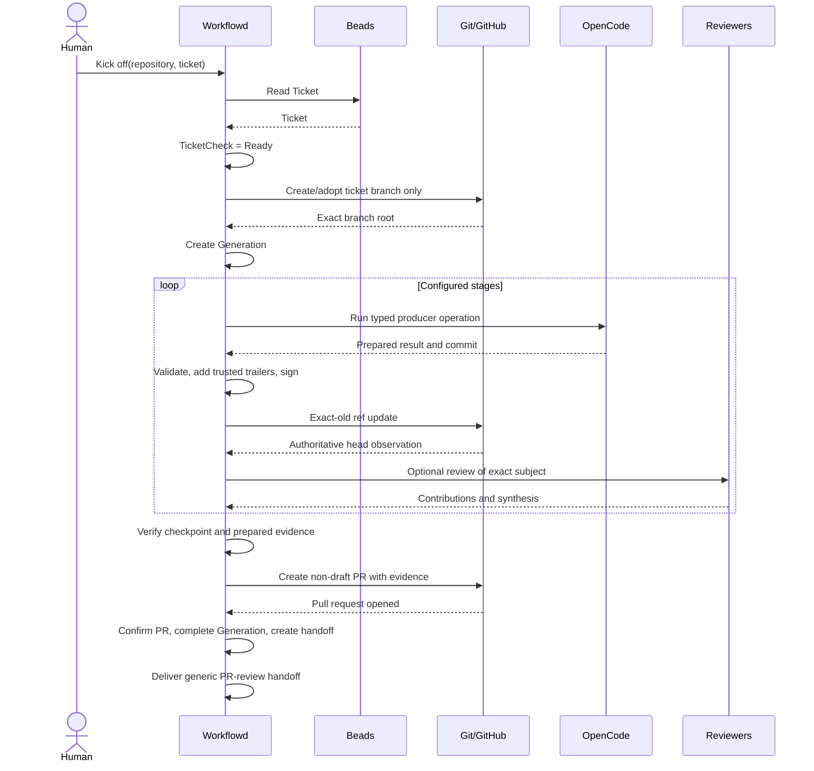
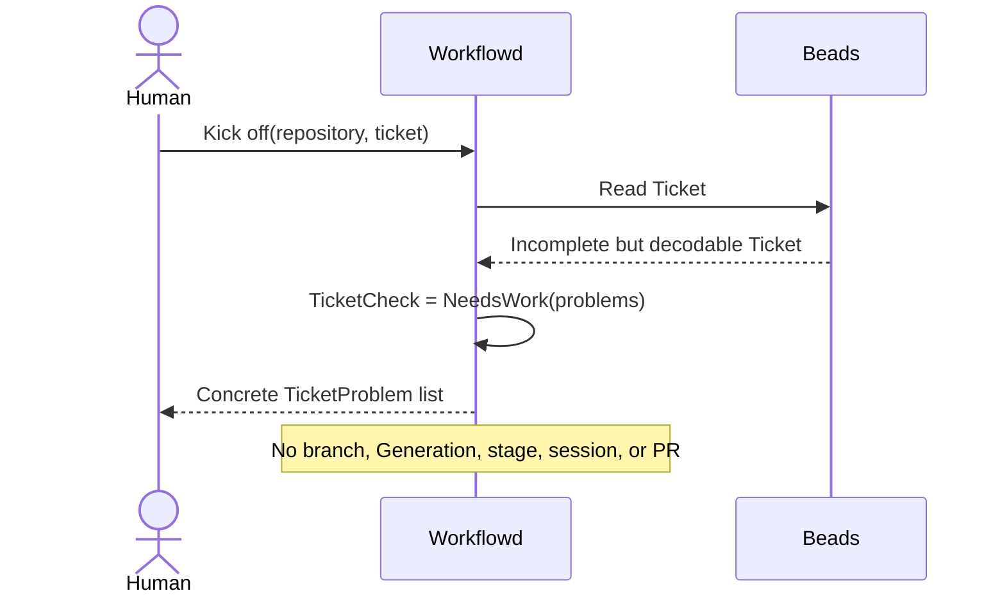
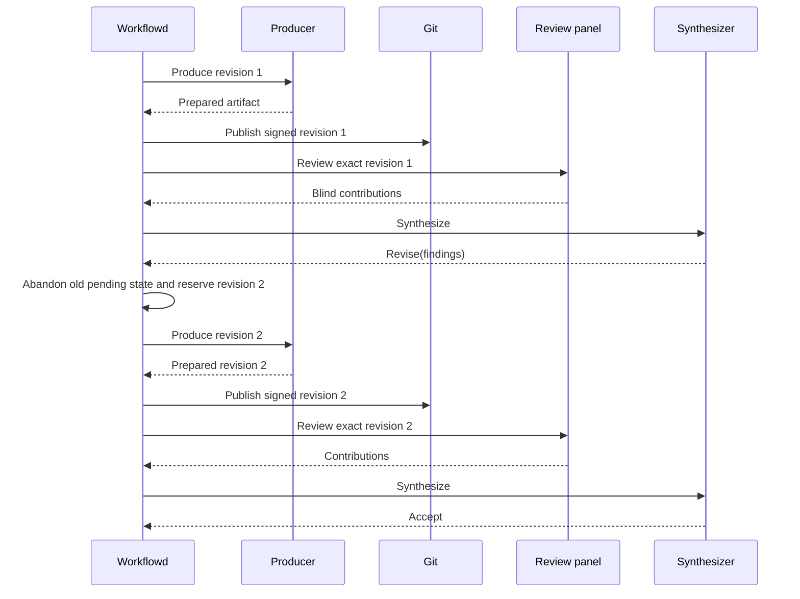
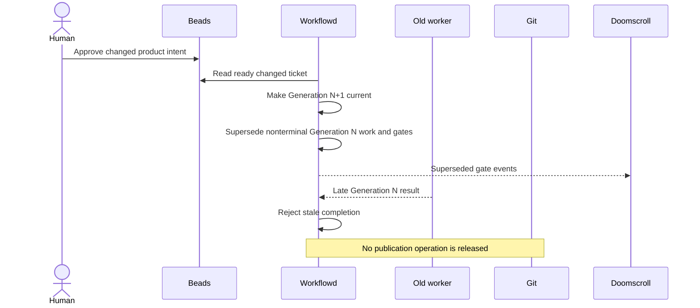
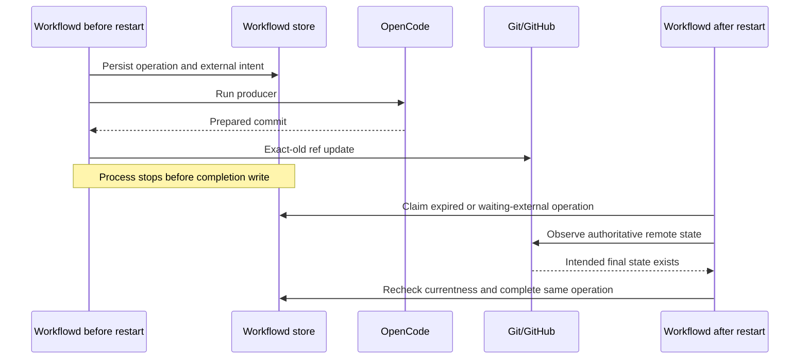

# QRSPI Workflow Contract

## Status and Scope

This document defines the durable contracts and lifecycle rules for bead-native QRSPI
work. It fixes system ownership, identities, stage progression, review, human gates,
Git publication, final pull-request creation, cancellation, supersession, and recovery.

It does not define SQL tables, prompts, UI layout, or worker class structure. Follow-on
implementation work may choose those details only when it preserves this contract.

The words MUST, MUST NOT, SHOULD, and MAY are normative.

## Core Decisions

1. A valid but incomplete Beads ticket decodes so Workflowd can explain what is
   missing. Ticket decoding and readiness judgment are separate operations.
2. QRSPI runs on one deterministic ticket branch without a pull request.
3. Questions, research, design, structure, and plan artifacts are committed to that
   branch and reviewed by immutable Git identity.
4. A non-draft pull request is created only after required stages, implementation,
   verification, delivery evidence, and human gates are complete.
5. Beads owns product intent. Git owns artifact and implementation content. Workflowd
   owns operational state.
6. One shared `WorkflowOperation` contract governs leases, retries, replacement,
   external effects, observation, operator intervention, and recovery.
7. An expected signed QRSPI commit advances one workflow generation. It does not create
   a new generation merely because the ticket-branch head changed.

## System Boundaries

| System | Owns | Must not own |
| --- | --- | --- |
| Beads | Ticket identity, product intent, acceptance criteria, BDD scenarios, source references, and dependency links | Stage queues, leases, review rounds, gates, or sessions |
| Workflowd | Workflow generations, operations, stage and review state, currentness, gates, session references, and publication intent | Editable product intent or canonical artifact content |
| Git repository | Signed stage commits, canonical stage artifacts, implementation changes, and reachable history | Queue state, retries, gates, or transcripts |
| GitHub pull request | Current merge-candidate presentation and delivery evidence after QRSPI completion | Planning-stage review or ticket readiness |
| Provenance | Selected questions, proposals, contributions, synthesis, and ratified product meaning | Worker, lease, gate, or session state |
| Doomscroll | Presentation of pending gates and action-delivery status | Gate truth or approval authority |
| Plannotator | Optional interactive annotation of one exact artifact | Durable gates or asynchronous approval |
| OpenCode | Server-resident conversation and structured agent output | Canonical artifacts, workflow state, or approval authority |

When records disagree, the current accepted ticket revision owns product meaning. Git
owns artifact bytes. Workflowd decides whether work, review, response, or publication
is current.

## Common Identity and Hashing

### References

`RepositoryReference` contains:

```text
providerInstanceId
repositoryId
repositoryFullName
```

The provider instance and immutable provider repository ID form identity. The full name
is a mutable locator and display value.

`TicketReference` contains tracker kind, tracker-instance ID, and native ticket ID.
`PullRequestReference` contains `RepositoryReference` and provider-native PR number.

QRSPI v1 requires the Beads workspace bound to the target repository and a branch in
that same repository. It rejects cross-workspace tickets and fork branches.

`WorkflowId` identifies one `RepositoryReference` and `TicketReference` pair.
`ControllerId` is a stable Workflowd installation UUID stored with its database.
Durable work identity is `ControllerId` plus the record ID, never a process name.

### Canonical hashes

Contract hashes use SHA-256 over UTF-8 RFC 8785 canonical JSON after Unicode NFC string
normalization. Non-finite numbers and negative zero are rejected. Each hash preimage
includes contract and normalization versions.

`ticketRevisionSha256` hashes normalized product fields and computed scenario coverage.
It excludes its own digest, check time, and tracker observation metadata.

`workflowDefinitionSha256` and `stageDefinitionSha256` hash complete normalized
definitions while excluding digest fields. `contentSha256` hashes exact artifact bytes.

## Ticket Contract

### Ticket and ReadyTicket

`Ticket` is the bounded Beads record Workflowd reads. Readiness fields are optional raw
values so an incomplete ticket still decodes. It contains:

```text
TicketReference
native Beads issue type
optional title
optional user story
optional description
optional source and out-of-scope entries
optional acceptance-criteria entries
optional scenario entries
```

Missing identity, issue type, or malformed bounded fields produce `TicketReadError`.
Missing or weak readiness fields produce `TicketProblem` instead.

`ReadyTicket` requires:

1. A title that names the desired change.
2. Product-focused context describing current behavior, affected actor or system,
   desired result, value, and known limits.
3. A user story when it helps new feature work identify actor, capability, and value.
   Bugs, chores, and work without a meaningful actor MUST NOT receive a fake story.
4. Observable acceptance criteria.
5. Named Given/When/Then scenarios that make every criterion concrete.
6. Resolvable source references.
7. No unresolved contradiction that changes product meaning.

Criterion-to-scenario coverage is explicit trusted readiness evidence supplied with the
readiness judgment. It uses positions in the captured normalized arrays. The ticket does
not require a `Covers` field or a new persistent identifier scheme.

### TicketCheck

The durable boundary returns:

```text
Ready
  readyTicket
  ticketRevision
  checkedAt

NeedsWork
  ticket
  non-empty TicketProblem[]
  checkedAt
```

Initial problem codes are:

```text
missing_title
unclear_title
missing_description
unclear_product_outcome
missing_user_story
inappropriate_user_story
missing_acceptance_criteria
unobservable_acceptance_criterion
missing_scenarios
invalid_scenario
uncovered_acceptance_criterion
unresolved_source
contradictory_product_direction
```

`missing_user_story` applies only when a readiness judgment establishes that a story is
appropriate. Schema decoding alone cannot make that judgment.

A `NeedsWork` result creates no branch, generation, stage, or technical session.

### Inputs not required at kickoff

Readiness MUST NOT require research questions, research, design decisions, structure,
plans, technical tasks, delivery evidence, or a prescribed proof method. Those are
QRSPI or implementation outputs.

The implementing agent chooses delivery evidence and eventually places scenario-linked
evidence on the final pull request.

### TicketRevision and product changes

`TicketRevision` stores the normalized `ReadyTicket`, computed scenario coverage,
source revision when available, check time, and `ticketRevisionSha256`. It is immutable
historical input, not another editable ticket.

Technical artifacts may clarify implications but MUST NOT silently replace product
intent, acceptance criteria, or scenarios. A proposed product change creates a human
gate against the exact proposal artifact.

Approval creates ticket-update work for the exact approved change. Workflowd then reads
and checks Beads again. A changed ready ticket creates a newer generation. A not-ready
or unreadable result remains waiting for product or operator input.

Rejection may restore prior stage state only when Beads still matches the captured
revision and gate policy permits continuation. If Beads has changed, the old generation
cannot continue against stale product authority.

Workflowd currentness is scoped to the latest ticket revision it has observed. It does
not claim protection during the interval before a ticket-change event or reconciliation
read arrives.

## Workflow and Generation

### Workflow start

`WorkflowStart` is a workflow-scoped `WorkflowOperation` used before a Generation
exists. It:

1. Checks the ticket.
2. Selects and persists one branch name:

   ```text
   <ticket-type>/<ticket-id>-<slug>
   ```

3. Verifies that no open pull request exists for that branch.
4. Creates or adopts the branch through an exact repository operation.
5. Rechecks ticket revision, definition, base target, and remote branch.
6. Creates the Generation and succeeds atomically.

Later title or issue-type edits do not recompute or rename the persisted branch.

Concurrent starts with the same repository, ticket revision, definition, base target,
and branch resolve to the same logical operation. A changed input supersedes the old
start. Retrying a terminal failure creates a replacement operation; terminal history is
never reopened.

### WorkflowTarget

One Generation pins:

```text
repository: RepositoryReference
baseRef
baseSha
headRef
rootSha
ticketRevisionSha256
workflowDefinitionSha256
```

`rootSha` is the accepted branch head when the Generation starts. `currentHeadSha` is a
mutable cursor advanced only by confirmed current Workflowd publication.

These changes require a newer Generation after reconciliation accepts them:

- ticket revision;
- base ref or accepted base commit;
- head ref or repository;
- branch history replacement or rebase;
- unexpected external branch mutation; or
- adopted workflow definition.

Expected signed stage and implementation commits advance `currentHeadSha` within the
same Generation.

### Generation lifecycle

Generation states are:

```text
running
waiting_ticket
waiting_human
reconciling
finalizing
completed
rejected
cancelled
failed
superseded
```

The last five are terminal.

| From | Event | To |
| --- | --- | --- |
| creation | WorkflowStart succeeds | `running` |
| `running` | ticket becomes not-ready or unreadable | `waiting_ticket` |
| `waiting_ticket` | ready changed ticket accepted | `superseded`; create next Generation |
| `waiting_ticket` | valid restore response against unchanged ticket | persisted prior state |
| `running` | required human gate opens | `waiting_human` |
| `waiting_human` | gate resumes work | `running` or `waiting_ticket` |
| active state | target ambiguity appears | `reconciling` |
| `reconciling` | exact target is restored | persisted prior state |
| `reconciling` | changed target is accepted | `superseded`; create next Generation |
| `running` | required stages finish and finalization is required | `finalizing` |
| `finalizing` | final PR publication succeeds | `completed` |
| `running` | plan-only configured stages finish | `completed` |
| nonterminal state | required stage or finalization fails by policy | `failed` |
| nonterminal state | required approval is rejected | `rejected` |
| nonterminal state | cancellation is accepted | `cancelled` |
| nonterminal state | newer Generation is made current | `superseded` |

Only one Generation for a `WorkflowId` is current. Creating a successor does not rewrite
an already terminal predecessor's outcome.

## WorkflowOperation

### Purpose

`WorkflowOperation<I, O>` is the shared durable contract for claimable or externally
observed work. Operation kinds include:

```text
WorkflowStart
StageProduce
ArtifactPublish
ReviewContribute
ReviewSynthesize
TicketUpdate
TargetReconcile
ProvenancePublish
PrePullRequestVerify
PullRequestPublish
PullRequestRetire
GenericReviewHandoff
```

Each kind has its own Effect Schema input and output. The shared lifecycle is not a
stringly typed replacement for those domain contracts.

### Fields

```text
operationId
logicalOperationId
operationRevision
retryOf, when this replaces a terminal operation
kind
scope: WorkflowScope | GenerationScope
typed input
typed output, when complete
state
attempt and retry policy
lease owner, token, and expiry
runAt
external intent and observation, when applicable
observation attempts and policy
parent effect on success, failure, cancellation, and data error
last error
createdAt and updatedAt
```

Only one operation revision is current for a `logicalOperationId`.

### States and transitions

```text
blocked
ready
leased
waiting_external
waiting_human
succeeded
failed
cancelled
superseded
data_error
```

The last five are terminal.

| From | Event | To |
| --- | --- | --- |
| `blocked` | prerequisites succeed | `ready` |
| `ready` | claim succeeds | `leased` with new attempt and random lease token |
| expired `leased` | recovery claim succeeds | `leased` with new attempt and token |
| `leased` | pure/local operation succeeds | `succeeded` |
| `leased` | retryable local failure | `ready` with future `runAt` |
| `leased` | retry budget is exhausted | `failed` and apply parent effect |
| `leased` | durable external intent is stored | perform effect, then `waiting_external` |
| `waiting_external` | observation confirms intended result | `succeeded` |
| `waiting_external` | observation proves effect absent and retry remains | `ready` |
| `waiting_external` | outcome remains unknown within observation budget | remain `waiting_external` |
| `waiting_external` | observation budget is exhausted | `waiting_human` with operation gate |
| `waiting_human` | response schedules observation or same-record retry | `waiting_external` or `ready` |
| `waiting_human` | response fails or cancels operation | `failed` or `cancelled` |
| nonterminal state | scope loses currentness | `superseded` |
| nonterminal state | stored record cannot decode with readable identity | `data_error` |

An unknown external result MUST NOT become `failed` merely because mutation attempts
are exhausted. It remains observable or waits for an operator.

Terminal operations never reopen. Retrying a terminal operation creates a replacement
with incremented `operationRevision` and `retryOf`. The replacement becomes current for
the logical operation. A replacement is allowed only when the operation kind's parent
state remains current.

Artifact publication with a terminal failure is not replaced in place. Recovery creates
a new StageRevision and therefore a new logical publication identity.

### Leases and fencing

Only the exact unexpired lease token may mutate leased work. Reusing a worker name does
not restore authority. A replacement attempt receives a new token and attempt-specific
workspace.

Execution timeout and lease expiry are separate. Lease duration MUST exceed execution
timeout plus cancellation and durable completion time.

No lease is held while waiting for a human.

### Currentness by scope

`WorkflowScope` operations verify exact WorkflowId, logical operation and revision,
input target, lease token when leased, and that no replacement or conflicting resolution
has precedence. They may intentionally refer to a terminal Generation without changing
its outcome.

`GenerationScope` operations additionally verify current Generation, exact target,
StageRun and revision where applicable, review subject and round where applicable, and
gate revision where applicable.

Currentness is checked in the same transaction as every durable state advance.

### External-effect protocol

Every external mutation follows one protocol:

1. Under the current lease, persist exact intended target, idempotency identity, and
   expected prior external state.
2. Perform the external effect.
3. Observe authoritative external state.
4. In one transaction, recheck operation currentness, store the observation, complete
   the operation, and apply its parent success effect.

If currentness is lost after the effect, Workflowd records the stale effect and enters
the operation's reconciliation path. It cannot pretend the external write did not
happen, but it MUST NOT advance the stale parent.

### Parent effects

Every operation declares parent effects when created. A terminal child can therefore
never leave its aggregate waiting without claimable work or a gate. Effects are selected
from:

```text
advance parent
keep parent and replace operation
open operation-scoped gate
fail StageRun
fail Generation
cancel Generation
audit only
```

## Git Branch and Artifact Contract

### Branch and artifact paths

QRSPI uses the persisted ticket branch without opening a pull request.

Default artifact paths are:

```text
docs/qrspi/<ticket-id>/01-questions.md
docs/qrspi/<ticket-id>/02-research.md
docs/qrspi/<ticket-id>/03-design.md
docs/qrspi/<ticket-id>/04-structure.md
docs/qrspi/<ticket-id>/05-plan.md
```

A repository policy may change the root and enabled stages but MUST produce a
deterministic repository-relative path. Paths reject absolute paths, parent traversal,
Git internals, symlink ancestors, gitlinks, submodules, and destinations outside the
configured root. Writes use no-follow operations.

Revisions update the same path in later commits. Immutable identity, not branch path,
selects content for review.

### ArtifactReference

```text
repository: RepositoryReference
workflowId
generation
stageKey
stageRevision
commitSha
path
blobSha
contentSha256
mediaType
```

`commitSha` is the final signed commit. Worktree path, mutable branch URL, session ID,
or future PR head is not artifact identity.

Markdown is the default format. HTML is allowed only when the private presentation
layer renders it safely.

### Signed commit publication

The producer prepares one non-merge commit whose sole parent is the Generation's
`currentHeadSha`. It does not push.

Workflowd verifies the complete parent-to-candidate tree diff, expected paths and
content, and structured output. It removes candidate provenance trailers, adds trusted
runtime values in this order, and signs the commit:

```text
Provenance-Version
Ticket
Workflowd-Job
Session
Harness
Agent
Model
```

`Workflowd-Job` resolves `ControllerId` and durable operation. `Session` resolves a
Workflowd `SessionReference`. Agent and model are exact trusted runtime values, not
aliases supplied by repository code.

The `ArtifactPublish` operation binds exactly one final SHA. Another SHA for the same
operation is a reconciliation conflict.

Remote update is exact compare-and-set:

```text
updateRef(
  headRef,
  expectedOld = currentHeadSha,
  new = finalSha,
  fastForwardOnly = true
)
```

The adapter rejects an ancestor rollback, descendant, any other old value, and every
non-fast-forward update. An ordinary push without exact-old protection does not satisfy
the contract.

Publisher or optional repository push event verifies signature and trailers, matches
the operation, reads the authoritative remote ref, and applies the shared external
completion transaction. A delayed event for older succeeded work is ignored only when
the remote still equals the stored current cursor; rollback enters reconciliation.

There is no pull-request synchronization during QRSPI stage work.

### Workspace handoff

Producer completion atomically binds the final local commit to `ArtifactPublish`,
completes producer work, fences producer workspace access, and transfers immutable
workspace custody to publication. If this transaction fails, producer remains
incomplete and publication remains blocked.

After transfer, publication may verify and publish but cannot edit the commit.

### Git retention

Workflowd does not rebase or force-push accepted ticket history. Artifact commits are
guaranteed reachable while the branch or a preserving merge retains them. After PR
closure, deletion, or squash merge, repository Git retention governs old commit
availability. Missing historical content is explicit; references never redirect.

## Stage Contract

### WorkflowDefinition

`WorkflowDefinition` is versioned trusted server configuration. Repository-controlled
prompts, plugins, models, or schemas MUST NOT replace it while untrusted work runs.

V1 is a linear sequence. Each `StageDefinition` declares:

```text
unique key and kind
enabled or conditional policy
bounded typed inputs
producer agent, model, timeout, and retry policy
stage-specific request and result schemas
artifact or implementation checkpoint contract
automated review policy
human-gate policy
```

Initial configurable stages are Questions, Research, Design, Structure, Plan, and
Implementation. Disabled stages create no run. A considered conditional stage may be
recorded as skipped with its policy reason.

The ticket always outranks technical artifacts for product meaning. Among accepted
technical artifacts, later stages refine earlier technical detail:

```text
Plan > Structure > Design > Research > Questions
```

A later artifact cannot override the ticket.

### StageRun

StageRun states are:

```text
blocked
active
waiting_review
waiting_human
waiting_ticket
succeeded
skipped
rejected
failed
cancelled
superseded
data_error
```

The last seven are terminal.

StageRun stores `publishedRevision`, `pendingRevision`, and `acceptedRevision`. At most
one revision is pending. Successor stages consume only `acceptedRevision`.

| From | Event | To |
| --- | --- | --- |
| `blocked` | prior stage succeeds or this is first | `active` |
| `blocked` | condition excludes stage | `skipped` |
| `active` | current revision publishes and no review/gate is required | `succeeded` |
| `active` | current revision publishes and review is required | `waiting_review` |
| `waiting_review` | synthesis accepts and no gate remains | `succeeded` |
| `waiting_review` | synthesis requests revision | `active` with next revision |
| `waiting_review` | synthesis asks human | `waiting_human` |
| `waiting_human` | approve | policy-selected `succeeded`, `active`, or `waiting_review` |
| `waiting_human` | request changes | `active` with next revision |
| `waiting_human` | approve product change | `waiting_ticket` |
| `waiting_ticket` | ready changed ticket arrives | `superseded` with Generation |
| nonterminal | required child operation fails by declared effect | `failed` or `waiting_human` |
| nonterminal | cancellation | `cancelled` |
| nonterminal | newer Generation | `superseded` |

A succeeded or skipped stage releases only the next configured stage.

### StageRevision

StageRevision is a tagged union.

`DocumentStageRevision` contains:

```text
revision ordinal
source ArtifactReferences
one StageProduce operation
one ArtifactPublish operation
prepared structured result
final ArtifactReference, when published
current ReviewRound, when any
state
```

`ImplementationStageRevision` contains:

```text
revision ordinal
source ArtifactReferences
ordered ImplementationStep[]
prepared delivery evidence
ImplementationCheckpointReference, when complete
current ReviewRound, when any
state
```

Each `ImplementationStep` contains contiguous position, one producer operation, one
publication operation, session references, structured commit result, and final
`ImplementationCommitReference` when published.

Revision states are `producing`, `publishing`, `reviewing`, `waiting_human`, `accepted`,
`abandoned`, `failed`, and `superseded`. The last four are terminal.

When failed publication recovery needs a new revision, one transaction marks the old
revision `abandoned`, clears `pendingRevision`, reserves the next ordinal, creates its
producer and blocked publication operations, and sets the new pending pointer. A failed
revision never remains pending.

A document publication with no review or gate sets published and accepted pointers
together. Otherwise publication sets published; review or gate sets accepted.

### Implementation loop

Each implementation commit follows the signed exact-parent publication contract.

Confirming an intermediate step atomically appends its commit reference and creates the
next producer plus blocked publication operation. The next producer receives a new
attempt workspace rooted at the confirmed commit.

The final producer marks its step final and supplies bounded `PreparedDeliveryEvidence`
with ticket-scenario links. Final commit confirmation validates that evidence, assembles
`ImplementationCheckpointReference`, and forbids another implementation step.

The checkpoint contains repository, workflow, generation, stage and revision, stable
checkpoint ID, base and final SHAs, ordered commit references, changed paths, and
`preparedDeliveryEvidenceSha256`. It contains no pull-request identity.

## Automated Review and Synthesis

Configured stages may open a ReviewRound against exactly one `ReviewSubject`:

```text
ArtifactReference | ImplementationCheckpointReference
```

Reviewers receive the same subject and bounded sources. They cannot mutate repository
state or see other contributions before submitting their own.

Each reviewer slot accepts at most one valid immutable contribution. Contributions
record trusted reviewer/session identity, exact subject, claims, evidence, verdict,
risks, objections, uncertainty, suggestions, and timestamps.

ReviewRound states are:

```text
collecting
synthesizing
waiting_human
accepted
revision_requested
failed
cancelled
superseded
data_error
```

The last six are terminal.

Collection closes when all slots respond or its deadline passes with the configured
minimum valid contributions. Missing reviewers are never counted as agreement.

Synthesis preserves consensus, contested claims, minority objections, evidence gaps,
unsupported speculation, open questions, and required human decisions. It returns:

```text
Accept
Revise(actionable findings)
AskHuman(question, contested claims, response policy)
Fail(non-retryable contract or evidence failure)
```

`Revise` is allowed only within the stage revision budget. Budget exhaustion becomes
`AskHuman`, not another automated loop. Reviewer count is not truth and majority vote
is not a synthesis rule.

Review contributor and synthesizer execution use `WorkflowOperation`.

## Human Gates

### Gate records

`Gate` is the stable logical decision. `GateRevision` is immutable history for one
version of its question, scope, review subject, response policy, links, and state.
`PendingGate` is the current read projection.

Gate scope is:

```text
GenerationGateScope(generation, optional stage/revision)
WorkflowOperationGateScope(operation logical ID and revision)
```

Operation gates may refer to pre-generation or terminal-Generation work without
changing a terminal outcome.

Initial gate kinds are product change, design choice, contested synthesis, artifact
approval, revision-budget exhaustion, implementation risk, and operator intervention.

Gate revision states are `pending`, `answered`, `expired`, `cancelled`, and
`superseded`. All but pending are terminal.

### Responses

A response request contains:

```text
actionId
gateId
expectedGateRevision
expectedScope
expectedReviewSubject, when subject-scoped
typed response payload
```

The authenticated endpoint derives actor identity. It does not trust actor data from
the request body.

Action insertion, currentness validation, gate transition, parent effect, and stored
response result occur in one transaction. Repeating the same action returns the prior
result. Reusing an action ID with different content is a conflict.

Response effects include:

```text
AcceptStageRevision
CreateStageRevision
CreateReviewRound
AwaitTicketRevision
RestoreSavedStates
RejectGeneration
CancelGeneration
ResumeOperation
ReplaceOperation
ResolveOperation
FailOperation
```

Operation effects bind exact logical operation ID and revision. They cannot target an
unidentified queue or implicitly accept a changed workflow target.

Terminal records never reopen. `ReplaceOperation` creates a linked replacement under
the shared operation rules. `CreateStageRevision` performs the atomic abandonment and
replacement transition defined above.

### Timeouts and link revisions

A gate with no decision deadline waits indefinitely. A deadline declares one effect:

```text
fail Generation
cancel Generation
fail operation
cancel operation
create bounded replacement gate
```

Replacement count and final escalation are fixed when the gate is created.

Plannotator or session-link expiry does not answer or expire the decision. Workflowd
supersedes the old pending GateRevision, creates a new pending revision with updated
links, and emits both lifecycle events.

Opening any artifact, Plannotator, Doomscroll, or OpenCode link is never approval.

### Doomscroll

Workflowd exposes an authenticated current projection of pending gates and immutable
opened, revised, answered, expired, cancelled, and superseded events. The current
projection keeps unanswered work visible beyond a daily collection window.

Doomscroll may track action delivery, but Workflowd remains the gate source. Agents do
not publish directly to Doomscroll.

### Plannotator

Plannotator receives one immutable artifact and returns annotations or approval intent
that Workflowd translates into GateResponse. Its draft, process, port, and share URL
are not canonical state.

Workflowd persists the gate before advertising Plannotator. Loss of the live process
removes that response surface but leaves asynchronous response available. No lease is
held during the wait.

## OpenCode Sessions

`SessionReference` contains:

```text
sessionReferenceId
predecessorSessionReferenceId, when reusing a native session
serverId
private endpoint alias
normalized absolute directory
native sessionId
WorkflowId and optional Generation
operation ID and revision
attempt and lease token
createdAt
state
```

`serverId` is a stable configured identity for one OpenCode data store, not a hostname
or process ID. Server, directory, and native ID select the native session. Title or
`--continue` is not identity.

Workflowd stores session launch intent before calling OpenCode and stores the reference
before prompting. Because OpenCode does not currently accept a client session ID, a
crash after creation but before reference storage may leave an orphan. Recovery creates
a new session and never guesses by title or adopts a metadata match.

Every operation attempt gets a new SessionReference, even when it reuses a native
session. The predecessor remains fenced by its old lease token. Late output cannot
publish for the replacement attempt.

Durable agent launch intents and structured outputs use global UTF-8 encoded JSON byte
envelopes large enough for the maximum valid built-in trusted schemas. Workflowd MUST
validate each complete encoded envelope with Effect Schema before persistence. Every
trusted harness definition declares maximum encoded input and output sizes, and startup
MUST reject a definition whose declaration exceeds the corresponding global envelope.

If cleanup cannot confirm that a native session stopped before its bounded attempt
budget is exhausted, the SessionReference remains active for fencing and enters explicit
operator-required cleanup. Its operation or job MUST NOT become retryable or release a
replacement. A malformed persisted SessionReference with readable durable identity is
quarantined as a cleanup data error, remains fenced, and MUST NOT prevent cleanup or job
claims for unrelated work.

Session transcripts are conversational context, not canonical artifacts, gate
responses, or product decisions.

## Final Pull Request

QRSPI creates no PR until it has a completed merge candidate.

### Finalization prerequisites

The Generation enters `finalizing` only when:

- all required stages are succeeded or skipped;
- implementation checkpoint is accepted;
- every ticket scenario has prepared evidence or accepted not-applicable result;
- current pre-PR verification passed against exact checkpoint, head, policy hash, and
  evidence hash;
- branch head equals `currentHeadSha`; and
- no human gate remains pending.

`PrePullRequestVerify` is a Generation-scoped operation. Its immutable output records
checkpoint, head, verification-policy SHA-256, command or provider-run references,
result, prepared-evidence hash, completion time, and session attribution. Failure
applies its declared gate or Generation-failure effect.

### PullRequestPublish

`PullRequestPublish` is a Generation-scoped external operation. Its input includes
exact repository, base, branch, head SHA, checkpoint, title, and prepared evidence.
Its deterministic external identity includes WorkflowId, Generation, base/head SHAs,
and evidence hash.

It creates a non-draft PR whose initial body already contains the implementing agent's
scenario-linked evidence. Unknown API outcome follows shared `waiting_external`
observation rules and cannot fail until authoritative lookup proves absence or an
operator resolves it.

Exact adoption requires one PR matching repository, base, branch, head SHA, and initial
body hash. Any other PR is a conflict handled by workflow-scoped reconciliation.

`PullRequestBodyReference` stores PR identity, exact submitted body snapshot,
`contentSha256`, submission and observation times, and provider immutable edit ID when
available. Workflowd's retained snapshot is canonical for the immutable initial
evidence version; GitHub owns current presentation after edits.

On confirmed success, one transaction:

1. Completes `PullRequestPublish`.
2. Stores `PullRequestReference`, `PullRequestBodyReference`, and delivery evidence
   references.
3. Completes the QRSPI Generation.
4. Creates blocked-or-ready `GenericReviewHandoff` operation.

The webhook or observer is acknowledged only after this transaction.

### Generic review handoff

`GenericReviewHandoff` is workflow-scoped and idempotently submits the exact PR snapshot
to existing PR ingestion. Failure opens an operation-scoped gate while preserving the
completed QRSPI Generation and open PR. Replacement uses shared operation revision
semantics.

Generic PR review and technical fixes do not reopen completed QRSPI. Product-contract
changes update Beads and require a successor QRSPI Generation.

Generic Workflowd fix commits are accepted branch history only when controller-signed
and linked to exact durable generic publication. Successor branch adoption verifies
every commit since the prior QRSPI cursor as either QRSPI publication or trusted generic
publication. Unknown commits require reconciliation.

### Successor generation with an existing PR

A new QRSPI Generation cannot start while the ticket branch has an open PR. An accepted
product change from PR review first supersedes nonterminal generic work and creates an
operator-authorized workflow-scoped `PullRequestRetire` operation.

Closure is confirmed through shared external observation. Only then may WorkflowStart
create the successor Generation from the reconciled branch head. The successor later
creates a new merge-candidate PR.

Conflicting, premature, stale, or uncertain PR effects use workflow-scoped
`TargetReconcile` operations. Reconciliation remains current and blocking while linked
retirement or observation is incomplete. It succeeds only after authoritative external
state matches its selected resolution.

## Provenance Publication

Workflowd publishes only records selected by a stage result under explicit policy.
Eligible records include questions, proposals, selected contributions, synthesis,
accepted requirements or resolutions, and promotion decisions.

Questions, proposals, contributions, and synthesis published before ratification remain
nonauthoritative evidence in native Provenance types. Only explicit human response may
authorize a Requirement, Resolution, Rule, or Promotion Decision as ratified meaning.

Operational state, full artifacts, retries, gates, and sessions MUST NOT be published
as product meaning.

`ProvenancePublish` uses supported CLI and emitted schemas, not direct JSONL mutation.
It uses deterministic record IDs derived from workflow, generation, stage, artifact
hash, and logical record identity. One operation writes one record so partial batches
remain observable and prerequisites precede dependents. Existing identical content is
success; conflicting content creates an operation gate. `provenance check` runs after a
batch.

Provenance delivery is asynchronous and does not block stage success in v1. A newer
Generation supersedes undelivered old records; already written records remain
attributable to their historical Generation.

## Cancellation and Supersession

Cancellation atomically moves the current Generation to cancelled, records actor,
time, and reason, and cancels or supersedes nonterminal child operations, stages,
rounds, and gates. Active OpenCode work is aborted best effort. Late work cannot pass
currentness.

Making a newer Generation current atomically supersedes the old nonterminal Generation
and its nonterminal children. Already terminal Generation outcomes remain unchanged.
Sessions are marked superseded for publication without deleting transcripts.

Old operational history remains auditable. Artifact availability follows Git retention.

## Persistence Ownership and Retention

Workflowd v1 performs no automatic deletion of QRSPI audit records. A later garbage
collector requires a separate contract.

| Record | Persisted fields | Canonical owner | Retention |
| --- | --- | --- | --- |
| Ticket | Native Beads fields | Beads | Beads history policy |
| TicketRevision | Ready fields, coverage, source revision, hash, check time | Workflowd snapshot; Beads owns meaning | No automatic deletion in v1 |
| WorkflowDefinition / StageDefinition | Full versioned trusted definitions and hashes | Workflowd config | While any Generation references them |
| WorkflowOperation | Shared identity/revision, scope, typed input/output, state, attempts, lease, external intent/observation, parent effects, errors, timestamps | Workflowd | No automatic deletion in v1 |
| Generation | WorkflowId, target, cursor, stage position, state, terminal fields, optional final PR references | Workflowd | No automatic deletion in v1 |
| StageRun | Stage identity, state, published/pending/accepted pointers, terminal reason | Workflowd | No automatic deletion in v1 |
| StageRevision | Tagged document or implementation fields, operations, results, review subject, state | Workflowd | No automatic deletion in v1 |
| ArtifactReference / implementation references | Exact repository, Generation, stage/revision, commits, paths, hashes | Workflowd references Git content | No automatic deletion in v1 |
| Canonical artifacts and code | Human artifact or implementation bytes and signed commit metadata | Git | While reachable, then repository policy |
| ReviewRound / contribution / synthesis | Exact subject, slots, evidence, outcomes, attribution, state, timestamps | Workflowd; selected copies may enter Provenance | No automatic deletion in v1 |
| Gate / GateRevision / GateResponse | Scope, revisions, question, response and timeout policy, links, actor, result, state | Workflowd | No automatic deletion in v1 |
| SessionReference | Server/directory/native identity, predecessor, operation attempt and lease binding, state | Workflowd reference; OpenCode owns transcript | Reference retained with operation |
| PullRequestBodyReference / delivery references | Exact submitted body snapshot/hash, PR and provider IDs, scenario links, timestamps | Workflowd owns immutable initial snapshot; GitHub owns current display | Snapshot retained with Generation |
| Provenance records | Native records and links | Provenance | Provenance Git history |
| Doomscroll gate copy and action delivery | Display projection and transport attempts | Workflowd owns gate truth; Doomscroll owns delivery copy | Product policies |
| Plannotator draft/process | Interactive annotation state | Plannotator | Disposable after response import |

Secrets, credentials, private signing material, unbounded prompts, and complete
transcripts MUST NOT appear in commit trailers, gate projections, or public URLs.

## Recovery Rules

- Expired leases become claimable with a new attempt and token.
- Human waits survive restart without leases.
- Prepared commits retain their managed workspace until publication is terminal.
- Crash before signing recovers prepared producer state or replaces the attempt.
- Crash after signing uses the one bound final SHA.
- Crash after remote update uses authoritative ref observation and shared completion.
- Unknown external state remains `waiting_external` or `waiting_human`, never silently
  fails.
- Duplicate push, PR, gate, and publication events are idempotent observations.
- WorkflowStart adopts only its exact branch effect and rejects conflicts.
- PullRequestPublish adopts only its exact PR and initial body hash.
- GenericReviewHandoff replays idempotently after restart.
- Missing OpenCode session state starts a replacement attempt; title or metadata is never
  used to guess or adopt a session.
- Unconfirmed OpenCode cleanup exhaustion remains durably fenced for operator recovery;
  it never releases replacement work.
- Malformed cleanup references with readable identity are quarantined without blocking
  unrelated work.
- Applicable WorkflowScope or GenerationScope currentness is rechecked before every
  state advance and external intent.

## Sequence Diagrams

### Normal path



### Ticket is not ready



### Automated request-changes loop



### Overnight human gate

```mermaid
sequenceDiagram
    participant W as Workflowd
    participant D as Doomscroll
    participant L as Plannotator
    participant O as OpenCode
    actor Human

    W->>W: Persist Gate and pending GateRevision
    W->>L: Optionally open exact-artifact review
    W->>O: Optionally retain resumable session
    W-->>D: Pending projection and opened event
    Note over W: No lease is held overnight
    L-->>W: Live surface expires
    W->>W: Replace links; gate remains pending
    D-->>Human: Decision Desk item
    Human->>W: Authorized action with expected revision
    W->>W: Atomically answer and apply typed effect
```

### Newer-generation supersession



### Recovery after restart



## Conformance Requirements

Follow-on work conforms only when it:

- uses Effect Schema at every durable boundary;
- keeps incomplete ticket decoding separate from readiness;
- creates no technical work for `NeedsWork` input;
- opens no PR before merge-candidate finalization;
- uses the shared WorkflowOperation lifecycle rather than inventing queue-specific
  retry, lease, replacement, or external-observation rules;
- uses exact currentness scope and random lease fencing;
- publishes only signed exact-parent commits through exact-old ref update;
- reviews immutable ArtifactReference or ImplementationCheckpointReference subjects;
- caps automated revision loops;
- holds no lease during human waits;
- preserves asynchronous gate response without Plannotator or OpenCode;
- keeps operational state out of Beads, Git artifacts, Provenance, and Doomscroll;
- places implementing-agent evidence on the final PR, tied to ticket scenarios; and
- exercises duplicate delivery, retry, timeout, cancellation, supersession, external
  uncertainty, and restart without stale workflow advancement.
