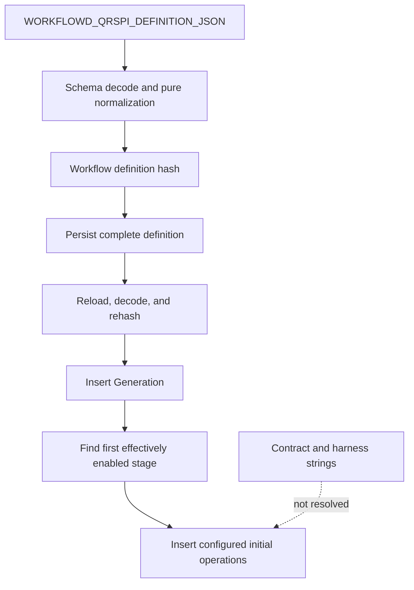
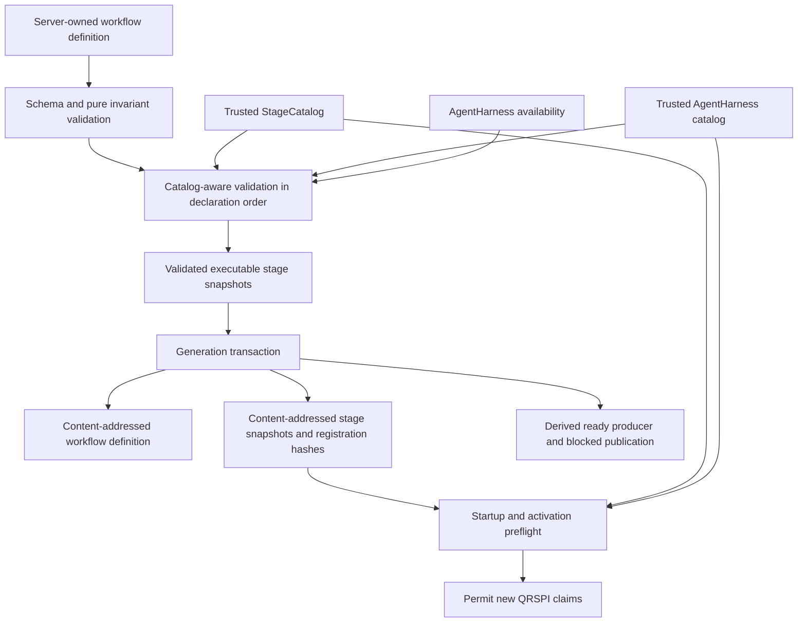

# Design: Trusted stage definitions and catalog

### Summary of change request

Build the server-owned QRSPI `StageCatalog` and stable stage-contract and agent-harness
reference boundaries. A configured workflow must resolve every considered stage to exact,
trusted, compatible, available registrations before the Generation transaction creates
claimable work. Persist enough executable identity to repeat the same checks after restart,
while retaining declaration order and the existing content-addressed workflow definition.

### Current State

- Workflow operators can supply an ordered, versioned workflow definition through server
  configuration, and malformed definitions fail during configuration loading.
- Workflow startup stores the complete definition by its canonical hash and reloads and
  verifies it before creating a Generation.
- A stage names an input contract and harness version, but those names are not resolved to
  trusted executable registrations.
- The first enabled stage's configured operations are inserted directly. Contract
  compatibility and agent/model availability do not guard that boundary.
- A restart can recover the pinned workflow definition, but it cannot prove that each active
  contract and harness implementation is the same trusted registration used originally.
- Adding stage behavior has no implemented catalog seam, so future code could drift toward a
  stage-name switch or one service and worker per stage.

### Desired End State

- Every considered stage uses stable `StageContractRef` and `AgentHarnessRef` values whose
  versions are data, not type-name suffixes.
- One trusted `StageCatalog` owns built-in contract registrations and is the only point where
  heterogeneous contract types are erased and restored through Effect Schema.
- One catalog-aware validation pipeline checks Schema shape, cross-stage invariants, safe
  paths, exact registration identity and hashes, compatibility, bounds, and harness
  availability in deterministic declaration order.
- Validation completes before the Generation transaction. A failed guard creates no ready
  stage operation, agent session, lease, or external intent.
- The Generation transaction stores immutable stage snapshots containing declaration order,
  normalized definition data, and exact contract and harness registration identities.
- Startup and later activation can reload those snapshots, recompute their hashes, and
  require the referenced registrations to remain installed before new work becomes
  claimable.
- A test built-in contract can be added through a contract value and catalog registration,
  without adding a Context tag, queue, worker, store family, or central stage-kind switch.
- QRSPI validation failure closes QRSPI ingress and new QRSPI claims with an exact local
  error, but does not define controller readiness or stop unrelated services.

### What we're not doing

- Implementing the six concrete Questions, Research, Design, Structure, Plan, and
  Implementation contract behaviors; that is owned by `workflowd-vs3.4.2`.
- Implementing stage runs, revisions, the generic operation loop, producer sessions,
  artifact publication, owner handoffs, review, gates, Design routing, or progression.
- Loading contracts, Schemas, prompts, agents, models, or harnesses from repository files.
- Adding per-stage Context tags, workers, queues, store families, or a stage-name dispatch
  switch.
- Adding service status, readiness, health aggregation, aggregate capacity policy, retention
  policy, or cumulative-storage controls.
- Converting legacy child operations into executable stage runs or inferring missing runtime
  facts.
- Creating or updating pull requests.

### Proposed End State Architecture

Before:



After:



The domain shape follows the accepted parent design:

```ts
type StageContractRef = {
  readonly name: string
  readonly contractVersion: number
}

type StageDefinition = {
  readonly key: string
  readonly kind: "document" | "implementation"
  readonly contract: StageContractRef
  readonly activation: StageActivationPolicy
  readonly definitionVersion: number
  readonly maxEncodedInputBytes: number
  readonly producer: {
    readonly harness: AgentHarnessRef
    readonly agent: string
    readonly model: string
    readonly timeoutMs: number
    readonly retry: StageRetryPolicy
  }
  readonly outputPolicy: StageOutputPolicy
  readonly reviewPolicy: StageReviewPolicy
  readonly humanGatePolicy: StageHumanGatePolicy
  readonly designPolicy?: PolicyReference
  readonly promotionPolicy?: PolicyReference
  readonly structurePolicy?: PolicyReference
}
```

`initialOperations` is removed from trusted configuration. The runtime derives one ready
`StageProduce`, one blocked `ArtifactPublish`, and their typed parent effects. This prevents
configuration from granting operation state or progression authority.

Each built-in contract remains locally typed:

```ts
type StageContract<Request, RequestEncoded, Result, ResultEncoded> = {
  readonly ref: StageContractRef
  readonly kind: "document" | "implementation"
  readonly requestSchema: Schema.Schema<Request, RequestEncoded, never>
  readonly resultSchema: Schema.Schema<Result, ResultEncoded, never>
  readonly maxRequestBytes: number
  readonly maxResultBytes: number
  readonly compatibility: (definition: StageDefinition) => void
  readonly assembleRequest: (sources: ExactStageSources) => RequestEncoded
  readonly buildTask: (request: Request) => AgentTask<Result, ResultEncoded>
  readonly prepareOutput: (
    result: Result,
    context: StageExecutionContext,
  ) => PreparedDocumentOutput | PreparedImplementationStepOutput
}
```

`TrustedStageCatalog` accepts a narrow heterogeneous registration type and builds an
internal runtime registration. Construction Schema-validates metadata, materializes request
and result JSON Schemas, checks durable envelope bounds, rejects duplicate references,
computes a canonical registration hash, and retains the exact source object. Public lookup
returns only a stable descriptor. Typed execution must enter through the selected trusted
source object; a lookalike object with the same reference is rejected.

The existing harness catalog gains a public stable descriptor lookup so definition
validation can obtain the exact harness registration hash without exposing executable
closures. `AgentHarness.validateAvailability` remains the authority for agent/model runtime
availability. No second harness implementation or per-stage harness service is introduced.

Validation is split by what each boundary can know, but exposed as one ordered operation:

```text
validateWorkflowDefinition
  1. Decode the complete WorkflowDefinition.
  2. Check stage keys, considered-stage rules, activation prerequisites, ordering,
     review bounds, output compatibility, and safe artifact paths.
  3. Resolve each considered StageContractRef in declaration order.
  4. Check contract kind, output policy, input/result limits, supported policy refs,
     and exact contract registration hash.
  5. Resolve each selected AgentHarnessRef and exact registration hash.
  6. Validate selected agent/model availability in first-reference order with duplicates
     removed only after preserving first occurrence.
  7. Return normalized workflow data plus immutable executable stage snapshots.
```

Pure checks run at configuration load. Catalog construction checks built-ins when the Layer
is built. The full pipeline runs before Generation creation, at startup for every current
new-format Generation, and again before later stage activation. The caller performs live
availability before entering the Generation transaction; the transaction verifies the
supplied normalized hashes and stores the snapshots before it creates any ready operation.

Add one strict table through the existing Effect SQL migration path:

```sql
CREATE TABLE qrspi_stage_definitions (
  stage_definition_sha256 TEXT PRIMARY KEY,
  workflow_definition_sha256 TEXT NOT NULL
    REFERENCES qrspi_workflow_definitions(definition_sha256),
  stage_key TEXT NOT NULL,
  sequence_position INTEGER NOT NULL CHECK (sequence_position > 0),
  definition_json TEXT NOT NULL,
  contract_name TEXT NOT NULL,
  contract_version INTEGER NOT NULL CHECK (contract_version > 0),
  contract_registration_sha256 TEXT NOT NULL,
  harness_name TEXT NOT NULL,
  harness_version INTEGER NOT NULL CHECK (harness_version > 0),
  harness_registration_sha256 TEXT NOT NULL,
  created_at TEXT NOT NULL,
  UNIQUE (workflow_definition_sha256, stage_key),
  UNIQUE (workflow_definition_sha256, sequence_position)
) STRICT;
```

The migration also applies the repository's existing JSON-object and lowercase SHA-256 SQL
checks. `stageDefinitionSha256` hashes the complete normalized stage under the same
`RFC8785-NFC-1` envelope as the workflow hash. Reads decode `definition_json`, recompute the
stage hash, and compare the persisted contract and harness refs and registration hashes to
the current trusted descriptors. The table stores executable identity, not executable
functions or Schemas.

### Design Questions

All design questions were resolved through the human's instruction to auto-approve the
recommended option at every decision gate.

### Resolved Design Questions

#### Should the existing provisional stage shape be retained or aligned now with the accepted parent design?

Use the accepted parent `StageDefinition` shape now. Introduce `StageContractRef`, embed the
existing `AgentHarnessRef` in producer selection, rename output fields to policy terms, add
the accepted optional specialized policy references, require a reason for conditional
activation, and remove configurable `initialOperations`.

This avoids supporting two new-format definition models and ensures all later CAP-D tasks
build on one durable hash contract. The rejected option was to layer a catalog over
`inputContract.schemaId/schemaVersion`, `harnessId/harnessVersion`, and configured initial
operations. That would preserve less code in this Bead but conflict with the accepted
architecture, leave operation authority in configuration, and require a later persisted
format migration.

#### Where should heterogeneous contract types be erased and restored?

Erase types only inside `TrustedStageCatalog` registration and resolution. Each source
`StageContract` retains concrete request and result Schemas. Resolution selects the exact
trusted source object, decodes the durable request with that object's Schema, and invokes
only its closures. Result decoding uses the same selected contract before a bounded prepared
output crosses back into generic runtime code.

The rejected options were a generic type chain across the runtime and `unknown` values
handled by stage-name branches. The former cannot model a runtime-configured heterogeneous
sequence without false coupling; the latter weakens Schema ownership and creates the
central switch this task forbids.

#### How should contract and harness trust be represented?

Use stable semantic references plus canonical registration hashes. Catalog construction
validates metadata and generated JSON Schemas, rejects duplicate refs, computes the hash,
and retains exact source-object identity. Durable snapshots carry both the contract and
harness reference and registration hash. Restart and activation require the same reference
to resolve and the current hash to match.

Source-object identity remains an in-process defense and is not treated as restart proof.
The rejected alternatives were reference-only resolution, which cannot detect changed code
or Schema metadata under the same version, and persistence of executable functions or
Schema objects, which is neither stable nor safe.

#### When must validation run relative to Generation and operation creation?

Run pure checks at configuration load, validate catalog construction at Layer creation, and
complete the full catalog and availability guard before the Generation transaction. Pass
validated immutable snapshots into the transaction, recheck all serializable hashes there,
persist the snapshots, and only then create derived operations. Repeat persisted-reference
validation at startup and before later activation.

The rejected option was startup-only validation. Availability or installed versions may
change after startup, and current durable work must not become claimable under a missing or
changed registration. The other rejected option was performing network availability checks
inside the SQL transaction; that would hold transaction locks across external I/O and still
could not make availability atomic.

#### What persistence is required in CAP-D1?

Keep `qrspi_workflow_definitions` as the complete content-addressed source and add only
`qrspi_stage_definitions` for immutable executable stage snapshots and registration
identity. Preserve sequence position explicitly even though workflow JSON retains array
order. Do not add stage-run, revision, execution, publication, handoff, or reconciliation
tables in this Bead.

The rejected option was relying only on workflow JSON. It can recover refs but cannot prove
which trusted contract and harness registrations were accepted. The rejected broader option
was to add all later runtime tables now; that would take ownership from dependent CAP-D
tasks and enlarge this migration without an executable lifecycle to test them against.

#### How should failures be reported and contained?

Use typed errors with stable reason codes and identity fields rather than assertions or
free-form wrapping. Separate catalog registration failures, workflow definition failures,
availability failures, and persisted-data failures. Diagnostics include workflow and stage
hashes when known, stage key and sequence, contract/harness refs, expected and actual
registration hashes, validation phase, and a bounded cause.

Required reason codes cover malformed or duplicate registration, unknown reference,
untrusted source identity, registration hash mismatch, kind/output incompatibility,
unsupported bound or policy, unsafe artifact path, invalid activation prerequisite, invalid
stage order, no considered stage, unavailable agent/model, malformed snapshot, and snapshot
hash mismatch. A failed guard suppresses QRSPI ingress or new QRSPI claims but does not stop
unrelated services. A readable operation-bound persisted-data error follows the existing
`data_error` quarantine pattern when that lifecycle is implemented.

The rejected option was process-wide startup failure. The accepted parent design requires
QRSPI to fail closed without defining controller readiness or preventing unrelated work.

#### How should Effect services be composed?

Provide one `StageCatalog` Context service backed by one `TrustedStageCatalog`. Continue to
provide one `AgentHarness` backed by one extended `TrustedAgentHarnessCatalog`, including
the stage execution `opencode@1` registration while retaining PR review/fix registrations.
Expose stable registration inspection through these existing boundaries and feed both into
catalog-aware workflow validation. The disabled QRSPI path keeps its current unauthorized
`WorkflowStart` behavior.

The rejected options were one Context service per stage and a second QRSPI-specific harness
stack. Both duplicate lifecycle and composition concerns and make registration-based
extension harder.

#### What testing boundary proves this design without implementing later runtime work?

Use domain and catalog unit tests for exact diagnostics, compatibility, Schema restoration,
hash sensitivity, order, and extension. Use real SQLite migration and store integration
tests for snapshot round trips, tamper detection, transaction rollback, and file-database
restart with retained, missing, and changed registrations. Extend Layer and configuration
tests to prove the complete set resolves, QRSPI closes on each missing or unavailable
reference, and unrelated services remain resolvable.

Add a custom test contract and prove it registers and resolves without changes to queues,
worker loops, store method families, Context tags, or a central switch. Do not claim stage
execution, publication, aggregate capacity, or controller readiness from these tests.

The rejected option was testing only static catalog lookup. It would not prove the critical
pre-claim transaction boundary or restart retention criterion.

### Patterns to follow

These show the patterns found in the existing codebase that will be followed to implement
the proposed end state architecture.

#### Trusted heterogeneous registration with stable lookup

`TrustedAgentHarnessCatalog` narrows a heterogeneous collection to stable references,
validates each runtime definition, retains order, and rejects duplicate identities -
`src/agent-harness.ts:259-305`.

```ts
constructor(definitions: ReadonlyArray<HarnessRegistration>) {
  for (const definition of definitions) {
    const runtime = decodeRuntimeDefinition(definition)
    Schema.decodeUnknownSync(DefinitionMetadata)(runtime)
    const key = referenceKey(runtime.ref)
    const inputJsonSchema = JSONSchema.make(runtime.inputSchema)
    const outputJsonSchema = JSONSchema.make(runtime.outputSchema)
    if (this.#byReference.has(key)) {
      throw new Error(`Duplicate AgentHarness reference ${key}`)
    }
    this.#byReference.set(key, {
      source: definition,
      definition: runtime,
      definitionHash: definitionHash(runtime, inputJsonSchema, outputJsonSchema),
      inputJsonSchema,
      outputJsonSchema,
    })
  }
  this.definitions = definitions
}
```

`TrustedStageCatalog` follows this shape but hashes stage-contract metadata and request/result
Schemas and exposes typed resolution rather than harness prompt preparation.

#### Exact source-object trust before Schema restoration

The harness checks exact registration identity, then uses the selected definition's Schema
to restore the concrete input type - `src/agent-harness.ts:371-386`.

```ts
const registration = yield* Effect.try({
  try: () => this.catalog.registrationFor(definition),
  catch: (cause) => this.error("select harness", cause, false),
})
const decodedInput = yield* Schema.decodeUnknown(definition.inputSchema)(input).pipe(
  Effect.mapError((cause) => this.error("validate agent prompt input", cause, false)),
)
```

Stage resolution applies the same order: resolve trusted registration, decode through that
contract's request Schema, enforce encoded bounds, and only then invoke contract closures.

#### Versioned canonical hashes preserve array order

QRSPI wraps definitions with explicit contract and normalization versions and canonicalizes
objects without sorting arrays - `src/qrspi/domain.ts:243-249,517-520,572-578`.

```ts
export function workflowDefinitionSha256(definition: WorkflowDefinition): string {
  return canonicalSha256({
    contractVersion: definition.contractVersion,
    normalizationVersion: "RFC8785-NFC-1",
    definition,
  })
}

function canonicalJson(value: unknown): string {
  if (value === null || typeof value !== "object") return JSON.stringify(value)
  if (Array.isArray(value)) return `[${value.map(canonicalJson).join(",")}]`
  return `{${Object.entries(value)
    .sort(([left], [right]) => (left < right ? -1 : left > right ? 1 : 0))
    .map(([key, item]) => `${JSON.stringify(key)}:${canonicalJson(item)}`)
    .join(",")}}`
}
```

`stageDefinitionSha256` uses the same canonical implementation and normalization envelope;
workflow declaration order continues to participate in `workflowDefinitionSha256`.

#### Content-addressed persistence and read-time revalidation

Workflow definitions are inserted idempotently and decoded and rehashed before use -
`src/qrspi/store.ts:317-323,712-737`.

```ts
yield* sql`
  INSERT INTO qrspi_workflow_definitions (
    definition_sha256, definition_json, created_at
  ) VALUES (
    ${input.workflowDefinitionSha256}, ${JSON.stringify(input.workflowDefinition)}, ${now}
  ) ON CONFLICT (definition_sha256) DO NOTHING
`

const definition = yield* Schema.decodeUnknown(Schema.parseJson(WorkflowDefinition))(
  definitionJson,
)
if (workflowDefinitionSha256(definition) !== input.workflowDefinitionSha256) {
  return yield* Effect.fail(
    dataError("workflow_definition", input.workflowDefinitionSha256, "hash mismatch"),
  )
}
```

Stage snapshots use the same insert, decode, recompute, and compare discipline, with added
registration-hash comparison before claimability.

#### Ordered availability before activation

Harness availability resolves trusted references and checks them sequentially -
`src/agent-harness.ts:350-369`.

```ts
Effect.forEach(
  input.refs,
  (ref) => {
    const registration = this.resolve(ref, "select harness")
    return Effect.flatMap(registration, ({ definition }) =>
      this.attempt("validate OpenCode availability", true, (signal) =>
        this.adapter.validateAvailability(
          { agents: [definition.agent], model: parseModel(definition.model) },
          signal,
        ),
      ),
    )
  },
  { concurrency: 1, discard: true },
)
```

Workflow validation preserves stage declaration order and first-reference order so failure
diagnostics remain deterministic.

#### File-database restart verification

Existing workflow recovery reconstructs both the service and database Layer against one
file and verifies that durable identity prevents duplicate external work -
`test/qrspi/workflow-start.test.ts:977-985`.

```ts
const filename = await databasePath()
const fake = fakes({ crashAfterCreate: true })
await expect(start(filename, fake)).rejects.toMatchObject({ _tag: "WorkflowStartUncertain" })

const restarted = await start(filename, fake)

expect(restarted).toMatchObject({ _tag: "Started", generation: 1 })
expect(fake.counts().createCalls).toBe(1)
```

Catalog restart tests reconstruct Layers with the same database and either the same,
missing, or changed registrations, proving that only exact retained versions permit new
QRSPI activation.
